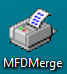
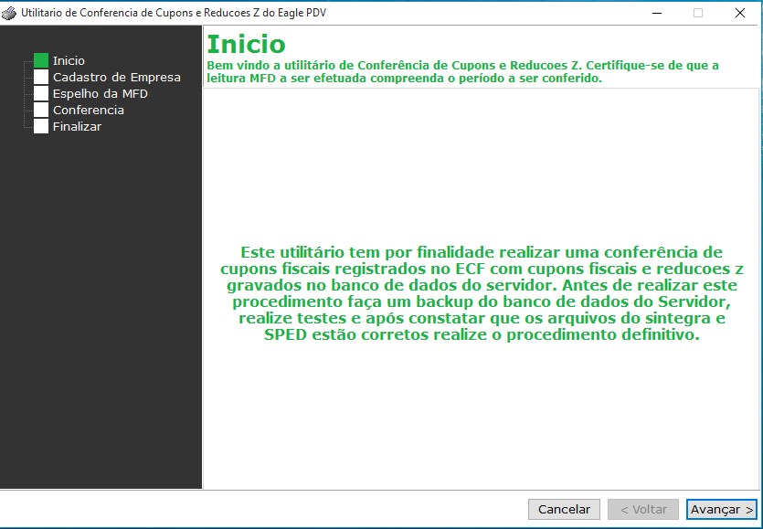
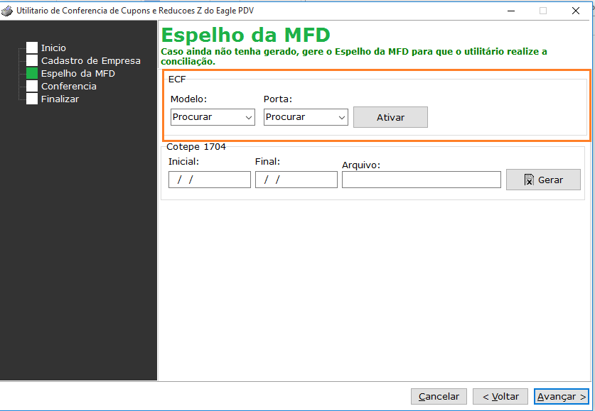
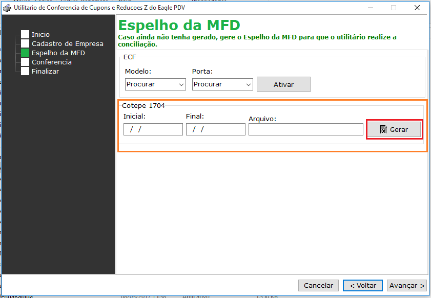
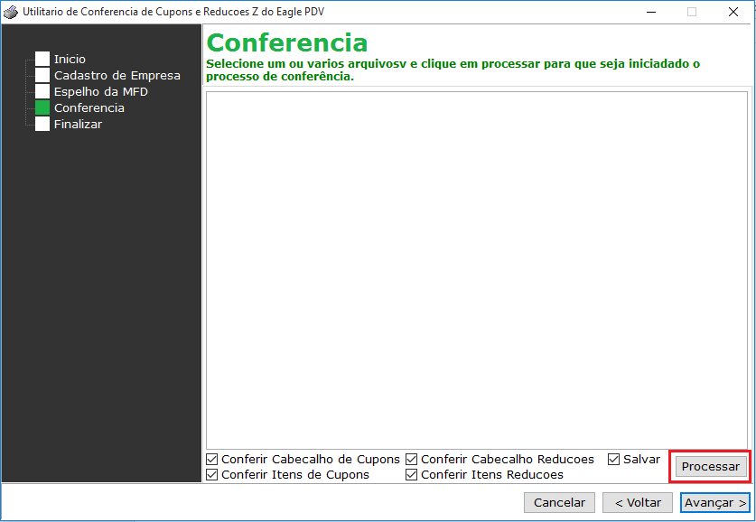
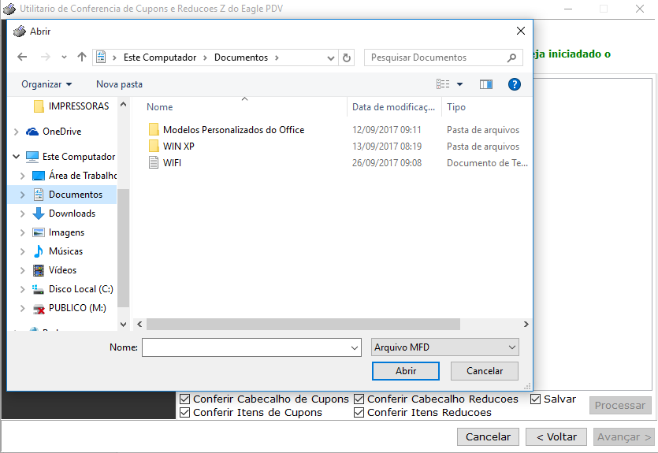

## Instruções
Antes de executar o merge, verifique se ele está instalado no computador, o arquivo deve ficar na pasta do Eagle PDV. 
! Se houver mais de uma impressora fiscal é necessário que o aplicativo esteja instalado em cada computador.

## Passo 1: Abrindo o aplicativo
* Abra o aplicativo

Clique em avançar
## Passo 2: Conectando ao banco de dados
* Conecte ao banco de dados do Eagle Gestão

* Após carregar as configurações do cadastro da empresa clique em avançar.

! A configuração do Host Servidor e Alias Servidor deve ser a mesma configuração usada no alias do firebird. 

## Passo 3: Conectando a impressora fiscal
* Procure o modelo e porta da impressora, e clique em ATIVAR

## Passo 4: Gerando ATO COTEPE
* Para gerar o ATO COTEPE deve colocar o período inicial e Final,após clique em gerar e selecione onde o arquivo será salvo, e clique em Avançar.

* Após cliente em processar e aguarde.

! Se o aplicativo travar ou demorar mais que o normal aconselhamos que o memo seja gerado pelo próprio aplicativo da impressora.
* Após gerar o arquivo, clique em avançar.

* Clique em processar e selecione o arquivo gerado.

* Nesse momento o merge fará a verificação jutamento com o arquivo ATO COPETE, após a verificação clique em finalizar. 
