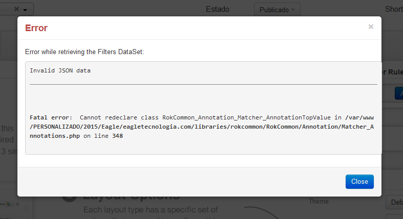

Primeiro abra o arquivo `php.ini(Localização: /etc/php5/apache2/)` do servidor web e descomente a diretiva `opcache.enable=0`, salve o arquivo e reinicie o apache.

Caso não tenha acesso ao arquivo `php.ini`, coloque o seguinte código em uma arquivo `.htaccess`:

``` apache
<IfModule mod_php5.c>
  php_value xcache.cacher Off
  php_value xcache.size 0
  php_value xcache.stat Off
</IfModule>
```

