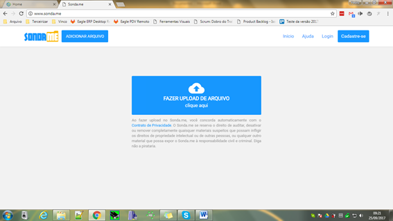
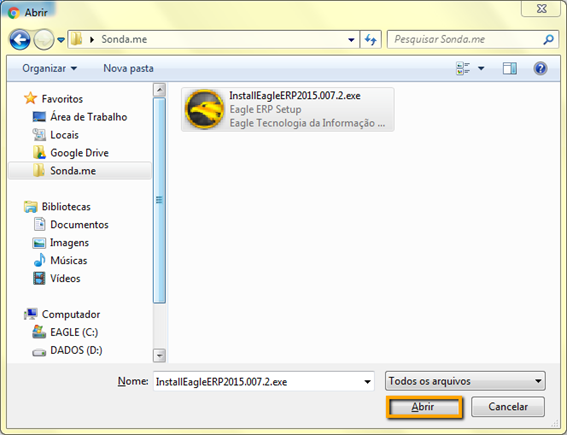
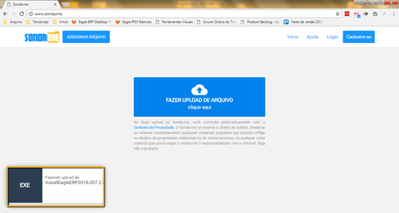
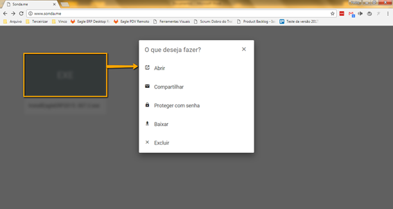
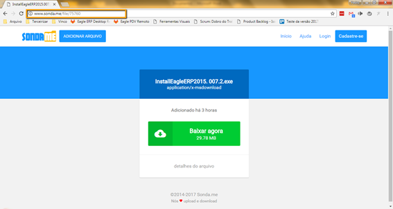

O Sonda.me é um site de compartilhamento de arquivos que pode ser utilizado para compartilhar arquivos maiores que geralmente não podem ser enviados por e-mail. Para compartilhar um arquivo siga os seguintes passos:

1. Entre no site [Sonda.me](http://www.sonda.me/)

1. Clique em Fazer **Upload de Arquivo**.

1. Selecione o arquivo desejado e clique em **Abrir** e Aguarde até que o arquivo seja totalmente enviado.

1. Assim que o upload do arquivo concluir clique sobre o nome do arquivo enviado para que seja apresentado as opções conforme na imagem a seguir:

1. Ao clicar em **Abrir** você terá acesso ao link para download do arquivo que poderá ser compartilhado para as pessoas interessadas para que possam realizar o download do arquivo..

!!!! Pronto este link estará ativo por tempo indeterminado e pode acessado quantas vezes for necessário.

