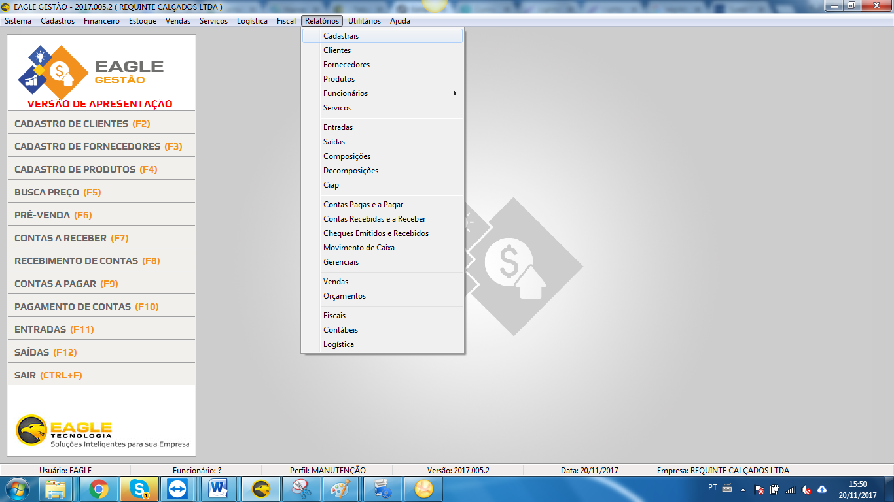
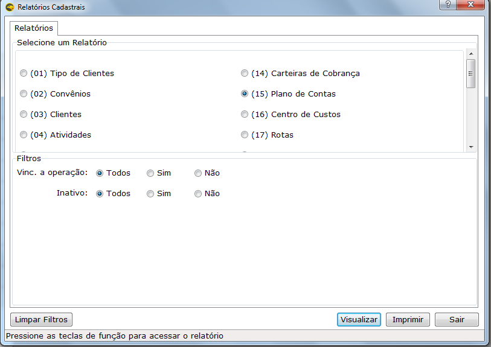
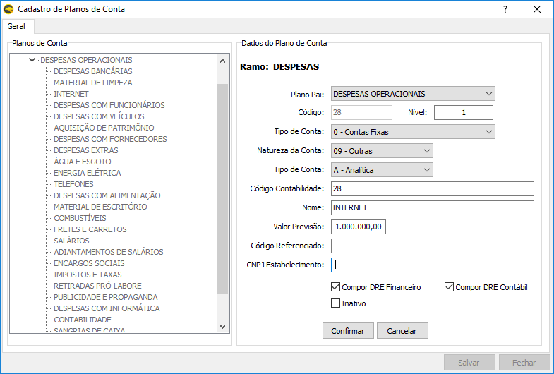
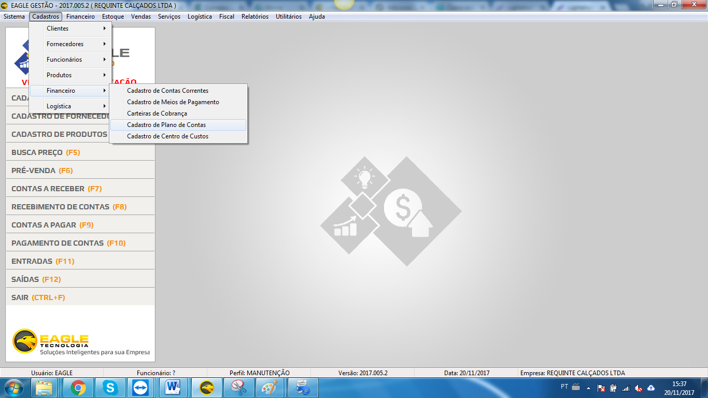
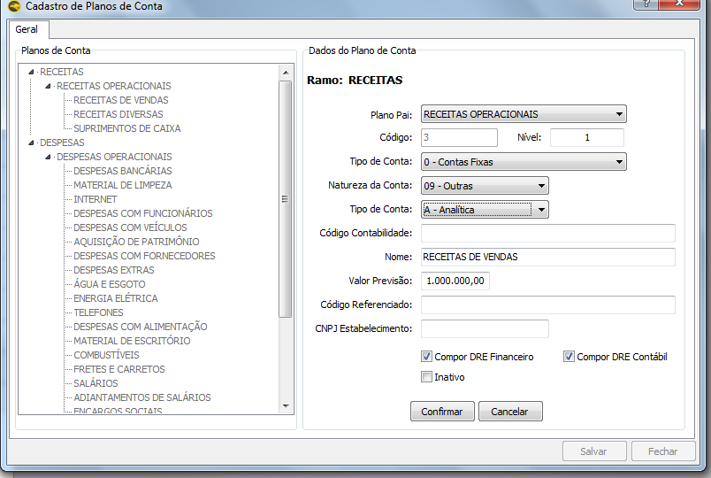

Para os clientes que emitem SPED PIS/COFINS é necessário enviar o Registro 0500.
* **O que é o registro 0500?**
Este registro tem o objetivo de identificar as contas contábeis utilizadas pelo contribuinte em sua Escrituração Contábil, relacionadas às operações representativas de receitas, tributadas ou não, e dos créditos apurados.

## Conferir o relatório de plano de contas
Primeiramente é necessário saber quais as operações que o cliente usa e se tem plano de contas vinculados à essas operações e se estão corretos. Para isso foi criado um relatório que mostra todas as operação ativas e os planos de contas vinculados.

Para consultar acesse:
1. Relatórios; Cadastrais

Assim é possível uma análise para saber os planos de contas vinculados, e identificar se será necessário alguma uma correção.

## Informações dos campos

* **Plano de conta pai** –  Registro principal da arvore de planos de contas, usado nos relatórios financeiros.
* **Código** –  Código interno do plano de contas usado pelo sistema.
* **Nível** – Nível da conta dentro do plano de contas, deve ser o mesmo usado pela contabilidade. O campo é usado no SPED contribuições no campo Nível.
* **Tipo de Conta 1** – O campo determina como serão feitos os cálculos dos DREs dentro do sistema.
* **Natureza da Conta** –  Código da natureza da conta, os valores são fixos segundo os SPEDS. No SPED contribuições o registro é o COD_NAT_CC e deve ser o mesmo informado pela contabilidade.
* **Tipo da conta 2** –  Esse é o indicador do tipo da conta segundo a contabilidade para ser informado no regsitro IND_CTA do SPED contribuições. Deve ser informado o mesmo código que a contabilidade. 
* **Código Contabilidade** – Código da conta, esse código deve ser o mesmo que a contabilidade usa. No SPED contribuições é usado no campo COD_CTA.
* **Nome** – Nome da conta, esse nome deve ser o mesmo que a contabilidade usa. No SPED contribuições é usado no campo NOME_CTA.
* **Valor Previsão** – Valor que será gasto no mês.
* **Código Referenciado** – Código da conta correlacionada no Plano de contas referenciado publicado pela Receita. Não é obrigatório para O sped.
* **CNPJ Estabelecimento** –  CNPJ do estabelecimento, no caso da conta informada no campo COD_CTA ser específica de um estabelecimento.
! Os códigos devem ser inseridos sem pontos.

Referência: [Sage EAD](http://sageead.com.br/ajudaonline/artigo.aspx?artigo=6066)

## Para cadastrar o plano de contas contábil
1. Acesse o cadastro de plano de contas

2. Selecione o plano de contas, clique duas vezes e será habilitado os campos para inserir as informações.

3. Após, clique em salvar.
4. Após inserir as informações, o plano de contas deve ser vinculado no cadastro da operação.