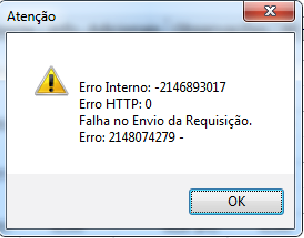

Mesmo após instalar certificado renovado e configura-lo no sistema Eagle Gestão, tem acontecido Erro Interno ao transmitir nf-e

Quando acontecer o erro da imagem acima, confira no aplicativo do certificado se ele já está habilitado para a emissão da NF-e, geralmente os certificados são habilitados um dia após a renovação.