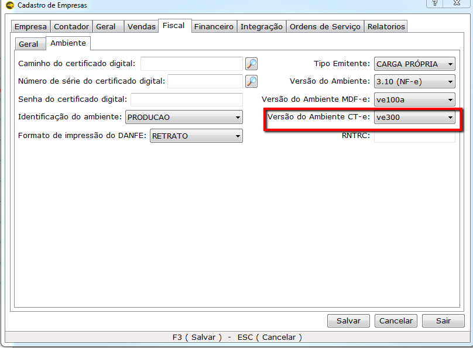

A partir do dia  **02/10/2017** o CT-e será passará ser obrigatório ser emitido na **Versão 3.0**. Para que não ocorra erros nos clientes por esse motivo, é necessário fazer a alteração no cadastro da empresa para que os clientes possam realizar a emissão.

# Principais mudanças
A partir da versão 3.00 será permitido, além do protocolo SSL, o uso do protocolo TLS 1.2 para comunicação.

* **Data e Hora de Emissão e Outros Horários**
Todos os campos relacionados a data e hora vão adotar o mesmo padrão da NFe, ou seja, eles serão informados no formato UTC completo com a informação da TimeZone. Dessa forma, serão aceitos horários de qualquer região do mundo.

* **Consulta de CT-e**
O processamento da requisição das consultas de CT-e (Consulta chave) será limitado no período de consulta para 180 dias da data de emissão do CT-e. Segundo o manual, atualmente as requisições do webservice de Consulta representam aproximadamente 30% das requisições recebidas no ambiente da SEFAZ Autorizadora, sendo que algumas empresas mantêm processos em “loop” consultando Chaves de Acesso inexistentes, mesmo para CT-e autorizadas em anos anteriores.

* **Inclusão de novos eventos**
Para o emitente do CT-e foi adicionado o evento de Informações da Guia de Transporte de Valores (GTV), que será utilizada para que o mesmo possa informar as GTV relacionadas com a prestação de serviço. Esse é um evento permitido apenas para o modelo 67.

Outro evento acrescentado na versão 3.00 é o de Prestação do Serviço em Desacordo. Ele será utilizado apenas pelo tomador, para que o mesmo possa informar ao fisco que o documento CT-e que o relaciona está em desacordo com a prestação de serviço. Ele é permitido para os dois modelos (57 e 67).

* **Regras de Validação**
As regras de validação alteradas, foram principalmente aquelas vinculadas aos novos campos ou novos controles, que tem como objetivo melhorar a qualidade das informações prestadas pelas empresas à SEFAZ  

Referência: [TECNICOSPEED](http://tsdn.tecnospeed.com.br/blog-da-tecnospeed/post/ct-e-3-00-saiba-tudo-e-fique-preparado-para-as-mudancas)