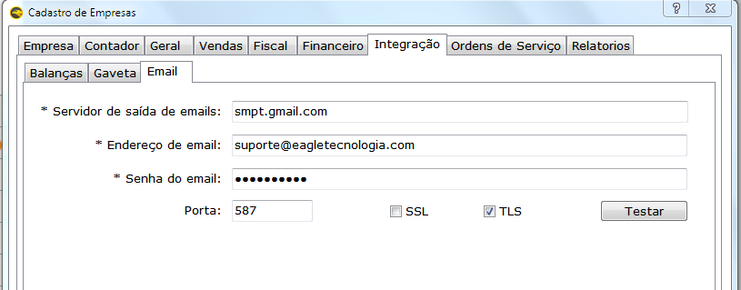
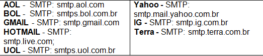

O sistema Eagle gestão possui função de envio automático de documentos fiscais NF-e e CT-e por e-mail.  Para realizar o envio automático, o e-mail do cliente deve ser configurado no cadastro da empresa. 

Abaixo estão as configurações dos principais e-mail.

! Obs. Informações como portas e servidores também podem ser encontradas na internet. 

Após a configuração mande testar.

Alguns servidores de e-mail bloqueiam o envio automático e para que se tenha a autorização por exemplo do Gmail deve-se:
Acessar o E-mail ir em: Configurações - Encaminhamento de E-mail e POP/IMAP  
* Marcar opção **Ativar POP para todos os e-mails**
* Marcar opção **Ativar IMAP**
* Salvar Configurações.

Após essa configuração, tentar um novo teste na configuração de e-mail do sistema, sendo assim você receberá um e-mail solicitando a autorização para o envio de e-mail automático e nesse e-mail você poderá habilitar a autorização. 
Caso mesmo após a autorização no e-mail tenha sido habilitada e ainda está apresentando erro, confira a senha do e-mail e as portas configuradas.
