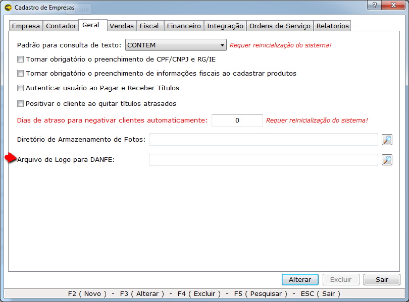

1.	Crie uma nova pasta de preferencia no aplicativo que faz o backup do Eagle Gestão com o nome Logo e coloque a imagem, a imagem deve está no formato (BMP).
 	_Obs: A pasta pode está localizada em qualquer lugar do computador, mas se a pasta for apagada a logo não sairá no Danf, e com o uso do backup ela pode ser restaurada._
2.	Após criar a nova pasta compartilhe em rede.
3.	No sistema Eagle Gestão acesse: 
4.	Sistema; Cadastro da Empresa.
5.	Aba geral.
6.	Na opção ‘Arquivo do Logo do Danfe, pesquise a pasta em rede e selecione a referida imagem. 

7. 	Após a imagem ser selecionada clique em salvar.