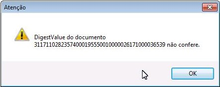
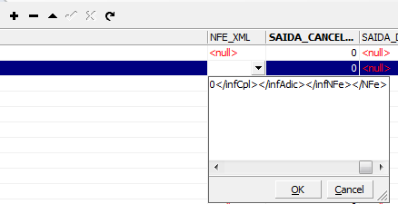
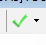

O Digest Value é uma chave calculada pelo software emissor de NF-e com a finalidade de validar se as informações contidas no XML não foram alteradas.
Algumas vezes ao tentar transmitir uma nota, a Sefaz não retorna nenhuma mensagem e, ao tentar transmitir novamente, o sistema apresenta a seguinte mensagem de aviso:

Isso pode acontecer caso o arquivo XML tenha sido corrompido ou alterado, quando por exemplo, você altera uma nota e tenta transmitir de novo. Isso faz com que o Digest Value da nota mude.
Há duas possíveis formas de resolver. Para isso confira se o XML da nota no sistema é igual ao XML da nota na Sefaz. Exporte o XML do sistema e baixe o XML da Sefaz, referente àquele numero de nota e compare.

## 1.  Caso o XML da nota seja o mesmo.
* No Eagle Gestão, exporte o XML da nota referida.
* Abra esse XML com o bloco de notas, selecione todo o conteúdo e copie.
* Na tabela SAIDAS do bando de dados, cole o conteúdo selecionado na coluna NFE_XML na linha referente à nota fiscal, usando o IBExpert. Clique em OK

* Clique em Commit Transaction.

* Caso a tela de saídas no sistema esteja aberta nessa nota, feche e abra novamente antes de tentar transmiti-la.
* Realize a transmissão.

## 2. Caso o XML não seja o mesmo
* No Eagle Gestão, conferir o ID da saída da NF-e
* Baixe o XML dessa nota no site da Sefaz
* Exclua a nota que está no banco.
* Importe a nota usando o XML baixado.
* Coloque o ID da saída original e na tabela saídas no campo SAIDAS_ID no banco de dados.
* Consulte a nota na Sefaz.

