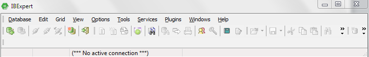

1.	Abra o IBEXPERT, clique em Database, em seguinte clique em register database

2.	Ao clicar em register database abrirá a tela de configuração
 
3.	Configuração de caminho banco: SERVER: local ou remote, se a maquina onde o (PDV ou ERP) tiver instalado for um servidor, será (local), se for um terminal será (remote).

4.	Em caso de computador terminal, configure a opção: SERVER como remote, e na opção SERVER NAME: colocar o nome do servidor, ou o IP.

5.	A opção protocol: Deixe a opção TCP/IP.

6.	Em server version: Coloque a versão do firebird.

7.	Database file: Caminho do banco de dados

8.	Database: Nome do banco

9.	User name : sysdba

10.	Password : masterkey
 
11.	Na opção charset, selecione a opção : WIN1252

12.	Em client library file  colocar : fbclient.dll

13.	Na configuração Font Characters Set, selecione a opção: DEFAULT_CHARSET

14.	Após a configuração teste a conexão, se estiver tudo correto, clique em registrar.

