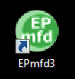

**Impressora Bematech** 

Espelho de Cupons Fiscais 
1.	Abra Aplicativo **BEMATOOL**

2.	Localize a impressora Fiscal
 
3.	Clique em **Dados da MFD e Relatórios**

4.	Selecione o Tipo de intervalo a ser gerado o Espelho: **Data ou Cupom COO** 
 
5.	Selecione a opção **Gerar Espelho**e Clique em **Download da MF da Impressora**

6.	Após Download, visualize o relatório 

Espelho Redução Z

1. Siga os passos anteriores até o 4º passo
2. Selecione uma das opções de **Listar Redução Z ou Separar Reduções Z**
 
3. Selecione a opção **Gerar Espelho** e Clique em **Download da MF da Impressora**
4. Após Download visualize o relatório.

**Impressora Epson**

Espelho de Cupons Fiscais 

1.	Abra o Aplicativo **EPmfd3**

2.	Clique em **Extrair arquivos de impressora (ECF)**

3.	Clique em **Gerar Relatórios Modo Avançado** Através dessa janela, é possível gerar Espelhos ATO/COTEPE, Arquivo eletrônico de registros do PAF-ECF, SPED-Fiscal e Relatório Sintegra. Lendo diretamente da impressora ou de um arquivo binário. 

4.	Abrirá a Janela de leituras Seriais, Selecione **Gerar Espelho de Documentos** ao selecionar esta opção, a lista “Tipos de Espelhos” é habilitada, para que o seja possível selecionar quais tipos de documento devem ser gerados.

5.	Selecione a Opção **Cupom Fiscal**
6.	Selecione o **Intervalo da leitura –** 
a.	**Data:** Especifica que sua leitura será através de um intervalo de data. Ex.: Caso o usuário queira efetuar uma leitura do movimento do ECF do dia 01/08/2017 até o movimento do dia 31/08/2017, deverá preencher os campos “Início” e “Fim”, no formato ddmmaaaa, ou seja: 01082017 até 31082017.
b.	**COO (Contador de Ordem de Operação):** Especifica que a leitura será obtida através de um intervalo de COO.
7.	Depois clique em **Iniciar Leitura** 
8.	Para Visualizar os Documentos gerados, clique em **Espelhos** esse botão possibilita sua visualização do espelho gerado, ou de um espelho salvo em disco.

Espelho de Redução Z 

1.	Siga os passos anteriores até o passo 4
2.	Selecione a opção **Redução Z**

3.	Selecione o intervalo de leitura, podendo ser por **data** ou **CRZ (Contador de Redução Z)** que especifica que sua leitura será através de um intervalo de CRZ
4.	Clique em **Iniciar Leitura** 
5.	Depois Visualize os relatórios Clicando em **Espelhos** esse botão possibilita sua visualização do espelho gerado, ou de um espelho salvo em disco.

