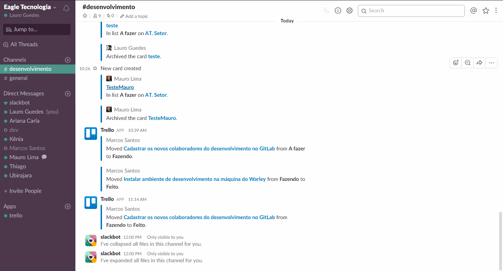
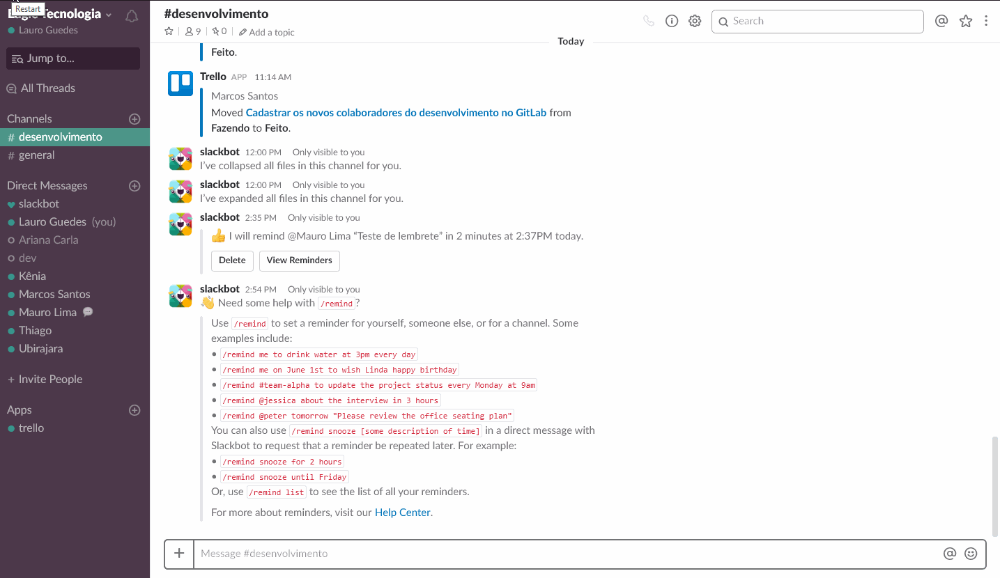
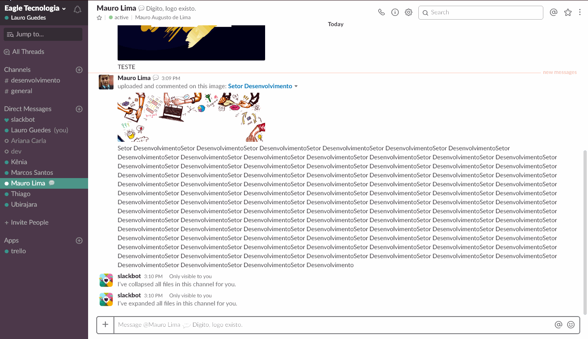

O Slack é uma ferramenta de comunicação entre equipes de alto desempenho. A vantagem da ferramenta é o grande número de integrações disponíveis para extender as capacidades do comunicador. Essa página tem o intuito de abordar as funcionalidades e integrações mais úteis.

## Atalhos de teclado

Use as teclas `Ctrl + /` para listar todos os atalhos disponíveis:

Atalho | Descrição
--------------------------|-----------
`Ctrl + k` | Navegue entre os canais mais rapidamente
`Ctrl + Shift + K` | Navegue entre as mensagens diretas mais recentes
`Alt ↓` e `Alt ↑` | Navegue para a sua mensagem ou canal direto anterior ou seguinte.
`Alt + Shift + ↑` e `Alt + Shift + ↓` | Navegue até sua Mensagem direta anterior ou próxima não lida . Este comando é semelhante ao último, mas permite que você navegue especificamente para mensagens não lidas.
`Ctrl + Shift + K` | Abrir Menções Recentes. Sua lista de menções recentes é uma lista de todas as vezes que outro membro da equipe marcou você em uma mensagem. Abrir esta lista pode ser uma maneira útil de acompanhar os itens de ação que você pode ou não ter concluído.
`Ctrl + Shift + E` | Diretório de equipe aberta. O diretório da equipe exibe as informações de contato de todos os membros de uma equipe.
`Ctrl + Shift + I` | Abra o painel de informações do canal. O painel de informações do canal contém informações sobre os membros, mensagens e histórico de criação de todos os canais em uma equipe específica.
`Ctrl + Shift + S` | Abrir itens com estrelas. Se você "star" itens para marcá-los como importante, esta é uma maneira de ver todos esses itens ao mesmo tempo.
`Ctrl + F` | Procure no canal ou conversa atual. Use este comando para encontrar uma mensagem específica em um canal ou para pesquisar todas as instâncias de uma palavra ou frase mencionada. Depois de inserir a frase na barra de comando, cada instância será destacada no canal.
`↑` | Edite sua última mensagem no canal atual. Você pode alterar a forma como uma mensagem que você enviou exibe em um canal. Use este comando para fazê-lo, tendo em mente que a mensagem aparecerá como editada para outras pessoas no canal.
`Ctrl + U` | Enviar um arquivo. Este comando abrirá uma janela de seleção de arquivos do seu computador.
`Ctrl + Shift + Enter` | Envie trechos de código. É formatado para se sentar em uma caixa de código, permitindo que os membros da equipe vejam seus elementos claramente definidos e fáceis de copiar em outro lugar.
`Ctrl + Shift + V` | Cole o conteúdo da área de transferência como um novo trecho de código. Se você já tiver um texto codificado que deseja compartilhar, você pode compartilhá-lo como um snippet (em vez de como uma mensagem de texto rica) usando este comando.
`Alt + [mensagem]` | Marque as mensagens para as quais você deseja responder mais tarde. Se você ler uma mensagem na qual você não tem tempo para responder, lembre-se de voltar mais tarde por Alt + clicando nela para marcá-la como não lida.

## Funcionalidades Principais

#### Status de não perturbe

Precisa de um tempo sem ouvir sons ou pop-ups pulando em sua janela? O Slack conta com um status comum aos mensageiros, mas com uma capacidade extra: programação. Com ele, é possível programar quanto tempo o status ficará ativo.



#### Lembretes

Recebeu uma solicitação que é longa demais para resolver instantaneamente, mas não chega a ser trabalhosa ao ponto de incluir em sua lista de tarefas? Agende um lembrete com o Slackbot para dar atenção à tarefa em questão.

No chat com o Slackbot, escreva o comando `/remind` e em seguida a tarefa e o horário para que o robô o mande um lembrete. Além disso, também é possível estabelecer lembretes para outras pessoas e grupos usando o mesmo comando. No entanto, lembre de fazê-lo na janela de conversa específica. Para conferir todos seus lembretes, use o comando `/remindlist` em suas conversas. A partir da lista, é possível deletar lembretes já resolvidos.

```
/remind [quem ou canal] [tarefa] [quando]
```

**Formas de agendar lembretes:**

* **Incremento de Tempo**: in 10 seconds, in 17 minutes, in 1 hour, or in 2.5 hours. Ex: `/remind me Enviar Lembrete in 25 minutes`;
* **Tempo Específico**: at 8:55pm (12-hour clock), at 16:00 (24-hour clock), at midnight. Ex: `/remind @lima Hora do Lanche! at 12:30pm`; 
* **Data Específica**: on January 1, on 8 Feb, on 11/30/2018 (MM/DD/YYYY). Ex: `/remind #management Enviar relatório anual on December 15`;
* **Dia Específico**: every weekday, every Monday, Wednesday, and Friday. Ex: `/remind #design Reunião Scrum every Thursday`;
* **Dias específicos, semanas alternadas**: every other Tuesday. Ex: `/remind me Atualizar Agenda every other Wednesday`;

!!! Caso queira ver os possíveis comandos digite `/remind help`. E se quiser ver a lista de tarefas criadas digite `/remind list`.



#### Esconder imagens da Conversa

Uma das melhores funções do Slack também pode ser incômoda. O app dispõe de prévias de links enviados, assim como também dá suporte à imagens gifs. Independente do seu objetivo, para que as imagens deixem de ser exibidas, basta usar o comando `/collapse` em uma conversa ou grupo para esconder todas as imagens do feed. Ainda será possível aos colaboradores enviar imagens, mas você não mais as visualizará. Para desfazer, basta digitar o comando `/expand`.



#### Formatar texto

Para destacar algumas partes do texto é possível usar de alguns símbolos do markdown para formatar textos no Slack. Verifique a tabela:

Simbologia | Descrição
-----------|----------
* | 1 asterisco antes e depois exibe a informação em negrito
_ | 1 underline antes e depois exibe a informação em itálico
~ | 1 til antes e depois exibe a informção tachada
` | 1 crase antes e depois exibe a informção com destaque de código
> | Use o sinal de maior antes de frases para formatar a informação como citação


#### Fazer Mensões

Particularmente efetiva em grupos grandes, as menções ajudam a evitar que o destinatário de sua mensagem não veja uma questão dirigida a ele dentro do grupo, mas sem a necessidade de enviar uma mensagem privada para que seja lida, ou mesmo criar novos grupos apenas para mandar um recado. Para mencionar alguém, basta digitar `@` junto ao nome de usuário da pessoa – localizado na lista de membros de um grupo – que essa pessoa receberá a notificação de que alguém está falando diretamente com ela, reduzindo drasticamente as chances dela passar despercebida.

## Integração Trello

É possível realizar várias operações do Slack para o Trello, facilitando a criação de rotinas e tarefas de forma rápida e centralizada.

#### Comandos do /trello

Para que o trello seja integrado em um canal do Slack é necessário convida-lo usando o comando `/invite @trello`, assim será possível usar os seguintes comandos para integração:

* **Vincule um canal a um quadro**: `/trello link [pesquise o termo]`. Ex: `/trello link AT. Setor` ou `/trello link https://trello.com/b/MOgC1rHq/at-setor`;
* **Incluir um cartão**: `/trello add [membro] [nome cartão]`. Ex: `/trello add @john @jessica Finalisar um Post`;
* **Mostrar detalhes de um cartão ou de um quadro**: `/trello [url]`. Ex: `/trello https://trello.com/b/MOgC1rHq/at-setor`;
* **Visualize as informações do quadro vinculado de um canal**: `/trello info`;
* **Remova e cancele a autorização vinculada à conta do usuário Trello**: `/trello reset`;
* **Verifique a conta do usuário Trello vinculada e a associação da equipe**: `/trello setup`;
* **Atribuir membros do time a um cartão**: `/trello assign @john @jessica`;
* **Inclua um comentário em um cartão**: `/trello comment [comment text]`. Ex: `/trello comment Colocando um comentário`;
* **Incluir uma data de entrega**: `/trello set-due next Friday at 5pm` ou `/trello set-due today`

#### Links úteis relacionados a integração do Trello

* Utilização do Power Up do Slack no Trello ([Link 1](http://br.blog.trello.com/integracao-trello-para-slack/), [Link 2](http://br.blog.trello.com/slack-trello/))
* Usando o trello a partir do Slack ([Link 1](http://br.blog.trello.com/trello-app-para-slack/), [Link 2](http://help.trello.com/article/1049-slack-app))