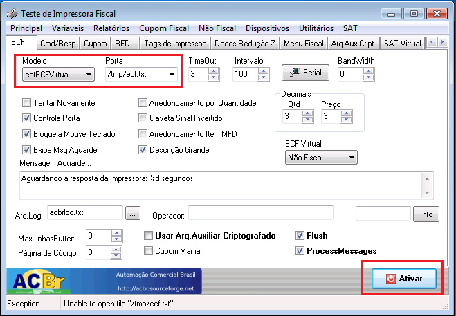
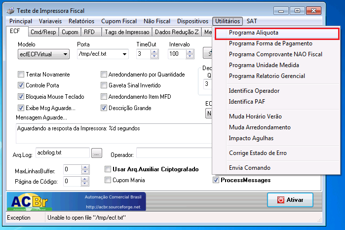
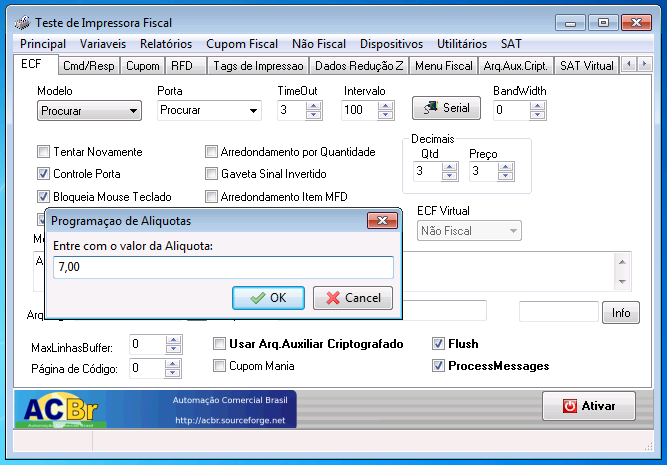
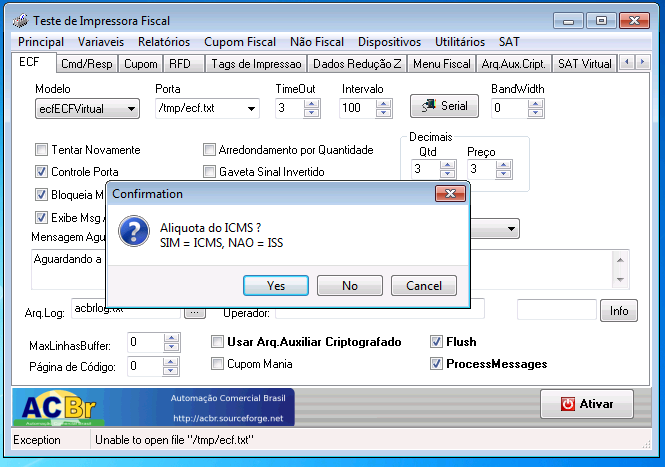
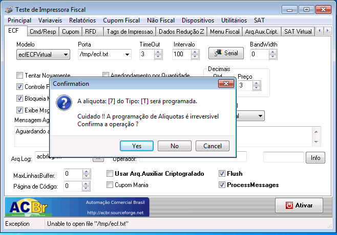

A interventora ao lacrar a impressora, por padrão  a impressora fiscal já é cadastada com a alíquota 18% , mas se a alíquota de alguns produtos for menor ou maior que 18%, e se na impressora não estiver cadastrada tal alíquota o produto aparacerá na lista de rejeitado e não será possível fazer a sua venda. 

## Conectar ao ECFTeste

!! É importante informar que esses cadastros são irreversíveis, ou seja, ficaram registrados na impressora, portanto sempre confira antes a real necessidade de cadastrar essas informações confira com o contador.

1. Após abrir o aplicativo do ECFTeste, primeiro você deve conectar a impressora e configurar a conexão, informando o modelo, porta e clicando em ativar.

2.	Depois caso tenha alguma duvida sobre os dados que já se encontram gravados na impressora pode ser possível verifica-los através do menu Variáveis -> Ler Todas as Variáveis

## Cadastrar alíquota

1.	Selecione a opção Programa Alíquota, informe a alíquota que deseja cadastrar (ex: 7,00), e clique em Ok.

2.	Depois selecione Yes caso seja alíquota de ICMS.

! Não é possível emitir Cupom Fiscal de Serviço (ISS) através do Eagle PDV.
3.	Por fim se os cadastros estiverem corretos clique em Yes
