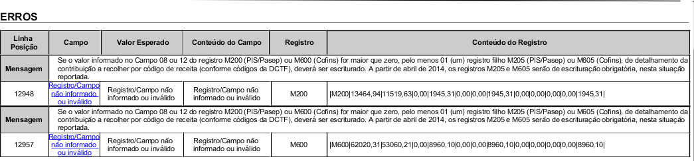
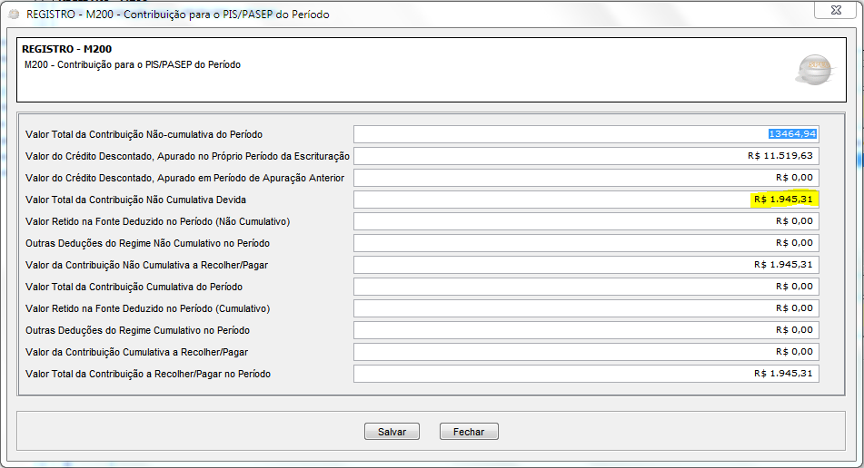
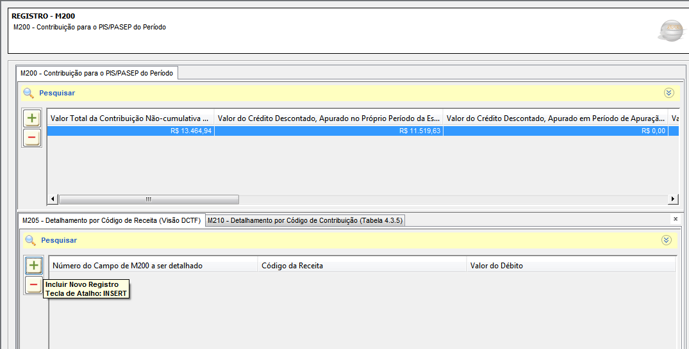
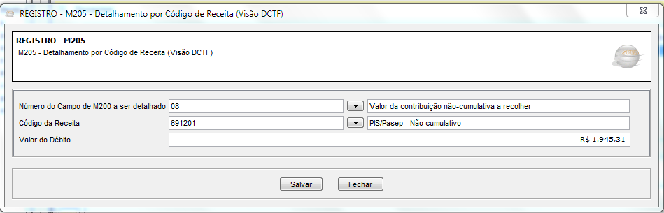
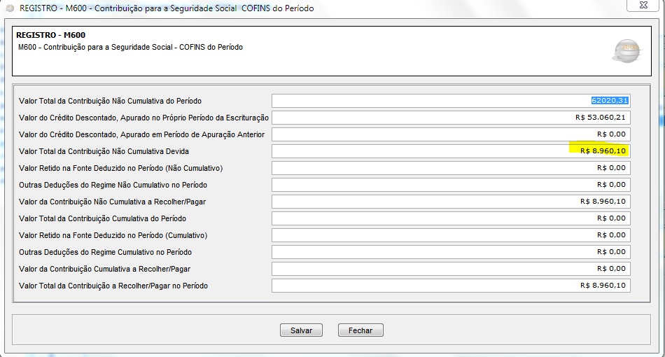
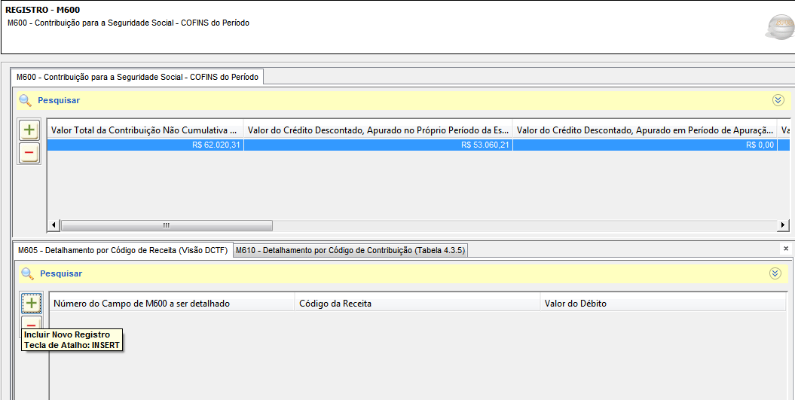
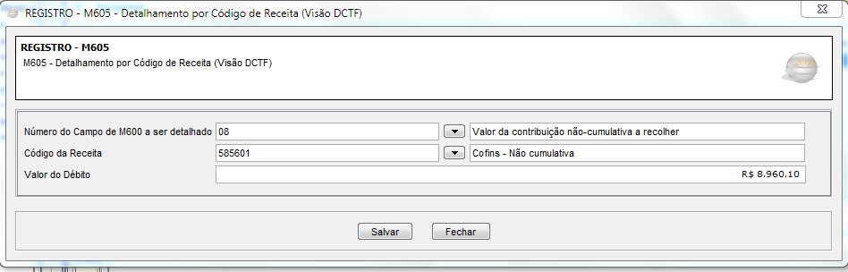

Quando se está validando o Sped Contribuições apresenta os seguintes erros nos registros M200 e M600.

## Como inserir os registros
Para resolver, basta inserir os valores de corretos a recolher dos registros .
1.	Clique em cima da erro referente ao registro M200 Pis /Pasep que abrirá a  seguinte tela :

Anote o Valor Total da Contribuição Não Cumulativa Devida , no Exemplo 1945,31 e clique em Fechar .
2.	Apresentará a tela seguinte:

3. Clique no (+)  Incluir Novo Registro que abrirá tela seguinte: 

4.	Preencha os campos :
* **Número do campo de M200 a ser detalhado:** Cod  08- Valor da Contribuição não cumulativa a recolher .
* **Codigo da Receita**: 691201 – Pis/Pasep Não Cumulativo 
* **Valor do Debito**: Insira o valor total da Contribuição Não Cumulativa Devida – No exemplo 1945,31

5.	Clique em Salvar . 
* Corrigindo erro Registro M600.
* Clique no erro referente ao M600 Confins , abrirá a tela seguinte :

Anote o Valor total da Contribuição Não cumulativa Devida , exemplo 8960,10.
6.	Clique em fechar . 
7.	Apresentará a seguinte tela : 

8.	Clique no (+) Incluir Novo Registro que abrirá tela seguinte : 

9.	Preencha os campos :
* **Número do campo de M200 a ser detalhado:** Cod  08- Valor da Contribuição não cumulativa a recolher .
* **Codigo da Receita:** 585601 – Confins  Não Cumulativo 
* **Valor do Debito:** Insira o valor total da Contribuição Não Cumulativa Devida – No exemplo 8960,10.
10.	Clique em Salvar . 
11.	Após a inserção desses registros, valide o seu Sped Contribuições como de costume. 

! A Contribuição Cumulativa e Não Cumulativa varia de acordo com as configurações do Sped.