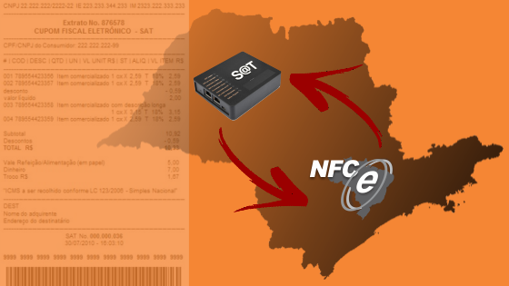

### Embora no estado de São Paulo o SAT Fiscal já esteja sendo utilizado por muitas empresas, é possível o uso de NFCe, entretanto, note que para que seja possível utilizar a NFCe é obrigatório que o contribuinte possua um equipamento SAT ativo, veja:

### Os requisitos para emissão de NFC-e em São Paulo são:
1. Acesso a Internet;
1. Possuir certificado digital no padrão ICP-Brasil, contendo o CNPJ da empresa;
1. Fazer o credenciamento como emitente de NFC-e;
1. Desenvolver ou adquirir um software emissor de NFC-e;
1. Solicitar o Código de Segurança do Contribuinte (CSC) de produção através do Portal da NFC-e;
1. Estar com a inscrição estadual regular;
1. Ter um equipamento SAT ativo.

### Pontos Comuns e Diferenças entre SAT e NFC-e
|Funcionalidades|SAT|NFC-e|
|---------------|---|-----|
|Documento Fiscal (DF) gerado|CF-e-SAT(59)|NFC-e(65)|
|Meio de geração do DF|Equipamento SAT|Programa emissor|
|Meio de transmissão do DF ao Fisco|Internet|Internet|
|Momento de transmissão do DF ao Fisco|Posterior à venda(a geração, contudo, é feita previamente á venda)|Prévio à venda(autorização on-line)|
|Guarda do DF|Contribuinte|Contribuinte|
|Tipo de Impressora|Comum (para impressão de Extrato)|Comum (para impressão de DANFE)|
|Computador(PC/similar) no ponto de venda|Necessário|Necessário|
|Disponibilidade de Internet|Periódica(cf. exigência Fisco)|Full time(autorização on-line)|
|Manutenção|Devolução ao fabricante|Fornecedor do AC|
|Contingência|SAT Reserva, NF-e, NFC-e|SAT|
|Transmissão de REDF(Nota Fiscal Paulista)|Não precisa|Não precisa|

### Fontes:
- [Portaria CAT 102, de 29-08-2014](http://info.fazenda.sp.gov.br/NXT/gateway.dll/legislacao_tributaria/portaria_cat/pcat1022014.htm)
- [SEFAZ São Paulo](http://www.nfce.fazenda.sp.gov.br/NFCePortal/Paginas/DuvidasFrequentes.aspx )
- [DJSystem](https://www.djpdv.com.br/nfc-e-posso-usar-em-sao-paulo/)
- [Vinco](http://vinco.com.br/2018/03/25/uso-correto-sat-nfce-em-sp/)

