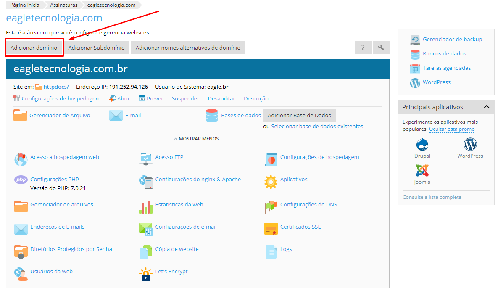
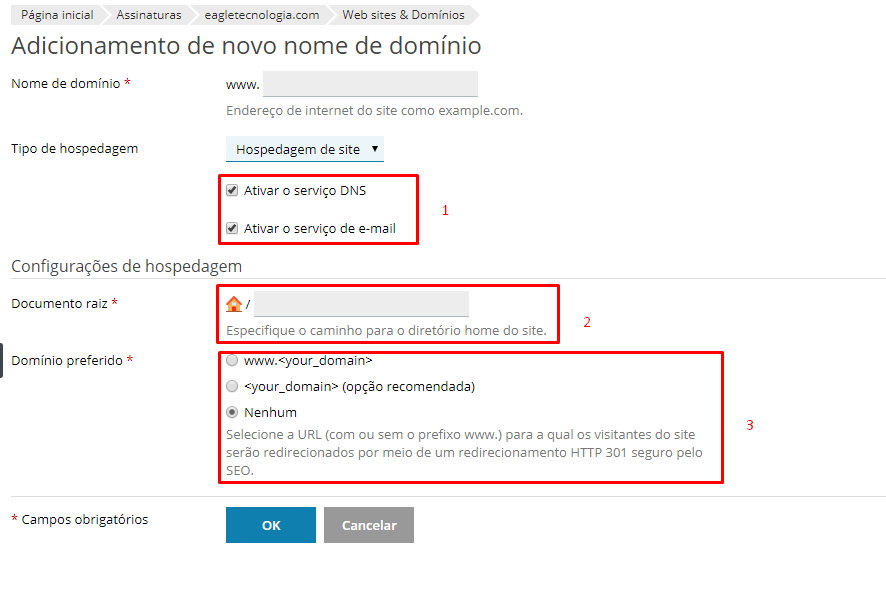
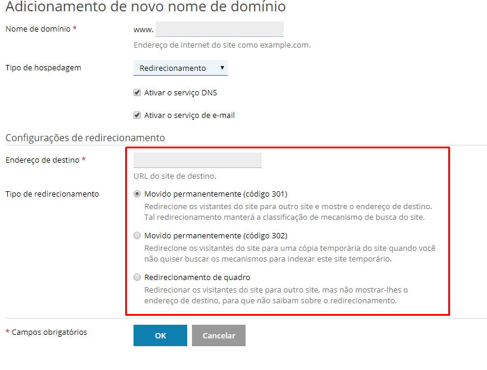
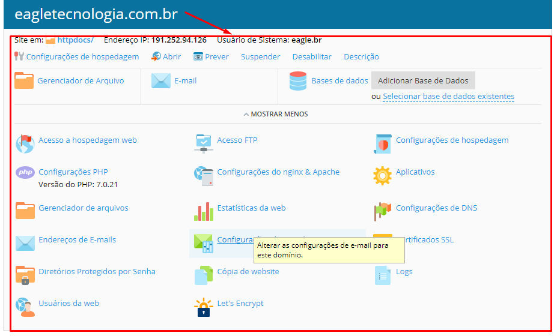
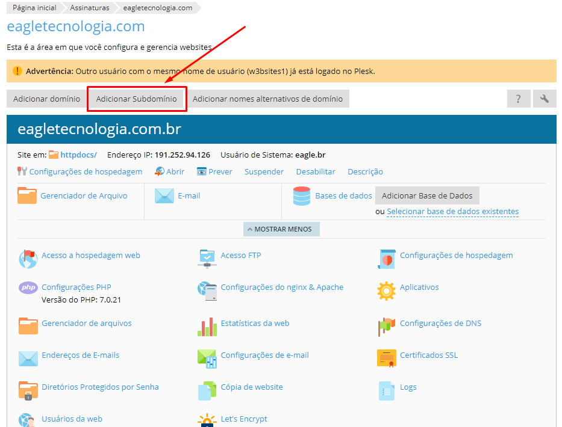
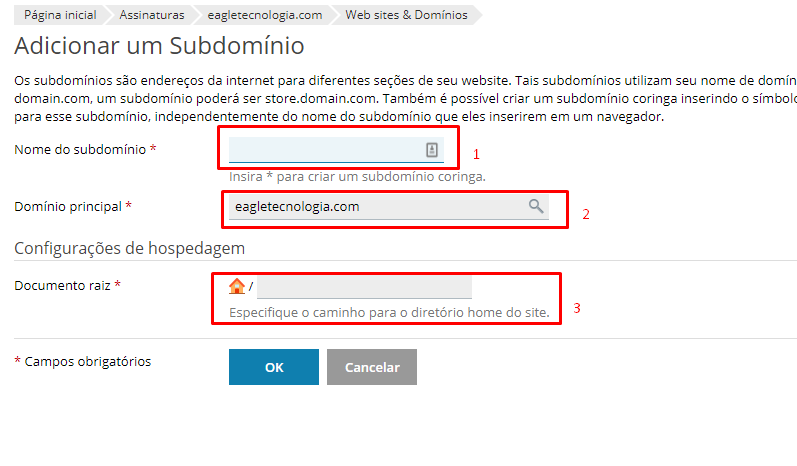

A qualquer momento pode ser adicionado um domínio ou subdomínio para uma assinatura cadastrada. Esses procedimentos as vezes é necessário para que o website tenha um domínio adicional e garanta o acesso por vários meios e áreas distintas, além de obter outras formas acesso.

## Domínio

Para cadastrar um domínio adicional, basta clicar em `Adicionar domínio` no painel principal da assinatura.

No formulário para inserir um novo domínio, primeiramente coloque um domínio válido e que já [esteja registrado](https://ajuda.eagletecnologia.com/faq/como-registrar-um-dominio), pois se não estiver o sistema irá lançar um erro. Após colocado o domínio o próximo passo é selecionar qual o objetivo do domínio:

### Hospedagem de site

Nessa opção o domínio irá apontar para uma pasta específica onde carregará uma página ou um conjunto de páginas, geralmente essa opção aponta para a pasta principal do projeto colocando o domínio como mais uma opção de acesso.

1. Opções para ativar a funcionalidade de criar registros DNS e contas de E-mail;
2. O caminho no qual o domínio irá apontar. **Obs**: caso deseje que o domínio aponte para o projeto principal, basta colocar a pasta `httpdocs` no campo;
3. Selecione se prefere que o domínio tenha `www` na frente.

### Redirecionamento

Como essa opção é possível fazer com que o domínio aponte para uma URL externa. Ex: se deseja que quando algum usuário acessar seu domínio `meudominio.com.br` ele seja redirecionado para `google.com`, então utilize essa opção e coloque no campo de redirecionamento o domínio alvo.

Após inserido a url de redirecionamento, escolha a forma como esse domínio será redirecionado.

### Sem Hospedagem

Com essa opção escolhida o domínio servirá somente para configurações de DNS e cadastro de contas de E-mail.

Após salvo as configurações de novo domínio, no painel principal da assinatura irá aparecer o ítem com todas as opções de hospedagem.

## Subdomínio

O Subdomínio é uma alternativa para gerar uma organização de nomes dentro de um projeto de websites. As vezes é necessário separar certas partes de um projeto em várias outras para que o acesso fique mais amigável e para nomear e garantir esse acesso de forma simples é usado o Subdomínio.

!!! **Exemplo**: Suponha que o website está hospedado sobre o domínio `meudominio.com` e esse website consome os dados de uma API que está hospedada no mesmo local que o website. Para fazer a separação dos dois projetos e tornar o acesso mais amigável à API, uma sugestão de subdomínio poderia ser `api.meudominio.com`.

Para cadastrar um novo subdomínio clique no botão `Adicionar Subdomínio`:

Ao contrário do domínio o subdomínio não possui opções de configuração, como o objetivo principal do subdomínio é apontar para uma pasta específica do projeto, então só é necessário colocar o prefixo do subdomínio e o caminho no qual o subdomínio irá apontar para carregar a página.

1. Nome do subdomínio: Coloque o prefixo que nomeará o novo subdomínio;
2. Escolha qual será o domínio principal que atenderá ao subdomínio. **Obs**: é possível ter vários subdomínios de diferentes domínios de uma mesma assinatura;
3. Coloque o caminho no qual o subdomínio irá apontar.

! **Importante**: Tanto a criação de um novo domínio ou um novo subdomínio, poderá levar um tempo para que as configurações sejam efetivadas e os endereços façam o apontamento corretamente. Pode levar de 2 a 24 horas para que o apontamento seja concluido.

