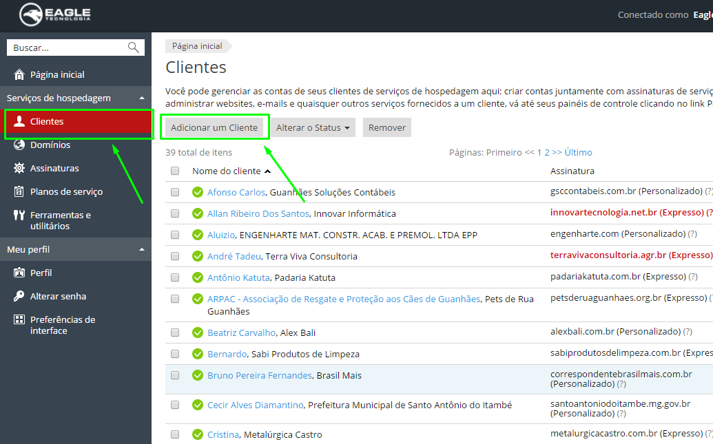
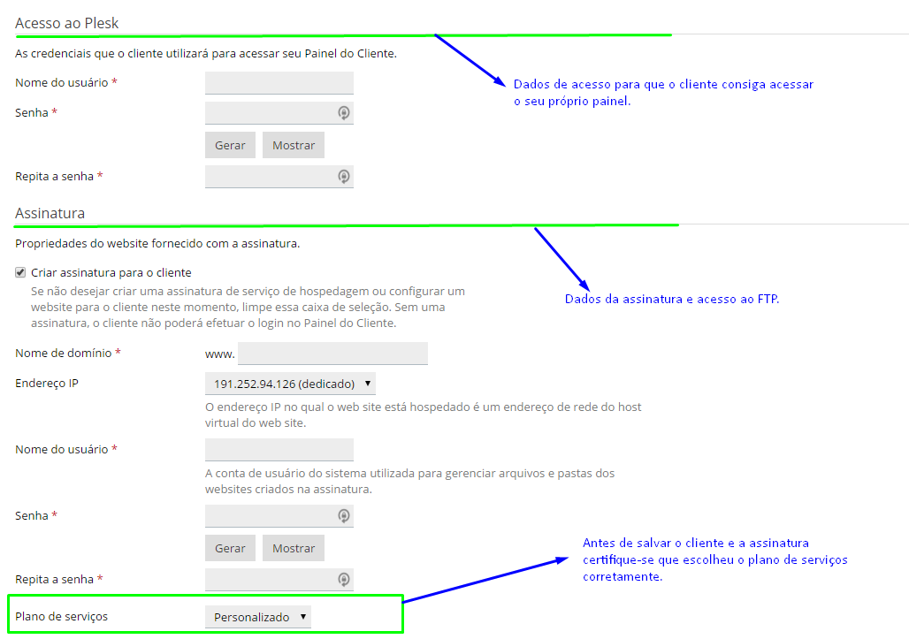
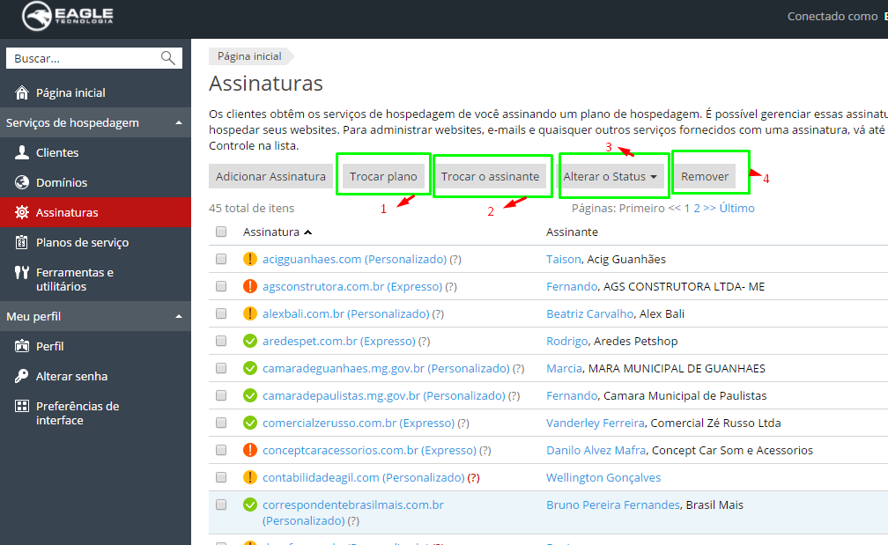
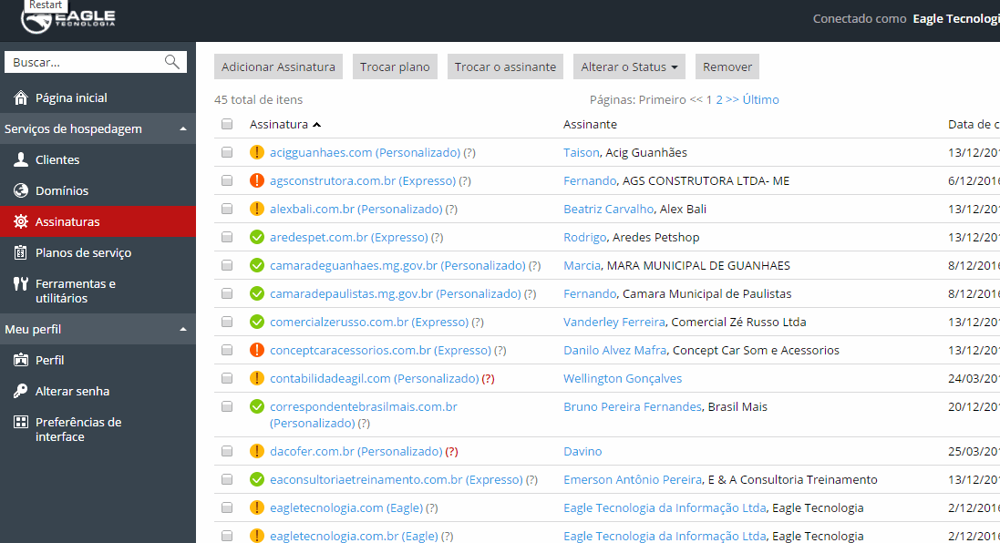
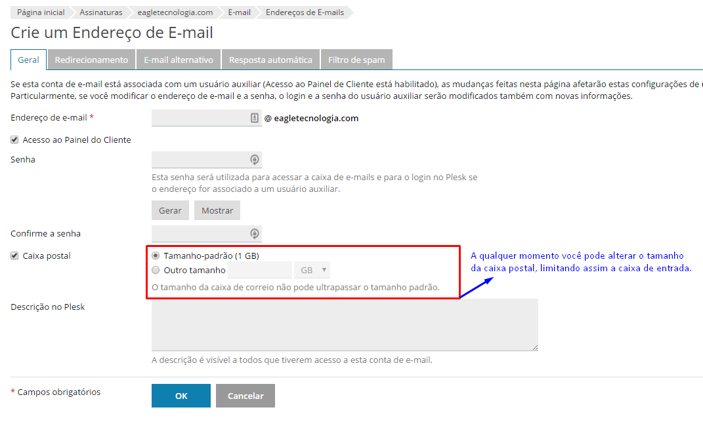
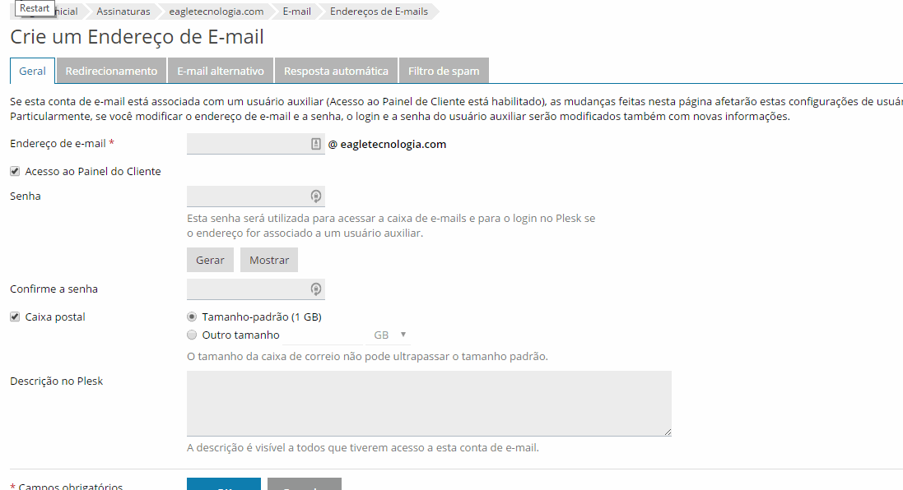
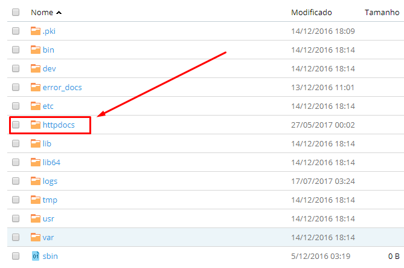
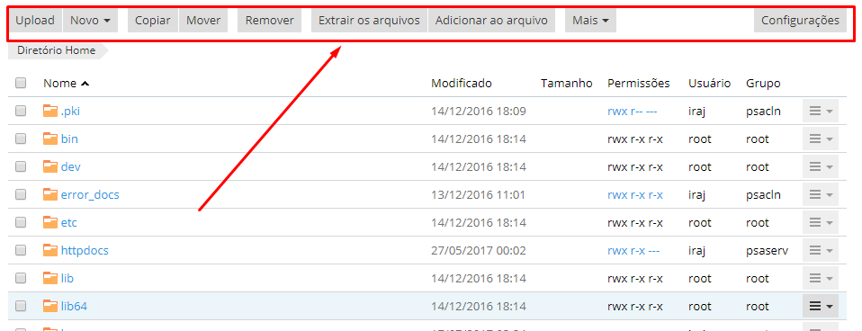

As assinaturas dentro da Revenda Plesk são registros que compõe toda a configuração da hospedagem do website, e-mail e banco de dados. Cada assinatura é identificada por um domínio, ou seja, para se cadastrar uma assinatura primeiro deve-se ter [um domínio registrado](https://ajuda.eagletecnologia.com/faq/como-registrar-um-dominio). Com o domínio registrado os passos seguintes será cadastrar o cliente, configurar assinatura, criar os e-mails e banco de dados. Faça o login na plataforma utilizando [esse link](https://plesk12l0007.hospedagemdesites.ws:8443).

## Cadastrar Cliente

Para cadastrar o cliente clique em `Clientes > Adicionar um Cliente` e preencha o formulário.

Após preencher todos os dados do Cliente, chegou a hora de entrar com as informações da assinatura. Confira na imagem os principais campos:

### Planos de Assinatura

Foi configurado na revenda plesk 3 planos de assinatura:

- **Personalizado**: esse plano cobre somente websites do tipo personalizado. **Especificações**:
	* 5GB armazenamento;
	* Tráfego Ilimitado;
	* 10 E-mails com 1GB cada caixa postal;
	* 3 bancos de dados
- **Expresso**: esse plano cobre todos websites da modalidaliade Site Expresso: **Especificações**:
	* 2GB armazenamento;
	* Tráfego Ilimitado;
	* 5 E-mails com 1GB cada caixa postal;
	* 2 bancos de dados
- **Eagle**: esse plano é epefício somente para projetos da Eagle Tecnologia: **Especificações**:
	* 8GB armazenamento;
	* Tráfego Ilimitado;
	* 20 E-mails com 1GB cada caixa postal;
	* 5 bancos de dados

## Gerenciar Assinatura

A qualquer momento você pode modificar as informações de uma assinatura e mudar o seu status.

1. Para trocar o plano de uma assinatura basta marcar as assinaturas que você quer, clicar no botão e **Selecionar plano**. Obs: caso a assinatura esteja com o símbolo de `!` amarelo, a assinatura está bloqueada para sincronização, isso significa que as informações o plano não serão sincronizadas com assinatura se caso for alterado o plano em um futuro.
2. É possível também realocar a assinatura para um outro cliente. Para isso basta marcar as assinaturas que deseja realocar e clicar no botão **Trocar o Assinante** e marque qual cliente tornará proprietário da assinatura.
3. Clicando na opção **Alterar o Status**, é possível suspender ou ativar uma assinatura. Basta marcar as assinaturas que deseja alterar o status selecionar uma opção. A opção **Suspender** irá tirar todo website, e-mails e bancos de dados do ar, ficando indisponível para acesso. Isso pode ser útil se algum cliente não pagou a fatora da hospedagem.
4. Por último temos a opção **Remover** que simplesmente deleta todos os dados da assinatura do plesk.

! **CUIDADO** com a opção **Remover** pois uma vez deletado a assinatura, não será possível **voltar os dados**.

## Criar E-mails

Para criar os e-mails primeiro clique em uma assinatura para abrir o seu painel, acesse a aba `E-mail > Crie um Endereço de E-mail`. Veja o processo na imagem abaixo:

Preencha o formulário com as informações do e-mail. Lembrando que o campo de endereço de e-mail é obrigatório e deve ser único e a senha deve ter no mínimo um caractere especial, uma letra maiúscula, um número e ter mais de 6 caracteres.

### Opções do e-mail

Ainda no formulário de e-mail existe algumas outras opções que podem ser configuradas para alterar o encaminhamento das mensagens. Veja a sequência:

- **Redirecionamento**: Configure o redirecionamento de mensagens de e-mail para um ou vários endereços de e-mail. Se sua caixa postal for ativada na guia “Geral”, as cópias de mensagens de e-mail serão armazenadas.
- **E-mail alternativo**: Os nomes alternativos de e-mail são endereços associados a um endereço de e-mail primário. Todos os e-mails enviados aos nomes alternativos serão recebidos pelo endereço de e-mail primário.
- **Resposta automática**: Configure uma resposta automática para qualquer mensagem de e-mail destinada ao seu endereço de e-mail. A resposta automática é um modo-padrão para notificar seus correspondentes sobre sua ausência ou período de férias.
- **Filtro de Spam**: O serviço de filtragem de spam detecta mensagens de spam enviadas ao endereço de e-mail. Você pode ajustar o filtro de spam para excluir as mensagens de spam, marcá-las como spam, alterando seu assunto, ou movê-las para a pasta especial de spam, que pode ser acessada por clientes de e-mail por meio do IMAP. O filtro de spam aplica uma grande variedade de testes locais e de rede para identificar assinaturas de spam.

## Gerenciar Arquivos

Na Revenda Plesk os arquivos são gerenciados na aba `Arquivos` do painel. Quando uma assinatura é cadastrada, é criado uma estrutura de pastas e arquivos padrões.

A pasta marcado em vermelho é o local público onde deverá ficar todos os arquivos do website. Qualquer arquivo colocado fora dessa pasta não será acessível.

Como qualquer outro gerenciador de arquivo, na Revenda Plesk é possível enviar, criar, copiar/mover, excluir, renomear e extrair arquivos e pastas utilizando a barra de menu superior:

Com a função de `Extrair os arquivos/Adicionar os arquivos`, é possível compactar/descompactar arquivos do tipo `.zip`. Isso ajuda na hora do envio dos arquivos do website.

! É recomendado que compacte os arquivos do website antes de enviá-lo para o gerenciador de arquivo. Com isso o envio tende a ser mais rápido e consome menos banda.

Após o envio do arquivo `.zip`, basta seleciona-lo e clicar no botão `Extrair os arquivos` para que sejam descompactados.

