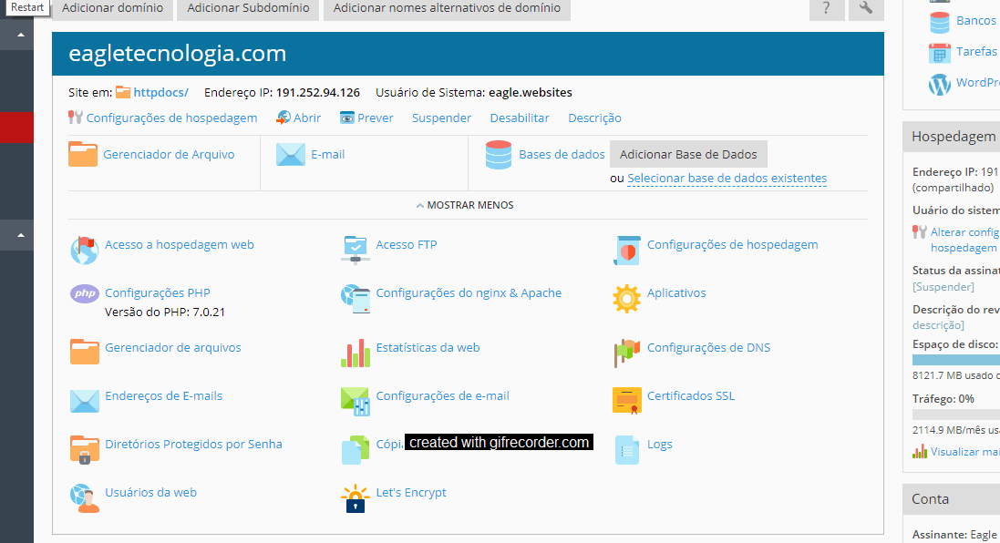
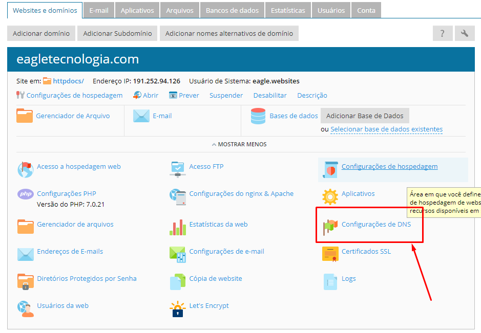
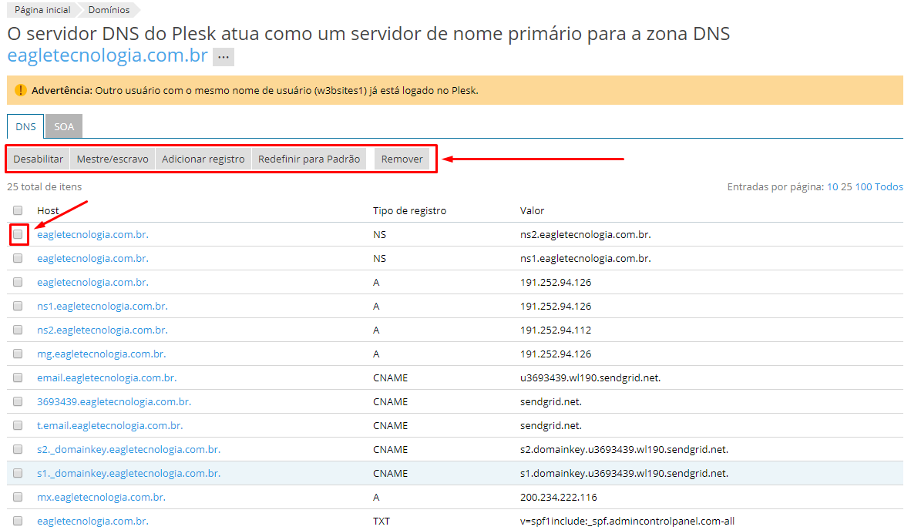
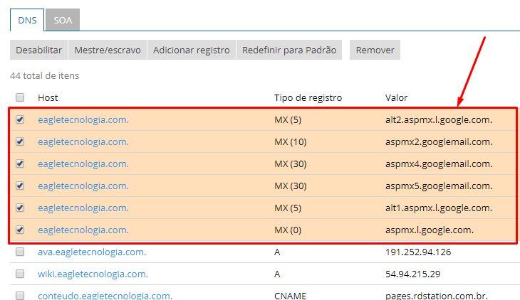
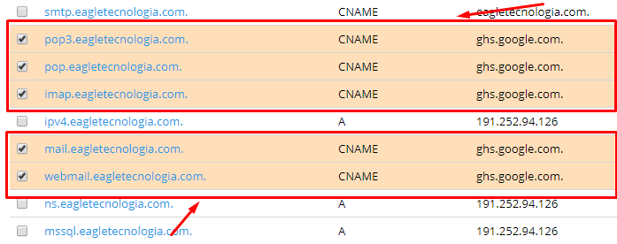
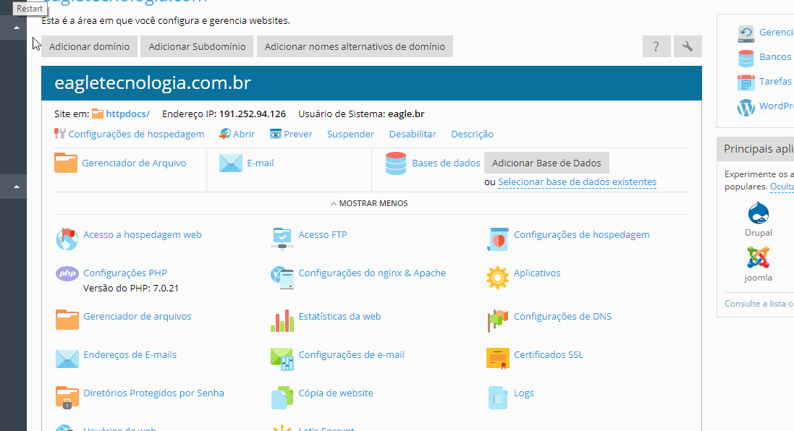
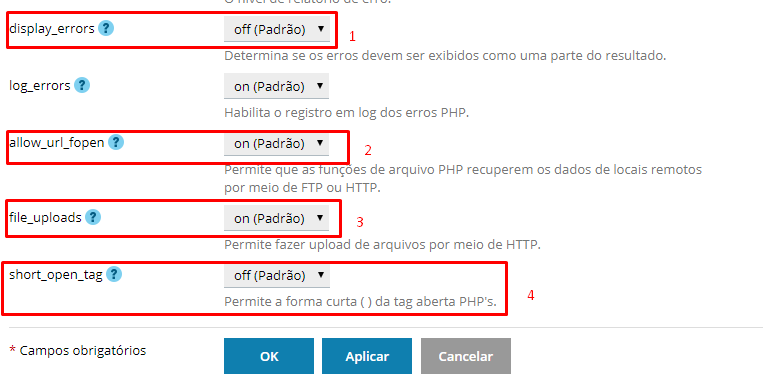

Existem algumas configurações importantes, mas que devem ter um certo cuidado ao altera-las no painel principal da assintaura. Essas configurações se não forem alteradas de forma adequeada pode tirar o website do ar.

## Let's Encrypt

O Let's Encrypt é um certificado digital gratuito que já vem embutido na Revenda Plesk. Quando se cria uma assinatura essa opção vem por padrão desativada. Ao ativá-la o domínio poderá ser acessado via `https://` tornando as informações trafegadas criptografadas e fazendo com que o website fique mais seguro e melhor ranqueável nos buscadores. Por esse motivo ao criar uma assinatura, essa opção deverá obrigatoriamente ser ativada.



As únicas opções que devem ser preenchidas é o e-mail para receber notificações caso ocorra algum problema com o certificado e o check para instalar o certificado também quando o domínio estiver com o subdomínio `www`.

! **Observação**: o certificado será renovado automaticamente 30 dias antes de expirar.

Ao ativar o _Let's Encrypt_ o protocolo `https://` já estará disponível para o domínio, porém ele não é inserido automaticamente na barra de endereço tendo que ser colocado manualmente.

Para resolver esse problema abra o arquivo `.htaccess` do projeto e adicione as seguintes linhas no final do arquivo.

```apache
RewriteEngine On 
RewriteCond %{SERVER_PORT} 80 
RewriteRule ^(.*)$ https://seudominio.com/$1 [R,L]
```

## Configurações de DNS

O servidor de DNS é um computador que recebe um nome e o converte em um IP. Os pacotes de dados em uma rede TCP/IP, como por exemplo a internet, trafegam entre endereços IP de origem e destino. Porém, as pessoas não tem facilidade de lembrar os números de IP de cada site que precisam acessar, por isto utilizam um nome, como por exemplo www.google.com, que é muito mais fácil de se lembrar. Este nome é enviado a um servidor de DNS que irá retornar o IP.

Na Revenda Plesk pode-se usar essa configuração para adicionar/remover entradas DNS para garantir acesso ao um servidor de webmail, servidor smtp, sistema externo entre outros.

Acesse o painel das configurações de DNS clicando na opção em destaque no painel principal da assinatura.



Para adicionar/deletar alguma entrada de registro DNS, basta usar a barra de menu superior. Lembrando que se for alterar alguma entrada deve-se checar o registro.



Para cada entrada de registro DNS existe um tipo específico. Confira na tabela abaixo o que significa cada tipo de registro

|Tipo|Descrição|
|----|---------|
|A|O A, também conhecido por hostname, é o registro central de um DNS, ele vincula um domínio ou subdomínio a um endereço IP direto.|
|AAAA|Executa a mesma função de A, porém, para um endereço IPv6.|
|NS|Name Server (Servidor de Domínio), especifica servidores DNS para o domínio ou subdomínio. Pelo menos, dois registros NS devem ser definidos para cada domínio. Geralmente, um principal e outro secundário.|
|CNAME|Significa Canonical NAME. Especifica um apelido (alias) para o hostname (A). É uma forma de redirecionamento.|
|MX|Sigla para Mail eXchanger. Aponta o servidor de e-mails. Pode-se especificar mais de um endereço, formando-se assim uma lista em ordem de prioridade para que haja alternativas no caso de algum e-mail não puder ser entregue.|
|PTR|PoinTeR, aponta o domínio reverso a partir de um endereço IP.|
|SOA|Start Of Authority. Indica o responsável por respostas autoritárias a um domínio, ou seja, o responsável pelo domínio. Também indica outras informações úteis como número serial da zona, replicação, etc.|
|TXT|Refere-se a TeXT, o qual permite incluir um texto curto em um hostname. Técnica usada para implementar o SPF.|
|SPF|Sender Policy Framework, é uma tentativa de controle de falsos e-mails. Permite ao administrador de um domínio definir os endereços das máquinas autorizadas a enviar mensagens neste domínio.|
|SRV|Abreviação de SeRVice, permite definir localização de serviços disponíveis em um domínio, inclusive seus protocolos e portas.|

### Configurar entradas MX para e-mails do Google

Para hospedagens que usam o Google como provedor de e-mail, deverá realizar as entradas apropriadas para que os servidores de e-mail do Google apontem de forma correta os e-mails enviados e recebidos.

Adicione os registros marcados na imagem abaixo ([Consulte a tabela de Registros MX do Google](https://support.google.com/a/answer/140034?hl=pt-BR)):



Adicione ou altere os registros existentes de forma a obter a configuração idêntica a imagem.



Após concluido todas as entradas, faça a confirmação das alterações para que seja efetivada a configuração.

! A configuração poderá demorar de 24 a 48 horas para propagar as alterações das entradas MX. Nesse período o envio e recebimento de e-mail do Gmail não funcionarão. Fique atento para fazer essas alterações de entrada MX em um dia que não há muita movimentação nos e-mails do Cliente.

## Configurações PHP

Configurar o PHP diretamente na interface da Revenda Plesk pode ser útil para determinados projetos que rodam com configurações específicas do PHP. Um exemplo disso é um projeto que rode somente na versão 5.4 do PHP. Neste caso no painel principal da assinatura é possível mudar essa configuração.



Existem outras configurações que podem ser alterados e que vão mudar o comportamento do servidor diante a requisição das páginas.



1. Habilita os erros do php no navegador, se essa opção estiver desabilitada qualquer erro resultará em uma página em branco;
2. Útil para permitir o website atualizar dados através de servidores remotos. É recomendado que fique `on` para websites baseados em CMS;
3. Permite sistemas de upload enviar arquivos para o website;
4. Se esta opção estiver habilitada, o servidor irá aceitar as tags de abertura do php ser escrita somente com `<?`.