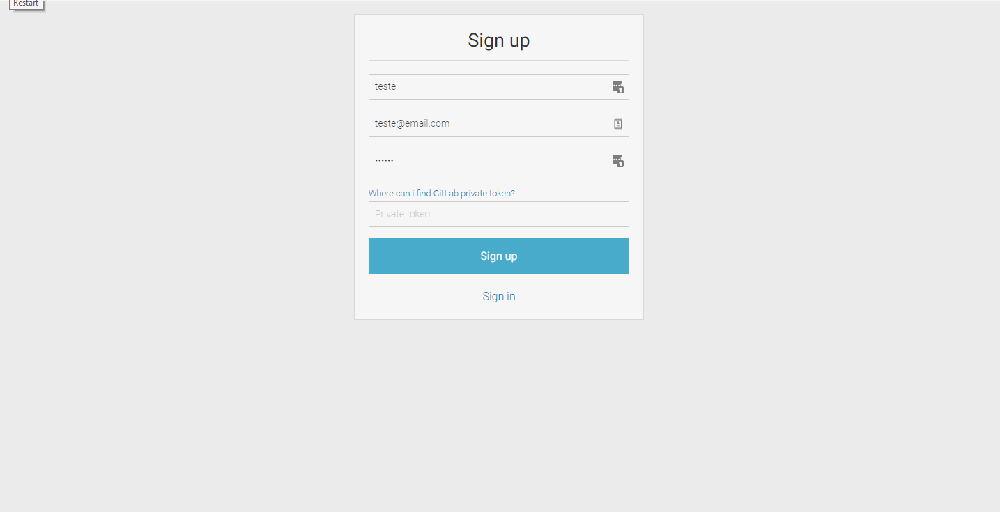
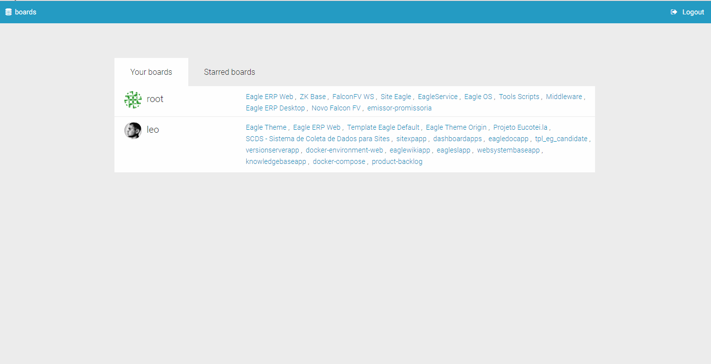
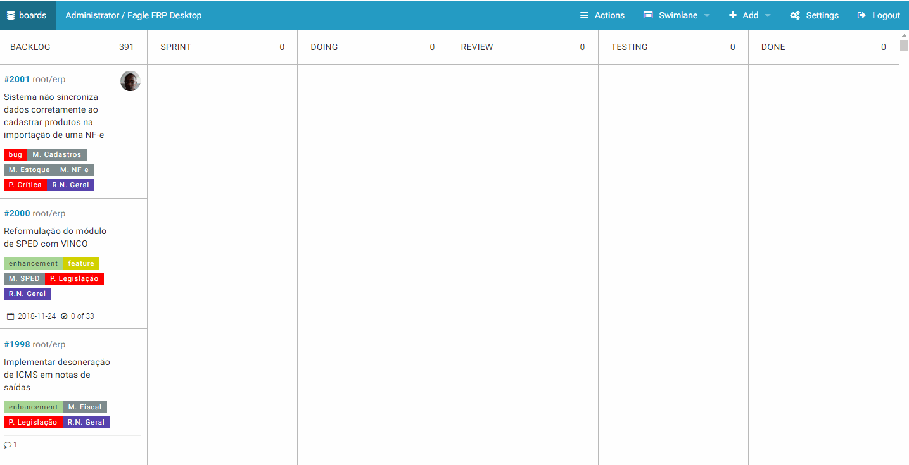
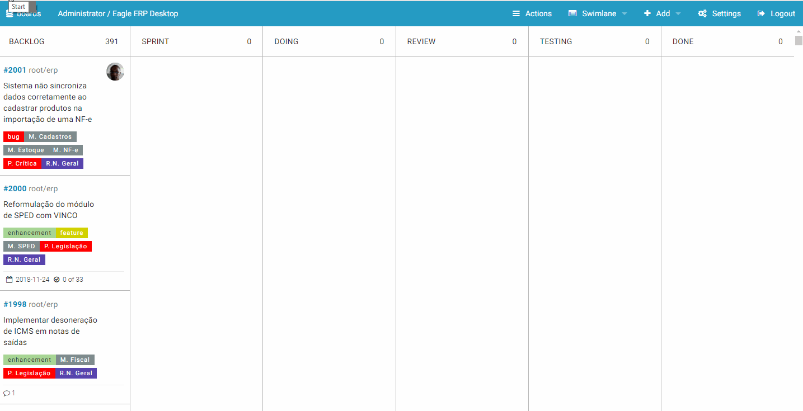
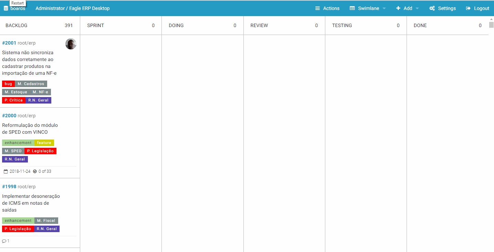

===

GitLab Kanban é um serviço para monitorar a evolução do ciclo de vida de issues de uma sprint. É composto por 6 colunas sendo:

* Backlog: São carregadas nessa coluna todas as issues criadas para o projeto;
* Sprint: Nessa ficarão as issues escolhidas pelo Product Owner para serem desenvolvidas no sprint;
* Doing: Issues que estão sendo feitas no momneto;
* Review: Issues que foram finalizadas e precisam de algum tipo de conferência pelo Gerente de Projetos;
* Testing: Issues que já foram revisadas e que estão em fase de teste;
* Done: Issues que foram testadas e já liberadas para merge no ramo master de um projeto.

## Processo

* Assim que é finalizado a reunião de Sprint Planning o Product Owner arrastará as issues priorizdas para a coluna `Sprint`;
* Cada desenvolvedor terá um acesso ao serviço no qual deverá manter a ferramenta aberta em todo o processo do Sprint. Assim que começar o Sprint o Desenvolvedor pega uma issue da coluna `Sprint`, arrasta para a coluna `Doing`, assina como membro e estipula uma data de entrega;
* Ao finalizar a issue, o desenvolvedor irá criar um Pull Request no projeto e irá empurrar para a lista de `Review`.
* A partir desse momento o responsável pela issue será o Gerente de Projetos que irá realizar os procedimentos de conferência de código e implementação. Após a conferência ele irá empurrar a issue para a lista `Testing`;
* A partir daí o Analista de Teste é responsável por realizar os procedimentos de teste;
* Testes finalizados o Analista empurra a issue para Done;

**Observações do Processo**

* Uma issue nunca pode fazer o caminho inverso, justamente para identificar qual o problema dela está parada na coluna;
* Se na coluna de teste for identificado algum bug, o Analista deverá comunicar com o desenvolvedor(s) responsável para que corrija o bug. Assim que for corrigido, o desenvolvedor comunica novamente para falar que foi corrigido. Caso o bug for muito grande, é recomendado que o analista crie uma nova demanda e a classifique como uma nova issue.
* Issues que por algum motivo foram canceladas durante a sprint deverá ser movida para a coluna de `Backlog` novamente para que no próximo sprint seja priorizada.

## Acesso ao Serviço

O serviço GitLab Kanban está hospedado no servidor interno da Eagle Tecnologia sobre o IP [192.168.1.10:8006](http://192.168.1.10:8006/).

Para facilitar e padronizar o acesso é recomendado que crie um virtual host de nome `gitlab-kanban`. Em ambientes windows basta alterar o arquivo `hosts` localizado em `C:\Windows\System32\drivers\etc` e inserir ao final da linha `192.168.1.10  gitlab-kanban`. Ao realizar esse procedinento basta acessar no navegador `gitlab-kanban/`.

## Como realizar um cadastro

Para fazer o cadastro no serviço basta clicar no link `Sign up` da tela de login e preencher as informações.

!!! Para preencher o campo `Private Token` é necessário clicar no link que está acima do campo, logar com o seu usuário no GitLab e copiar o código do campo `Private Token`.

Após feito o cadastro, entre com seu usuário e na primeira tela ficará disponível todos os projetos que você tem acesso. Clique no projeto e logo já visualizará a página com as colunas do fluxo Scrum.

## Filtragem de issues

O serviço permite uma filtragem bem completa de issues. Sendo possível filtrar por labels, prioridade, milestones e usuários. Basta clicar no menu `Actions` e marcar o que deseja ser filtrado. Caso deseje limpar os filtros, basta clicar na opção `None` na categoria de filtro.

## Divisão de Issues

O serviço também permite realizar divisão de issues por usuário, milestone e prioridade. Basta selecionar a opção desejada no menu `Swimlane`. Caso deseje retirar a divisão basta selecinar a opção `Reset`.

## Gerenciando Issues

Como o GitLab Kanban se integra totalmente ao Gitlab é possível através dele fazer o gerenciamento completo das issues como: 
Cadastrar, editar e fechar. Para adicionar uma issue ou milestone acesse o menu `Add` e escolha a opção que deseja cadastrar.

**Editar uma issue**

Para realizar a edição de uma issue basta clicar no link de seu código e depois clicar no botão `Edit Issue` na parte inferior da janela. A edição permite mudar o nome, descrição, assinatura, labels, prioridades, milestones e data de entrega.

**Fechar uma issue**

Há duas formas de fechar uma issue no serviço. A primeira forma é pela edição clicando no botão `Mark as Closed` em vermelho. A Segunda forma é quando a issue é arrastada para a coluna `Done`, irá aparecer um botão `close`.

## Labels de controle do Serviço

Para que o Gitlab Kanban gerencie o fluxo, ao mover uma issue de uma coluna para a outra é usado um padrão de labels lá no GitLab com o seguinte formato:

**KB[stage][0][Backlog]**

**Onde**:

**KB[stage]** - prefixo da coluna reservada

**[0]** - posição da coluna

**[Backlog]** - título da coluna

Cada coluna do fluxo equivale a um label padronizado do serviço no GitLab.

!!! Se ao mover uma issue #1998 da coluna `Backlog` para `Sprint` o serviço irá inserir a label `KB[stage][20][Sprint]` no GitLab. Se a mesma for movida para `Doing` a label da coluna `Sprint` é retirada e inserida a `KB[stage][20][Doing]`.

!! O nome dessas labels não devem ser alteradas diretamente no GitLab, pois irá causar falha no serviço.

## Gerenciar Colunas

Para alterar o nome da coluna do fluxo, acesse o menu `Settings`, altere o nome e clique em update. Se for necessário acrescentar uma coluna basta clicar em `Add new stage`.

