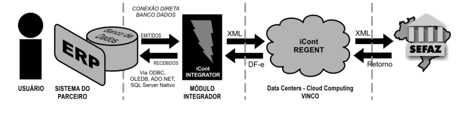

===

## Introdução
Este guia tem por objetivo mostrar ao desenvolvedor os links de documentação para instalar, configurar e implementar a integração com as soluções iContDFe e iContSPED.

## Infraestrutura
1. A SOLUÇÃO iCont® e os ambientes da VINCO estão apoiados na plataforma: Windows® | .NET | C#.
1. A SOLUÇÃO iCont® permite a integração e usabilidade com os ambientes DESKTOP e WEB.
1. Permite a integração e usabilidade com diversas linguagens de programação, por
exemplo, .Visual Basic®, Delphi®, FoxPro®, Clipper®, .NET e outros.
1.  Permite a integração e usabilidade com diversos banco de dados, por exemplo,
.SQL Server®, Firebird®, Oracle®, .DBF®, Access®, MySQL®, PostGree®, Paradox® e outros.
1. Permite a usabilidade com os ambientes fora da plataforma Windows®, por
exemplo, Linux®, Java® e Android®, através da integração via tecnologia BUS Service.

## Integração

A solução iCont®DFe receberá do Eagle Gestão um conjunto de dados já existentes e os transforma em documentos fiscais eletrônicos sendo que essas informações devem estar de acordo com a operação fiscal à qual ela se destina, caso contrário o arquivo digital ficará incorreto e/ou será reprovado. A integração via conexão ao banco de dados que é a mais recomendada consiste nas seguintes etapas:

1. **Conexão ao DB:** a conexão será feita de forma direta ao banco de dados através de fonte de dados:
ODBC, OLEDB ADO.NET ou SQL Server nativo.
1. **Captura dos dados:** as dados serão colhidos diretamente das tabelas e campos através de queries
executadas ao DB.
1. **Acionamento da captura dos dados:** a execução da extração de dados será acionada através de DLL de
InterOp que permitem, inclusive, detalhes operacionais controláveis, passagens de parâmetros,
aplicação de filtros e acionamento de telas do aplicativo através de funções da DLL.
1.** Montagem do XML:** não há a necessidade do setor de desenvolvimento conhecer a estrutura do arquivo DF-e nem
gerar arquivos para troca de dados como TXT ou XML, a própria SOLUÇÃO iCont® fará a composição do
arquivo XML utilizando-se dos dados capturados do DB.
1. **Validação do Schema:** após a montagem do XML, o iCont® aplica a verificação de um schema próprio da
SOLUÇÃO validando a estrutura do arquivo e a existência de determinadas inconsistências, evitando a
geração de XMLs incompletos ou inválidos.
1. **Envio e recebimento do arquivo para a SEFAZ:** o iCont INTEGRATOR fará a comunicação entre o ambiente
do CLIENTE e o ambiente web externo.

## iContDFe
1. O iContDFe é um componente que pode ser integrado ao nosso sistema conectando em diretamente em banco de dados e capturando informações através de querys que são mapeadas utilizando-se recursos de arrastar e soltar tendo como resultado ageração dos XML no layout correto e comunicação com a SEFAZ de qualquer DF-e: NF-e, NFS-e, NFC-e, SAT, CT-e, MDF-e.
1. [Download e Instalação ConfigExtractor](http://ajuda.vinco.com.br/2-uncategorised/3492-passo-3-download-e-instalacao-configextractor);
1. [Configure o sistema desejado](http://ajuda.vinco.com.br/2-uncategorised/3502-passo-4-inicio-do-desenvolvimento);
1. [Inicie o mapeamento dos campos de dados](http://ajuda.vinco.com.br/2-uncategorised/3512-passo-5-mapeando-os-dados);
1. Após o mapeamento dos campos implemente os returns;
1. Baixe os esquemas mais atualizados dos documentos fiscais;
1. Baixe a versão mais atualizada do [XSDDiagram]( http://regis.cosnier.free.fr/?page=XSDDiagram) para visualizar graficamente os esquemas dos documentos desejados;
1. [Após mapeamento dos dados inicie a vinculação dos campos](http://ajuda.vinco.com.br/2-uncategorised/3522-passo-6-associando-os-campos);
1. [Realiza os testes de emissão dos documentos](http://ajuda.vinco.com.br/2-uncategorised/3532-passo-7-testando-e-salvando-o-dfe);
1. [Trabalhando com homologação e produção](http://ajuda.vinco.com.br/2-uncategorised/3542-homologacao-e-producao);
1. [Passos Iniciais DF-e com DLL e ConfigExtractor](http://nfe.vinco.com.br/NFe/Download/DLLInterOpDelphi.aspx);

! O backup das integrações deve ser feito e armazenados regularmente.

## iContSPED
O iContSPED é um componente que pode ser integrado ao nosso sistema conectando em diretamente em banco de dados e capturando informações através de querys que são mapeadas utilizando-se recursos de arrastar e soltar tendo como resultado o arquivo fiscal no layout correto.

[Realize o download do ConfigExtractor do iContSPED](http://sped.vinco.com.br/SPED/Download/ConfigExtractor.aspx)

[Siga estas orientações para realizar a integração](http://ajuda.vinco.com.br/ajuda/3572-passos-iniciais-icontsped)

## Contingência

As SOLUÇÕES iCont®DFe contemplam as seguintes contingências:

1. **SVC – SEFAZ VIRTUAL DE CONTINGÊNCIA:** alternativa de emissão de NF-e | CT-e em contingência com transmissão da NF-e | CT-e para uma das SEFAZ Virtuais de Contingência, observando-se:
* Nesta modalidade de contingência o DANFE | DACTE poderá ser impresso em papel comum A4;
* A utilização da SVC depende de ativação da SEFAZ de origem, ou seja, a SVC só entra em operação quando a própria SEFAZ de origem estiver com problemas técnicos que impossibilitam a recepção da NF-e | CT-e;
* Não existe necessidade de transmissão da NF-e | CT-e para a SEFAZ de origem quando cessarem os problemas técnicos que impediam a transmissão;
* A ativação de contingência SVC poderá ocorrer de forma manual (pelo USUÁRIO) ou de forma automatizada através de configuração das DLLs.

1. **Off-line:** No caso do ambiente do cliente apresentar problema de comunicação com internet, a SOLUÇÃO iCont®DFe emitirá uma mensagem de aviso e permitirá a emissão dos documentos eletrônicos em modo de contingência off-line.
* A ativação da contingência off-line poderá ocorrer de forma manual (pelo USUÁRIO) ou de forma automatizada através de configuração das DLLs.
* A SOLUÇÃO iCont®DFe emitirá um arquivo XML temporário e o DANFE NFC-e com a respectiva mensagem de emissão em ambiente de contingência.
* O CLIENTE deverá ficar atento para não perder o prazo permitido para contingência que, na maioria dos estados é de 24 horas úteis, mas poderá variar conforme a legislação estadual.
* Quando a comunicação com a internet for restabelecida, o CLIENTE deverá ativar o processo da SOLUÇÃO iCont®DFe que permite o reenvio dos arquivos XML gerados em modo de contingência off-line.

## Suporte

1. **Canais de suporte:** O suporte contempla o atendimento para o esclarecimento de dúvidas e auxílio na operação dos recursos do próprio iContDFe e iContSPED dentro das seguintes confições:
* E-mail: suporte@vinco.com.br.
* Telefone: (11) 3142-9944.
* FAQ: através do link [http://vinco.com.br/faq](http://vinco.com.br/faq).
* Tutoriais: através do link [http://vinco.com.br/documentos](http://vinco.com.br/documentos).
* Vídeos: através do link [http://vinco.com.br/videos](http://vinco.com.br/videos).
* SKYPE: somente com horário agendado e desde que seja autorizado por um profissional da VINCO.
* Acesso remoto: somente com horário agendado e desde que seja autorizado por um profissional da
VINCO.

1. **Horário de atendimento:** o suporte será prestado em horário comercial com base no fuso horário e dias
úteis do calendário do município de São Paulo, estado de São Paulo, Brasil, das 09h00min às 12h00min
e das 13h30min às 17h00min.

1. **Suporte (1º nível):** o suporte de 1º nível será sempre de nossa responsabilidade não havendo em nenhuma hipótese o contato direto da Vinco com nossos clientes.

1. **Suporte (2º nível):** o suporte de 2º nível será prestado pela VINCO, porém considerar-se-á 2º nível somente o suporte que se enquadrar em pelo menos uma das três situações:
* bugs (panes) nos softwares fornecidos pela própria VINCO;
* problemas operacionais nos servidores da VINCO;
* dificuldades na operação dos softwares fornecidos pela própria VINCO.

1. **Tempo de atendimento:** o tempo de resposta da VINCO para as dúvidas e solicitações enviadas irá variar de acordo com o assunto e da disponibilidade da equipe de suporte técnico:
* **Baixa complexidade:** as dúvidas e solicitações de baixa complexidade enviadas durante o horário comercial até às 17h00min, geralmente, são respondidos no mesmo dia ou em até 1 (um) dia útil.
* **Média e alta complexidade:** as dúvidas e solicitações de média e alta complexidade serão avaliadas caso a caso e o tempo de atendimento será informado pela VINCO. O tempo de atendimento para situações de média e alta complexidade, geralmente, são superiores a 2 (dois) dias úteis, uma vez que a SOLUÇÃO possui uma ampla abrangência técnica e fiscal podendo, inclusive, depender de definições e retornos da SEFAZ ou Prefeituras.
* **Plantão de atendimento:** para situações de urgência que necessitem atendimento fora do horário comercial ligue no telefone (11) 97548-2985. As chamadas serão recebidas, analisadas e encaminhadas à equipe de suporte da VINCO que retornará por e-mail, informando o tempo necessário e a forma que a solicitação será atendida.

!!!! Caso tenha alguma dúvida leia a ampla documentação disponibilizada acima.