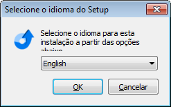

===

## Instalação do Inno Setup
1. Baixe neste [link](https://mlaan2.home.xs4all.nl/ispack/innosetup-5.5.9.exe) o instalador
1. Instale mantendo as opções sugeridas

## Objetivos
Este guia tem por objetivo orientar profissionais do setor desenvolvimento quanto a instalação e configuração do ambiente de desenvolvimento em delphi:

## Instalação do Git
1. Baixe [Git](https://git-scm.com/download/win) e instale;
1. Nas propriedade do Git Bash configure o campo **Iniciar em** com a informação `C:\development`


## Hosts
1. Abra o arquivo `C:\Windows\System32\drivers\etc\hosts\`
1. Insira na depois da última linha do arquivo
- `192.168.1.10        gitlab`
- `192.168.1.10        jira-software`

## Instalação do Delphi XE8
1.Execute o arquivo `install_RADStudio.exe` na pasta de instalação e clique em `Install Delphi XE8 and/or C++ Builder XE8`.

1. Aguarde até a opção de selecionar idioma. Selecione o idioma e clique em `Ok`

1. Na tela seguinte clique na primeira caixa de confirmação que o texto começa em “I agree to the...” e desmarque a seguinte caixa de confirmação e clique em `Next`.

1. Informe o serial do produto. Clique em `Next`.

1. Na tela seguinte marque a opção Delphi XE8 e deixe a opção C++ desmarcada. Clique em `Next`.

1. Siga para a tela de funcionalidades. Desmarque pelo menos a instalação do FastReport e clique em `Next`.

1. Avance até que a instalação inicie. Ao fim da instalação será exibida a seguinte tela:

1. Deixe desmarcadas as duas caixas de confirmação e clique em `Finish`.
1. Após encerrada a instalação abra o Delphi XE8. Serão exibidas opções para a ativação do mesmo. Ignore e feche as telas. 
1. Ative o delphi.
1. Abra o delphi
1. Em `Tools > Options > Eviroment Variables > User overrides` crie o alias `frameworks` apontando para um diretório que contenha os frameworks `Aspect4Delphi`,`db`,`DEB`,`Delphi-Mocks`,`dsharp`,`spring4d`, `x-superobject`
1. Em `Tools > Options > Editor Options` Desmarque a opção `Create Backup Files`
1. Em `Tools > Options > Editor Options > Library > Library path` cole os paths:
```
$(BDSLIB)\$(Platform)\release;$(BDSUSERDIR)\Imports;$(BDS)\Imports;$(BDSCOMMONDIR)\Dcp;$(BDS)\include;C:\Program Files (x86)\Raize\CS5\Lib\RS-XE8\Win32;C:\development\components\FastReport\LibD22;C:\development\components\fortesreport-ce\Binary\LibD22;C:\development\components\ACBr\Lib\Delphi\LibD22;C:\development\components\ZeosDBO\src\component;C:\development\components\ZeosDBO\src\core;C:\development\components\ZeosDBO\src\dbc;C:\development\components\ZeosDBO\src\parsesql;C:\development\components\ZeosDBO\src\plain;C:\development\components\mycomponents;C:\development\components\myComponents\MyDBGrid;$(VirtualTreeView)\Source;$(dsharp)\Aspects;$(dsharp)\Bindings;$(dsharp)\Collections;$(dsharp)\ComponentModel;$(dsharp)\Components;$(dsharp)\Core;$(dsharp)\DelphiWebScript;$(dsharp)\DevExpress;$(dsharp)\Interception;$(dsharp)\Logging;$(dsharp)\PresentationModel;$(dsharp)\Testing;$(dsharp)\Windows;$(spring4d)\;$(spring4d)\Base;$(spring4d)\Base\Collections;$(spring4d)\Base\Logging;$(spring4d)\Base\Patches;$(spring4d)\Base\Patterns;$(spring4d)\Core\Container;$(spring4d)\Core\Interception;$(spring4d)\Core\Logging;$(spring4d)\Core\Mocking;$(spring4d)\Core\Services;$(spring4d)\Data\ObjectDataSet;$(spring4d)\Extensions\Cryptography;$(spring4d)\Extensions\Utils;$(spring4d)\Persistence\Adapters;$(spring4d)\Persistence\Core;$(spring4d)\Persistence\Criteria;$(spring4d)\Persistence\Mapping;$(spring4d)\Persistence\SQL;C:\Users\Pedro\AppData\Local\Programs\TestInsight\Source
```

## Estrutura de Diretórios
1. Para iniciar a configuração do ambiente de desenvolvimento é necessária a criação da seguinte estrutura dentro do diretório C:

- `C:\development\`: Diretório raiz do desenvolvimento
- `C:\development\build\`: Diretório para direcionamento das compilações dos projetos
- `C:\development\components\`: Diretório para armazenamento dos componentes Fortesreports, FastReport, ACBr, mycomponents e ZeosDBO.
- `C:\development\projects\`: Diretório para armazenar os projetos

## Instalação do Fast Report
1. Se o DelphiXE8 estiver aberto feche;
1. Clone o repositório do FastReport dentro da pasta `C:\development\components`;
```
git clone http://@gitlab/root/fastreport.git
```
1. Dê um checkout na tag 5.4.6
1. Execute `C:\development\components\FastReport\recompile.exe` como Administrador;

1. Confira a versão do Delphi;
1. Selecione a versão `Entreprise` do FastReport;
1. Selecione a versão `TeeChartStd` do TeeChart;
1. Selecione `Change language to Brazil`;
1. Clique em `Compile`;
1. Clique em `OK`.
1. Ainda com o `recompile.exe` aberto

1. Selecione `Recompile all packages`;
1. Clique em `Compile`
1. Clique em `OK`.
1. Execute o arquivo `C:\development\components\FastReport\LibD22\Copybpl.bat` 

1. Abra o Delphi
1. Confira se o path `C:\development\components\FastReport\LibD22` se encontra em `Tools > Options > Library > Library Path`;
1. Com o Delphi aberto clique em  `Component > Install Packages`

1. Clique em `Add`;
1. Selecione todos os pacotes DCL;
1. Clique em `Abrir`

1. Confira os pacotes adicionados;

1. Clique em `OK`;

## Instalação do Fortes Report
1. Se o DelphiXE8 estiver aberto feche;
1. Clone o repositório Fortes Report dentro da pasta `C:\development\components`;
```
git clone https://github.com/fortesinformatica/fortesreport-ce.git
```
1. Execute o arquivo `c:\development\components\fortesreport-ce\frceInstall.exe`; 

1. Verifique a versão do delphi e clique em `Próximo`

1. Clique em `Próximo`

1. Clique em `Instalar` e aguarde

1. Aguarde

1. Após instalação com sucesso clique em `Finalizar`

1. Como Delphi aberto solicite uma nova aplicação e verifique se os componentes do FortesReport aparecerão na paleta de componentes. Um teste de compilação também poderá ser feito.


## Instalação do ACBr
1. Feche o DelphiXE8;
1. Baixe e instale a versão mais atualizada do [TortoiseSVN](https://tortoisesvn.net/downloads.html);
1. Crie o diretório `C:\development\components\ACBR`;
1. Na pasta ACBR clique em `SVN Checkout` e informe a url `svn://svn.code.sf.net/p/acbr/code/trunk2`;
1. Execute o arquivo `C:\development\components\ACBr\ACBrInstall_Trunk2.exe`;

1. Clique em `Próximo`;
1. Na tela de configurações vamos configurar nossa instalação

1. Verifique se o diretório de instalação está informado corretamente;
1. Marque a opção `Deixar somente a pasta LibXX no Library Path do Delphi`;
1. Marque a opção `Copiar todas as Dll’s` para que o install copie as dlls do opensll e outras necessárias para o system do windows;
1. Clique em `Próximo`;

1. Marque todas as opções e clique em `Próximo`;

1. Clique em `Instalar` e aguarde;

1. Após compilados e instalados com sucesso os pacotes, clique em `OK` e `Próximo`;

1. Clique em `Finalizar`.
! É possível que a instalação do ACBr não tenha transferido para a pasta do Windows algumas DLL’s. Caso isso ocorra, copie-as da pasta do ACBr que foi baixada e cole-as na pasta system32 para sistema de 32-bits ou na pasta SysWOW64 para sistema de 64-bits. Feito isso o Delphi deve abrir sem erros.

## Instalação do ZEOSDBO
1. Feche o DelphiXE8;
1. Baixe e instale a versão mais atualizada do [TortoiseSVN](https://tortoisesvn.net/downloads.html);
1. Crie o diretório `C:\development\components\ZeosDBO`;
1. Na pasta ZeosDBO clique em `SVN Checkout` e informe a url `http://svn.code.sf.net/p/zeoslib/code-0/trunk`;
1. Abra o Delphi
1. Confira se o path `C:\development\components\ZeosDBO\src\component;C:\development\components\ZeosDBO\src\core, dbc, parsesql, e plain;` se encontram em `Tools > Options > Library > Library Path`;
1. Clique em `File > Open Project`;
1. Abra o arquivo `C:\development\components\ZeosDBO\packages\DelphiXE8\ProjectGroup22.groupproj`;

1. Logo após, na janela Project Manager clique em `Project > Build All Projects`;

1. Aguarde e clique em `OK`.
1. Na janela Project Manager clique com o botão direito em `ZComponentDesign220.bpl` e clique em `Install`;

1. Clique em `OK`;
1. Feche o DelphiXE8 sem salvar alterações;

! Por motivos de compativilidade as librarys do Zeos serão mantidas no path do Delphi e as novas funcionalidades de acesso a banco serão implementadas com o FireDAC

## Instalação do MyComponents
1. Se o DelphiXE8 estiver aberto feche;
1. Clone o repositório MyComponents dentro da pasta `C:\development\components`;
```
git clone http://@gitlab/root/myComponents.git
git checkout develop
```
1. Abra o Delphi
1. Confira se o path `C:\development\components\myComponents` e `C:\development\components\myComponents\MyDBGrid` se encontra em `Tools > Options > Library > Library Path`;
1. Clique em `File > Open Project`;
1. Abra o arquivo `C:\development\components\mycomponents\packages\DelphiXE8\MyComponents.dpk`;
1. Logo após, na janela Project Manager clique em `Project > Build All Projects`;
1. Aguarde e clique em `OK`.
1. Na janela Project Manager clique com o botão direito em `MyComponents.bpl` e clique em `Install`;
1. Clique em `OK`;
1. Feche o DelphiXE8 sem salvar alterações;

## Instalação do Spring4D
1. Se o Delphi estiver aberto feche;
1. Clone o repositório do Spring4D dentro da pasta desejada;
```
git clone https://bitbucket.org/sglienke/spring4d.git
git fetch develop
git checkout develop
```
1. Abra o Delphi;
1. Em `Tools > Options > Enviroment Variables > User overrides` crie um alias `spring4d` apontando para a pasta `source` do framework:

## Instalação do DSharp
1. Se o Delphi estiver aberto feche;
1. Clone o repositório do DSharp dentro da pasta desejada;
```
git clone https://bitbucket.org/sglienke/dsharp.git
git fetch spring-1.2.1
git checkout spring-1.2.1
```
1. Abra o Delphi;
1. Em `Tools > Options > Enviroment Variables > User overrides` crie um alias `dsharp` apontando para a pasta `source` do framework:

## Test Insight
1. O Test Insdign é um plugin que pode ser instalado no delphi para gerenciar e executar projetos de testes unitários.
1. Para baixar o plugin efetue o download do [TestInsight](https://bitbucket.org/sglienke/testinsight/wiki/Home).
1. Instale o plugin.
1. Abra o Delphi
1. Verifique o plugin em `View / TestInsight Explorer`

## Compilando Projetos
1. Clone o repositório includes dentro da pasta `C:\development\projects`; 
```
git clone http://@gitlab/root/includes.git
```

1. Clone o repositório eagle-pdv dentro da pasta `C:\development\projects`; 
```
git clone http://@gitlab/root/eagle-pdv.git
```

1. Clone o repositório eaglegestao dentro da pasta `C:\development\projects`; 
```
git clone http://@gitlab/root/erp.git
```

## Configurar utilitário de assinatura digital
Para evitar problemas com antivírus e ferramentas de diagnóstico utilizadas para aceso a site de bancos será necessário configurar o [Signtool](https://msdn.microsoft.com/pt-br/library/8s9b9yaz(v=vs.110).aspx) que é uma ferramenta que assina digitalmente arquivos. Siga os seguintes passos para configurar esta ferramenta:

1. Instale o Microsoft [Windows SDK for Windows 7 and .NET Framework 4](https://msdn.microsoft.com/pt-br/library/8s9b9yaz(v=vs.110).aspx) marcando todas as opções.

O certificado que será usado para assinar os arquivos que serão distribuídos foi gerado seguindo os seguintes passos:

1. Baixando e instalando o [Win32 OpenSSL](http://slproweb.com/download/Win32OpenSSL-1_0_2d.exe)
2. Criando e executando um arquivo de lote (.bat) com o seguinte código
```bat
set OPENSSL_CONF=C:\OpenSSL-Win64\bin\openssl.cfg
openssl req -x509 -nodes -days 3650 -newkey rsa:1024 -keyout eagletecnologia.pem -out eagletecnologia.pem
openssl pkcs12 -export -out eagletecnologia.pfx -in eagletecnologia.pem -name "Eagle Tecnologia"
```
3. Após executar o arquivo informe as seguintes informações:
```bat
Country Name: BR
State or Province Name: MInas Gerais
Locality Name: Guanhaes
Organization Name: Eagle Tecnologia
Organizational Unit Name: Dev
Common Name: Eagle Tecnologia
Email Address: dev@eagletecnologia.com
```
4. Quando for solicitado a senha informe D3v
5. Por fim foi gerado o Certificado Digital que terá validade para 10 anos a partir de 08/11/2015

Certificado de assinatura de executáveis da Eagle Tecnologia [Baixar](http://ava.eagletecnologia.com/pluginfile.php/496/mod_page/content/6/eagletecnologia.pfx)

Fonte:

http://thundaxsoftware.blogspot.com.br/2011/04/signing-your-delphi-applications-with.html

http://www.projetoacbr.com.br/forum/topic/22838-icones-e-bot%C3%B5es-sumindo/

## Instalação do Utilitário Inno Setup

## Fontes

- https://community.embarcadero.com/blogs/jim-mckeeth-podcast-at-delphi/entry/continuous-integration-with-svn-jenkins-and-dunit-delphi-with-craig-chapman