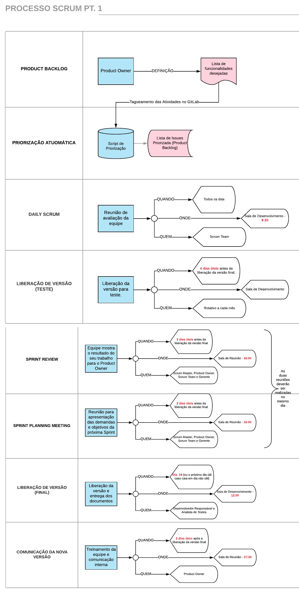

===

A concepção e o desenvolvimento de um software é algo que demanda inúmeras ferramentas e processos afim de se garantir o mínimo de controle e qualidade do produto final. Sendo esta uma tarefa de cunho intelectual, as únicas formas de se controlar o processo é por meio do uso de padrões e ferramentas. Aqui será exposto todo o arcabouço de padrões, normas, ferramentas e boas práticas que deverão ser adotados pelos envolvidos no processo de desenvolvimento.

Como cada projeto pode possuir particularidades, sempre que necessário o processo poderá sobre ajustes para se adequar as necessidades de cada produto. 

Será utilizado o projeto do Eagle Gestão como base para o processo de desenvolvimento, visto que este é o maior e mais complexo.

## Metodologias e Práticas

### Scrum

Para a gestão de projetos a Eagle Tecnologia adota como metodologia ágil Scrum.

Para maiores detalhes da metodologia clique [aqui](../processo-scrum) e [aqui](http://www.desenvolvimentoagil.com.br/scrum/).

A seguir temos o diagrama do fluxo de trabalho executado nos projetos da Eagle como base no Scrum.



**Caso precice baixar o Processo:**
* [PROCESSO SCRUM PT. 1.pdf](PROCESSO%20SCRUM%20PT.%201.pdf)
* [PROCESSO SCRUM PT. 2.pdf](PROCESSO%20SCRUM%20PT.%202.pdf)
* Projeto para Edição ([Pt 1](https://www.lucidchart.com/invitations/accept/3036aed1-2a69-43b6-b727-f5cd93cd8bbf), [Pt 2](https://www.lucidchart.com/invitations/accept/65299fc0-a7d9-4150-948a-21014d483f8c))

### Git flow

O [Git Flow](http://nvie.com/posts/a-successful-git-branching-model/) é um modelo de organização de _branches_ (ramos) que tem por finalidade facilitar o gerenciamento e a manutenção de inumeros ramos durante o processo de desenvovolvimento de um _software_.

Por se tratar de um modelo de organização de _branches_ o Git Flow estabelece algumas regras de nomenclaturas e função para os ramos. Vejamos a seguir os tipos e funções:

* **Branch master** - É o _branch_ que contém o código em nível de produção, ou seja, o código mais estável da aplicação. Este ramo somente é alterado no momento da liberação de uma nova versão.
* **Branch develop** - É o _branch_ que contém o código em nível de desenvolvimento, ou seja, é o ramo de integração dos fontes produzidos durante as implementações das features.
* **Branch feature/\*** - São _branches_ nos quais as novas funcionalidades são implementadas. Por convenção seus nomes possuem o prefixo "feature/" seguido do nome da _feature_, no entanto, para fins de rastreabilidade e melhor gerenciamento o padrão adotado será "feature/issue_(numero da issue)".<br/>
Os branchs do tipo feature são criados sempre com base no ramo **_develop_** pois as novas funcionalidades podem depender diretamente de outros recursos em desenvolvimento.
* **Branch hotfix/\*** - São _branches_ nos quais são realizadas implementações de correções das versões que estão em produção, desta forma são criados com base no ramo **_master_**. Por convenção seus nomes possuem o prefixo "hotfix/" seguido do número da versão que será gerada após o fechamento do mesmo.
* **Branch release/\*** - São _branches_ gerados com base no ramo "develop" e tem por finalidade apoiar o a fase final do processo de liberação de uma versão.<br/>Ramos _release_ possuem o código em estado beta de desenvolvimento, o qual deve ser apenas testado e receber correções. Por convenção o nome é composto pelo prefixo "release/" seguido do número da versão que será liberada.
* **Branch bugfix/\*** - São _branches_ nos quais as correções de bugs são implementadas. Sua nomeclatura segue o mesmo padrão dos ramos para _features_ .

Detalhamento esquemático: [aqui](https://danielkummer.github.io/git-flow-cheatsheet/index.pt_BR.html)

Repositório dos fontes: [aqui](https://github.com/nvie/gitflow)

! Faz-se necessário destacar que devido a utilização de outras metodologias e técnicas a Eagle não utiliza o Git Flow em sua forma pura.

### Kanban

A Eagle Tecnologia utiliza como metodologia de gestão de fluxo de resolução de demandas o Kanban.

Fontes externas para estudo:

[Kanban: Do início ao fim!](https://www.culturaagil.com.br/kanban-do-inicio-ao-fim/)

[Kanban](https://br.atlassian.com/agile/kanban)

### Integração Contínua

> "Integração Contínua é uma pratica de desenvolvimento de software onde os membros de um time integram seu trabalho frequentemente, geralmente cada pessoa integra pelo menos diariamente – podendo haver múltiplas integrações por dia. Cada integração é verificada por um build automatizado (incluindo testes) para detectar erros de integração o mais rápido possível. Muitos times acham que essa abordagem leva a uma significante redução nos problemas de integração e permite que um time desenvolva software coeso mais rapidamente." Martin Fowler

[Integração contínua por Martin Fowler](http://www.pedromendes.com.br/2009/03/04/traducao-do-artigo-sobre-integracao-continua/)

[O que significa integração contínua?](https://aws.amazon.com/pt/devops/continuous-integration/)

### Continuous Code Quality / Continuos Inspection

### Revisão de Código

Revisão de código é o nome dado à prática de um ou mais membro da equipe verificar e revisar o código escrito por outro membro.

Para um melhor entendimento deste assunto leia os artigos a seguir:

[What is Code Review?](https://smartbear.com/learn/code-review/what-is-code-review/)

[Revisão de código é mais do que revisar código?](http://blog.caelum.com.br/revisao-de-codigo-e-mais-do-que-revisar-codigo/)

## Ferramentas

### Controle de versão

O processo de desenvolvimento de software envolve a produção de documentos (código fonte, xml, texto plano entre outros), os quais ao longo do tempo podem sofrer inúmeras alterações, faz-se necessário utilizar algum mecanismo de controle das alterações. Este controle deve ser feito por ferramentas capases de registrar todas as versões dos documentos, com a possibilidade de se recuperar a qualquer tempo uma versão qualquer.

[Git](https://git-scm.com/) é um sistema de controle de versão open-source amplamente utilizado que atende todas as necessidades relacionadas a versionamento de sistemas. Por ser uma ferramenta livre, robusta e muito poderosa foi escolhida pela Eagle Tecnologia como sistema oficial de controle de versão.

### Gerenciador de repositório de software

O [Gitlab](http://192.168.1.10:8000/) é a plataforma de gerenciamento de versão adotada pela Eagle Tecnologia.

Todo o processo de desenvolvimento esta intimamente ligado aos recursos do Gitlab, devendo cada envolvido ter total conhecimento de como utilizar tal ferramenta.

### Gestão de Projetos

#### Controle de Demandas

As demandas de desenvolvimento sejam elas novos recursos, melhorias ou bugs deverão ser registradas com issues no [Jira](http://jira-software/secure/RapidBoard.jspa?projectKey=EN&rapidView=4).

Para maiores detalhes consulte: [Procedimento de Registro e Gestão do Ciclo de Vida de Issues](../procedimento-de-registro-e-gestao-do-ciclo-de-vida-de-uma-issue)

#### Controle de ciclo de desenvolvimento

Para a gestão do ciclo de desenvolvimento é utilizado o Jira e seu suporte a gestão de projetos baseados em Scrum.

### Servidor de Integração contínua

Como servidor de integração contínua a Eagle adotou o Jenkins.

Jenkins é um sistema open-source que prover suporte a inúmeras tecnologias de desenvolvimento, sendo muito customizavél e de facil utilização.

[Página oficial do Jenkins](https://jenkins.io/)

[Servidor Interno](https://192.168.1.10:8001)

### Servidor de Inspeção contínua

Como servidor de inspeção contínua a Eagle adotou o SonarQube ou simplesmente Sonar.

Assim como o Jenkins o SonarQube é open-source e possui suporte a inúmeras linguagens e plugins.

[Página oficial do SonarQube](https://www.sonarqube.org/)

[Servidor Interno](https://192.168.1.10:8002)

### Servidor de Gerenciamento de testes

[Página oficial do TestLink](http://testlink.org/)

[Servidor Interno](http://192.168.1.10:8003/testlink)

## Workflow

O fluxo básico do processo de desenvolvimento dos sistemas consiste nos seguintes passos:

1. [Registros das demandas no Jira pelo **_Product Owner_**](#registro-de-demanda)
2. [Alocação das demandas para um _sprint/milestone_](#alocao-de-demanda)
3. [Resolução das demandas](#resoluo-de-demanda)<br/>
3.1 [Assinatura da demanda pelo desenvolvedor](#assinatura-e-incio-da-resoluo)<br/>
3.2 [Estimar tempo necessário para a resolução da demanda](#estimar-tempo-necessrio-para-a-resoluo-da-demanda)<br/>
3.3 [Implementação da demanda](#implementao-da-demanda)<br/>
3.4 [Registro do tempo gasto na demanda (_Time Tracking_)](#registro-do-tempo-gasto-na-demanda-time-tracking)<br/>
3.5 [Submissão dos fontes e abertura de _Merge Request_](#submisso-dos-fontes-e-abertura-de-merge-request)<br/>
3.6 [Revisão de código e aprovação do _Merge Request_](#reviso-de-cdigo-e-aprovao-do-merge-request)<br/>
3.7 [Realização dos testes de aceitação](#realizao-dos-testes-de-aceitao)<br/>
3.8 [Fechamento das _issues_](#fechamento-das-demandas)<br/>
4. [Abertura de _release_](#abertura-de-release)
5. [Liberação de versão _release_](#liberao-de-verso-release)
6. [Fechamento de _release_](#fechamento-de-release)
7. [Abertura de _hotfix_](#abertura-de-hotfix)
8. [Liberação de versão _hotfix_](#liberao-de-verso-hotfix)
9. [Fechamento de _hotfix_](#fechamento-de-hotfix)
10. [Publicação das versões](#publicao-das-verses)

### Registro de demanda

Toda alteração do sistema independente de sua origem deverá ser registrada para que sofra análise e posterior implementação.

O processo de registro de demandas é descrito detalhadamente [neste documento](../procedimento-de-registro-e-gestao-do-ciclo-de-vida-de-uma-issue).

### Alocação de demanda

A cada ciclo de desenvolvimento (_Sprint_) o _Product Owner_ realizará a alocação das demandas para desenvolvimento.

A alocação das demandas segue a [política de priorização]() definida pela Eagle, ficando a cargo do _Product Owner_ gerir casos especificos e pontuais.

Por meio da reunião de planejamento de _Sprint_ (_Sprint Planning Meeting_) o time de desenvolvimento e o Product Owner definem as demandas que realmente serão implementadas no novo ciclo.

Acesso ao Product Backlog Priorizado - [http://192.168.1.10:81/issues](http://192.168.1.10:81/issues)

### Resolução de demanda

#### Assinatura e início de resolução

A resolução de uma demanda inicia-se no momento em que o desenvolvedor a assina no Jira.

O processo de assinar uma demanda é a definição formal que a mesma está em analise e desenvolvimento, por tanto, tal ação somente dever ser realizada quando de fato o desenvolvedor der inicio a resolução da _issue_.

Após assinar a demanda o desenvolvedor deverá realizar a alteração do status da demanda no quadro Kanban correspondente.

#### Estimar tempo necessário para a resolução da demanda

Antes de se iniciar a resolução propriamente dita da demanda, faz-se necessário realizar sua analise e estimativa de tempo necessário para a concretização do trabalho. Essa estimativa geralmente é feita na reunião de _sprint_ semanal por meio do [Story Points](https://ajuda.eagletecnologia.com/materiais/interno/desenvolvimento/processo-de-estimativa-de-software).

#### Implementação da demanda

Após a assinatura da demanda o desenvolvedor deverá abrir em seu computador um novo ramo baseado no ramo de destino da alteração para a realização da implementação da demanda.

Comando para abertura de _branch_ de _feature_:

``` bash
git flow feature start issue_(número da issue no Jira)
```
ou
``` bash
git checkout develop (caso ainda não esteja no branch develop)
git checkout -b feature/issue_(número da issue no Jira)
```

Durante o processo de desenvolvimento o desenvolvedor deverá sempre que necessário comentar o processo na área de comentários da _issue_ para documentação e discursão da demanda.

É de responsábilidade do desenvolvedor a atualização das listas de tarefas a serem executadas caso a _issue_ as possua.

! Antes de se abrir um novo ramo de _feature_ ou _bugfix_ faz-se necessário verificar a existência de atualização para o ramo de destino, para que o novo ramo seja aberto com o código mais recente.

#### Registro do tempo gasto na demanda (_Time Tracking_)

Durante o processo de resolução da demanda o desenvolvedor deverá contabilizar o tempo gasto com as atividades realizadas e realizar o registro do tempo na demanda no Jira.

O registro do tempo gasto é fundamental para a comparação com o tempo estimado.

#### Submissão dos fontes e abertura de _Merge Request_

Ao término da implementação de cada demanda, o código fonte contendo as alterações do sistema deverá ser enviado para o servidor Gitlab para posterior integração. Para se realizar esta tarefa o desenvolvedor deverá seguir as seguintes etapas:

1. Atualizar o ramo local que receber as alterações (**_develop_** ou **_release_** ou **_hotfix_**) com as alterações postadas no servidor. Antes de integrar os novos recursos é necessário obter as alterações que outros desenvolvedores postaram no ramo de destino. Este procedimento faz-se necessário pela posibilidade de outro desenvolvedor ter alterado trechos de código relacionados à _feature_ que será integrada. Navegue para o ramo de destino e realize sua atualização via comando [**_pull_**](https://git-scm.com/docs/git-pull).

Exemplo:

``` bash
git checkout develop
git pull origin develop
```
2. Atualizar o ramo da _feature_ com as alterações do ramo de destino. Estando o ramo de destino atualizado é hora de se realizar a atualição do ramo da _feature_. Esta etapa deverá ser realizada para se garantir que não exista conflitos de desenvolvimento. A atualização deverá ser realizada via comando [**_rebase_**](https://git-scm.com/book/pt-br/v1/Ramifica%C3%A7%C3%A3o-Branching-no-Git-Rebasing).

Exemplo:

``` bash
git rebase develop
```
O comando _rebase_ irá atualizar o ramo adicionando as alterações da _feature_ no topo da árvore de versionamento. Durante o processo de _rebase_ poderá ocorrer conflitos os quais deverão ser corrigidos ([Processo de resolução de conflitos](../processo-de-resolucao-de-conflitos-em-codigo-fonte)). É aconselhavél realizar o _rebase_ em um ramo filho, ou seja, cria-se um ramo com base no da _feature_ para aplicar o _rebase_ sobre ele. Este procedimento posibilita o processo de _undo_ mais simples caso ocorra algum problema durante o _rebase_, visto que o ramo da _feature_ está intacto.

! O uso do comando _rebase_ deve ser evitado a todo custo em ramos que estão sendo desenvolvidos de forma distribuida, ou seja, que estão sendo desenvolvidos por mais de um desenvolvedor.

3. Realizar os testes do sistema. Após o término do _rebase_ deverá ser realizado todos os testes disponíveis e aplicavéis às alterações feitas no sistema. Caso tenha ocorrido conflito, deverão ser realizados testes realizados às demandas envolvidas no conflito.

4. Enviar o fonte para o servidor de versionamento. Estando o ramo atualizado e sem erros, seu código deverá ser enviado para o servidor de versionamento via comando [**_push_**](https://git-scm.com/docs/git-push).

Exemplo:

``` bash
git push origem feature/issue_1962
```

5. Abrir um _Merge Request_ para a demanda. Após o envio dos fontes para o servidor deverá ser criado/aberto um [_Merge Request_](https://docs.gitlab.com/ee/user/project/merge_requests/). O _Merge Request_ (MR) é uma solicitação formal para a integração dos fontes postados ao branch especificado. A integração de codigo fonte nos ramos **_develop_**, **_release_** e **_hotfix_** somente será permitida por meio de MR, por tanto, todas as alterações do sistema precisarão possuir um MR.

! Após abrir o MR o status da demanda deverá ser atualizado para "**In Review**".

#### Revisão de código e aprovação do _Merge Request_

Após a abertura do MR o código fonte ficará a disposição dos membros da equipe para a realização da revisão.

A revisão poderá ser realizada por qualquer membro da equipe ou até mesmo por mais de um membro. Para que a revisão tenha início assim como uma demanda, o MR deverá ser assinado pelo revisor responsável.

A revisão deverá ser guiada pelo _checklist_ de cada projeto ou pelo _ckecklist_ padrão caso o projeto não possua um.

O revisor deverá analisar todos os itens da lista e quando encontrar alguma violação, realizar o comentário na linha de código correspondente. O comentário de uma linha implica automaticamente no bloqueio do aceite do MR até que a discursão aberta seja marcada como resolvida.

Após a realização da revisão e da resolução de todos as discursões abertas, o MR estará apto para o aceite, aceite este que deverá ser processado pelo usuário que possuir permissão **_master_** no projeto.

Ao aceitar um MR o sistema Gitlab realizará o processo de merge dos fontes ao ramo solicitado e iniciará o processo de integração contínua e suas etapas realizadas pelo servidor Jenkins.

! Após aceitar o MR o status da demanda deverá ser atualizado para "**In Testing**".

#### Realização dos testes de aceitação


#### Fechamento das demandas

O fechamento de uma demanda representa o aceite por parte do _Product Owner_ da implementação da demanda, desta forma, apenas o _Product Owner_ tem o poder de fechar uma demanda.

! Após a realização dos testes de aceitação e aprovação dos mesmos, o status da demanda deverá ser atualizado para "**Done**".

### Abertura de _Release_

Antes de entrar em modo _Release_ é recomendável que todas as _issues_ da versão já estejam implementada podendo a equipe trabalhar em outras funcionalidades em outros ramos para que não vá funcionalidades incompletas para a nova versão.

Para entrar em modo Release abra o Git _Bash_ na pasta do projeto e digite o seguinte comando:

``` bash
git flow release start 2018.001
```
ou

``` bash
git checkout develop (caso ainda não esteja no branch develop)
git checkout -b release/2018.001
```

Após entrar em modo release, publique o ramo para que os outros desenvolvedores possam ter acesso para realizar ajustes decorrentes de testes também.

``` bash
git flow feature publish 2018.001
```
ou 

``` bash
git push origin release/2018.001
```

Agora toda a equipe poderá trabalhar neste ramo para que a versão seja liberada.

### Liberação de versão _release_

A liberação de _release_ consistem no processo de teste e correção dos _bugs_ ou falhas de implementação das _issues_ alocadas para uma versão. Durante este período o ramo de _release_ não poderá receber nenhuma nova adição de recursos, apenas receber correções.

A fase de liberação poderá se estender de 1 dia à uma semana a depender do projeto. Durante esse tempo os membros da equipe realisarão testes e aplicarão correções ao ramo a fim de estabilizar a implementação.

Ao fim do período de release, um membro da equipe de desenvolvimento realizará os procedimentos de liberação da versão do produto. Tais procedimentos dependem do projeto e tecnologia utilizada para desenvolvimento.

[Liberação de Versão do Eagle Gestão](../liberacao-de-versao-do-eagle-gestao)

### Fechamento de Release

O fechamento de _Release_ consiste em integrar os fontes do ramo **_release_** aos ramos **_develop_** e **_master_**, publicando essas alterações no servidor.

A integração do código somente deverá ser realizado após todo o processo de liberação de versão estiver sido concluído, ou seja, após todos os testes e correções terem sidos feitos e a versão ter sido aprovada pelo **_Product Owner_**.

Para se realizar o fechamento do ramo da **_release_** deverão ser abeturos de dois _Merge Requests_, sendo um com destino o ramo _develop_ e outro para o ramo _master_.

Por questão de seguraça, não será permitido a realização de merge local e posterior publicação nos ramos _develop_ e _master_.

! Ao abrir os MR é de suma importância que a opção "**Remove source branch**" não seja marcada.

### Abertura de _hotfix_

_Hotfixes_ são ramos originados do ramo **_master_** e que possuem a finalidade de suportar a correção de um ou mais _bugs_ de uma versão em produção.

Ramos de _hotfix_ não deve ser utilizadas para a implementação de novos recursos e nem para a correção de _bugs_ que demandam grandes alterações do sistema ou da implementação de novos recursos. Eles devem possuir vida curta, sendo abertos e fechados em no máximo 5 dias.

É uma boa prática adotar o mesmo fluxo de trabalho da implementação das _features_ na resolução de _bugs_. 

Para cada _bug_ a ser corrigido faça:
1. Abra um ramo filho do _hotfix_
2. Implemente a correção
3. Faça um _rebase_ do _hotfix_ no filho
4. Execute os testes
5. Mescle a solução ao ramo pai

Este processo garante que no ramo _hotfix_ tenha somente código executável e sem _bugs_.

Para a abertura de um _hotfix_ execute o seguinte comando:

``` bash
git flow hotfix start (nome da versão de acordo com o projeto)
```
ou
``` bash
git checkout master
git checkout -b hotfix/(nome da versão de acordo com o projeto)
```
Após a abertura de um _hotfix_ o mesmo deverá ser enviado para o servidor Gitlab para que seja acessado pelos demais membros da equipe.

! Antes de se abrir um _hotfix_ certifique-se que o ramo **_master_** esteja atualizado, caso contrário seu _hotfix_ será gerado com base em uma versão desatualizada.

### Liberação de versão _hotfix_

Uma versão _hotfix_ por se tratar de uma versão para aplicar correções em uma versão corrente, não segue o mesmo procedimento de uma versão release.

A versão de _hotfix_ não possui tempo de dedicação exclusivo e especifico, sendo possível a existência e liberação de n versões de _hotfix_ ao longo de um clico de desenvolvimento (_Sprint_).

O build e geração da versão deverá serguir o mesmo procedimento de uma versão ordinária.

### Fechamento de _hotfix_

O fechamento do _hotfix_ deverá seguir o mesmo procedimento adotado para o fechamento de uma [_release_](#fechamento-de-release).

! O abrir os MR é de suma importância que a opção "**Remove source branch**" não seja marcada.

### Publicação das versões

Todos os instaladores e atualizadores gerados durante o processo de liberação de versão deverão ser disponibilizados no servidor de arquivos na pasta do setor de desenvolvimento seguindo o padrão de diretórios:

> storage/desenvolvimento/Eagle/{nome_do_projeto}/{diretorio_de_instaladores_atualizadores}/{ano_corrente}/{número_da_versao}

## Desenvolvedores por Módulo

|Modulo|Responsável|
|------|-----------|
|Boleto|Dev 1|
|Cadastro/Comuns|Dev 2|
|CTe|Dev 1|
|Estoque|Dev 3|
|Financeiro|Dev 2|
|Fiscal|Dev 2|
|Gerencial|Dev 1|
|Integração|Estagiário|
|Logística|Dev 2|
|MDF_e|Dev 3|
|NF_e|Dev 3|
|NFS_e|?|
|Relatórios|Dev 4|
|Serviços|Dev 2|
|Sintegra|Dev 1|
|Sistema|Dev 2|
|Sped|Dev 1|
|Vendas e faturamento|Dev 2|
|NFC_e|Dev 3|
|Projeto PDV|Dev 3|
|Teste |Todos|

Desenvolvedores:
1. Dev1: Warley
1. Dev2: Marcos
1. Dev3: Pedro
1. Dev4: Ariana