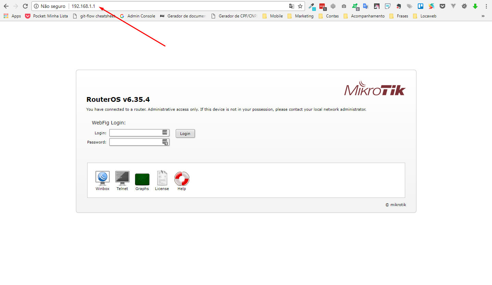
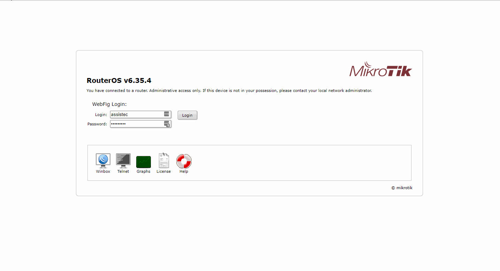
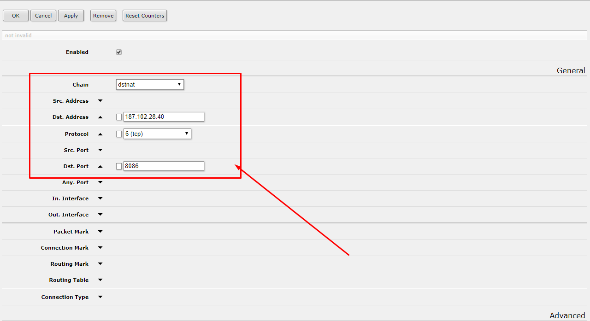
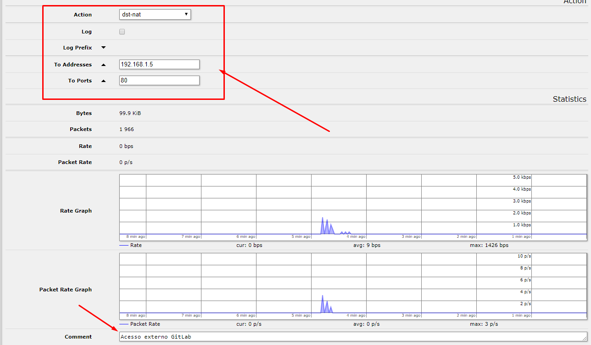
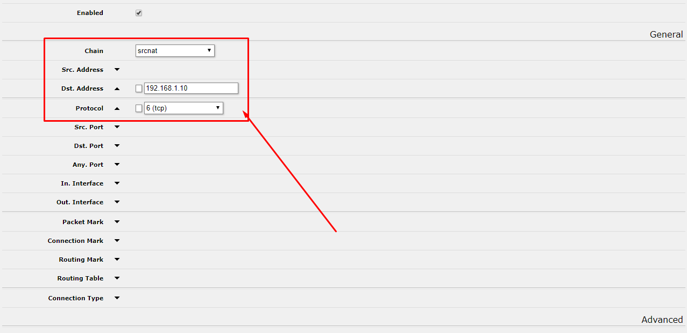
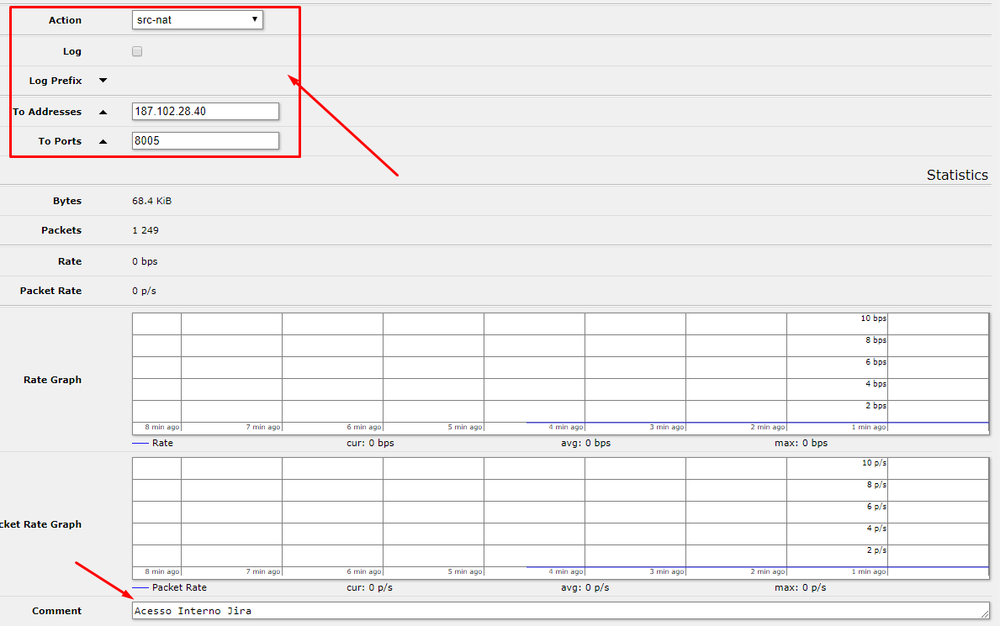

Esse é um procedimento que permite um serviço ser acessado fora da Eagle pelo seu ip fixo `187.102.28.40`. Isso é necessário caso algum colaborar queira realizar algum procedimento em um serviço fora da empresa. A configuração é feita através do aceso ao console web (solicitar gerência) do `Mikrotik` dispositivo responsável por distribuir a internet internamente.

O acesso ao console é feito pelo ip `192.168.1.1`.

## Configurar acesso externo

Após realizado o login acesse `IP / Firewall / Aba Nat`.

Para criar um novo redirecionamento clique em `Add New`, preencha os campos:

* `Chain` com o valor `dstnat`;
* `Dst. Address` com o ip `187.102.28.40`;
* `Protocol` com o valor `(tcp)`;
* `Dst. Port` escolha uma porta entre `8010 a 8099`. {c:red}Confira se a porta que irá colocar já não está em uso{/c};
* Dessa até o campo `Action` coloque o valor `dst-nat`;
* `To Addresses` com o ip do serviço. Na Eagle o endereço padrão [para os serviços](https://ajuda.eagletecnologia.com/materiais/interno/infraestrutura/servidores) é o `192.168.1.10`;
* `To Ports` coloque a porta que o serviço estará respondendo internamente: Ex: `8080 ou 8000`;
* `Comment` coloque o comentário `Acesso externo <nome do serviço>`;

Somente esses campos são necessários para relaizar o redirecionamento externo. Após realizado a configuração clique em `Ok`.

## Configurar acesso interno

O acesso interno é necessário em casos específicos quando precisa-se acessar o serviço de dentro da empresa sem usar o ip configurado internamente. Pode ser muito útil para realizar integrações entre serviços de outro ecossistema.

O processo até a configuração é idêntico à configuração externa, somente os campos e as entradas serão diferentes. Clique em `Add New` preencha os campos:

* `Chain` com o valor `srcnat`;
* `Dst. Address` com o ip do serviço. Na Eagle o endereço padrão [para os serviços](https://ajuda.eagletecnologia.com/materiais/interno/infraestrutura/servidores) é o `192.168.1.10`;;
* `Protocol` com o valor `(tcp)`;
* Dessa até o campo `Action` coloque o valor `src-nat`;
* `To Addresses` com o ip `187.102.28.40`;
* `To Ports` coloque a porta que o serviço estará respondendo internamente: Ex: `8080 ou 8000`;
* `Comment` coloque o comentário `Acesso interno <nome do serviço>`;

! Por questões de padronização, para toda configuração de redirecionamento externo deverá ter também uma configuração de redirecionamento interno.

! Após realizada cada configurção, faça o teste de acesso externamente utilizando um [proxy](https://www.proxysite.com/) e internamente realizando o mesmo acesso sem proxy.
