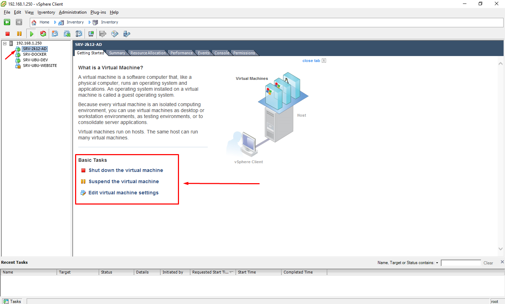

Atualmente na Eagle Tecnologia temos um servidor físico que aloca outros três servidores virtuais pelo software [VMWARE ESXI 5.1](https://ajuda.eagletecnologia.com/materiais/interno/infraestrutura/servidores#configurao-manual-de-rede-vmware-esxi-51). Sendo um servidor Windows e dois Linux.

O Servidor Windows controla Active Directory para acesso às máquinas. Um dos servidores Linux hospeda a aplicação GitLab e o outro servidor Linux hospeda o [restante dos serviços](https://ajuda.eagletecnologia.com/materiais/interno/infraestrutura/servidores).

## Acesso ao VMWARE ESXI

Para acessar diretamente o servidor físico e gerenciar as máquinas virtuais, é necessário ter um software cliente do VMWARE instalado na sua máquina. Para baixá-lo basta acessar [http://192.168.1.250](http://192.168.1.250) e clicar no link `Download vSphere Client`.

Após feita a instalação, inicialize o cliente e coloque o acesso (solicitar gerência).


**Gerenciar máquinas**

Para gerenciar as máquinas virtuais basta clicar em uma das máquinas e usar uma das opções em `Basic Tasks` para parar, desligar, iniciar ou alterar configurações.



! Cuidado ao parar ou desligar uma máquina. Sempre verifique se não está ocorrendo alguma atividade em alguns dos servidores e sempre avise a todos caso seja necessário realizar qualquer um desses procedimentos.

! Se ocorrer o desligamento ou renicialização do Servidor físico por qualquer eventualidade, esse demorará de `15` a `20` minutos até que todos os processos e máquinas virtuais sejam iniciadas. É recomendado após esse tempo, acessar o cliente VMWARE para verificar se todas as máquinas foram iniciadas automaticamente, caso contrário inicialize manualmente.

## Acesso aos servidores Linux

Para acessar qualquer um dos servidores Linux basta [usar um terminal](http://cmder.net/) e o comando `ssh`.

**Acessando servidor do GitLab**

```
ssh administrator@192.168.1.5
```
Coloque a senha (solicitar gerência)

**Acessando servidor de Serviços**

```
ssh srv-docker@192.168.1.10
```
Coloque a senha (solicitar gerência)

!!! Caso queira acessar qualquer um dos servidores sem utilizar uma senha, basta criar uma chave pública e privada e compartilhar entre as máquinas. Siga [esse tutorial](https://www.vivaolinux.com.br/artigo/SSH-Conexao-sem-senha) caso queira realizar esse procedimento.

## Acesso ao servidor da AWS EC2

Esse é o servidor onde está hospedado alguns sistemas da Eagle Tecnologia, como o `Falcon FV`, `EagleDoc` e a `Base de Conhecimento`.

O acesso é muito semelhante ao dos servidores Linux, pois a instância EC2 da AWS é um servidor Linux Ubuntu 14.04, porém não existe uma senha, só é possível acessar pelo método de chaves pública e privada ou pelo acesso com o arquivo `administrator.pem` (solicitar gerência). Esse arquivo deve ficar em um local seguro e não é recomendado que mude-o de diretório após feito a cópia, pois esse caminho deverá ser usado no ato do acesso.

**Acesso Instância EC2**

```
ssh -i /a/administrator.pem ubuntu@ec2-54-94-215-29.sa-east-1.compute.amazonaws.com
```
!!! Se for utilizar o método de chaves pública e privada, não é necessário inserir o trecho `-i /a/administrator.pem`