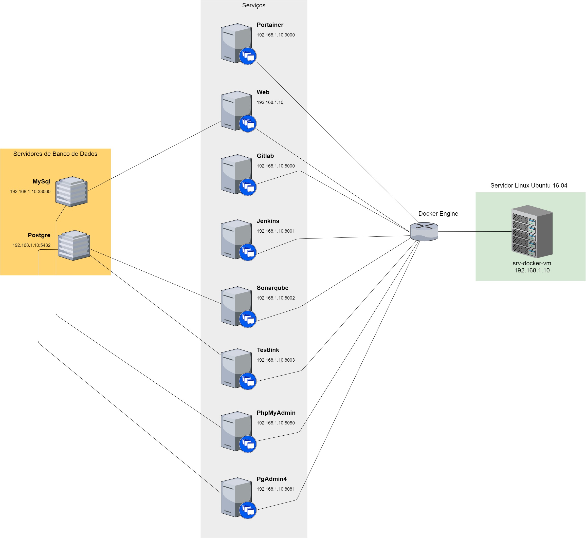
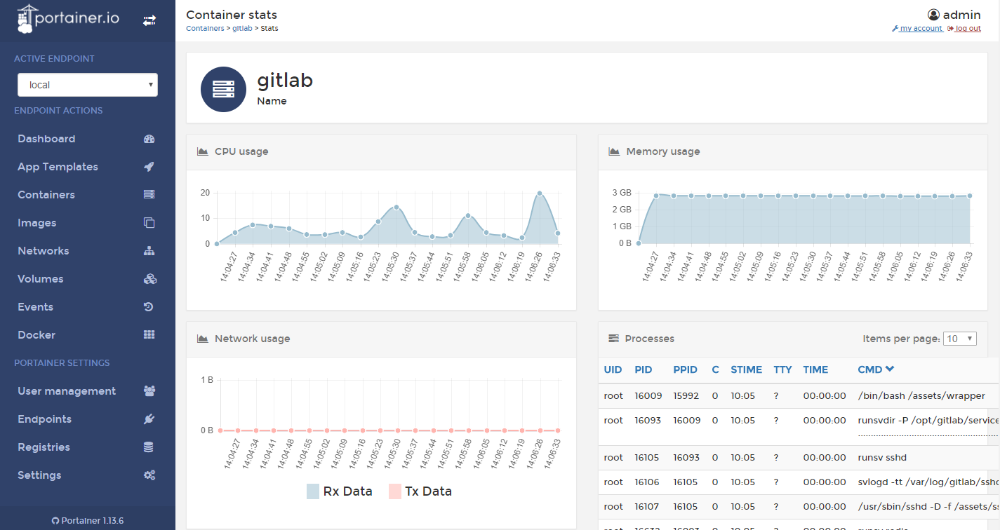
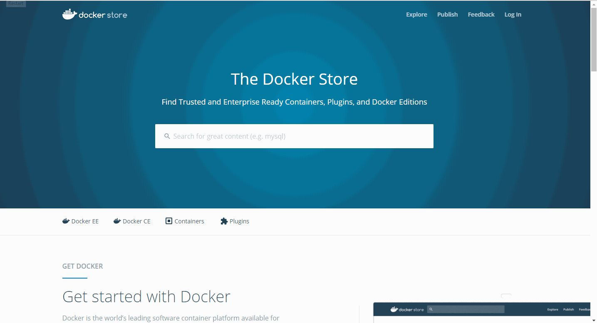
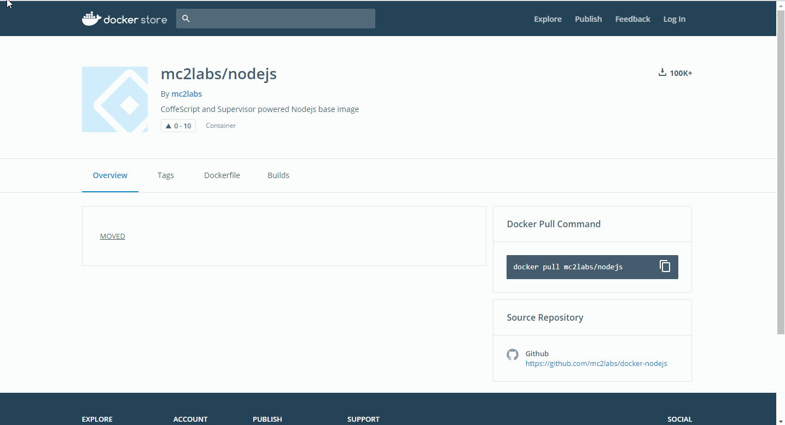
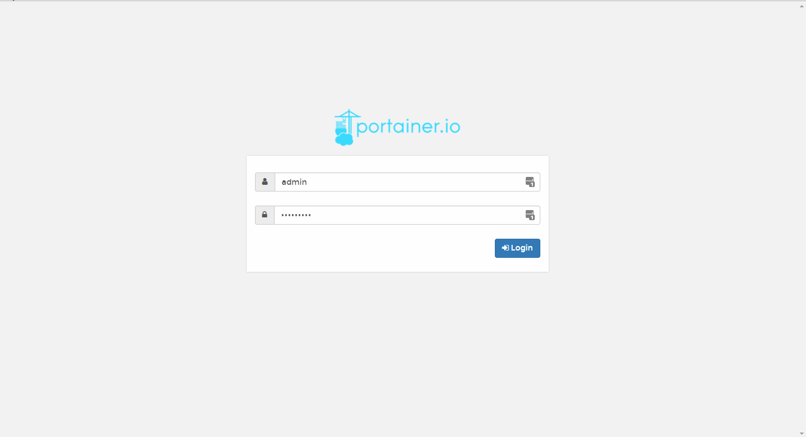
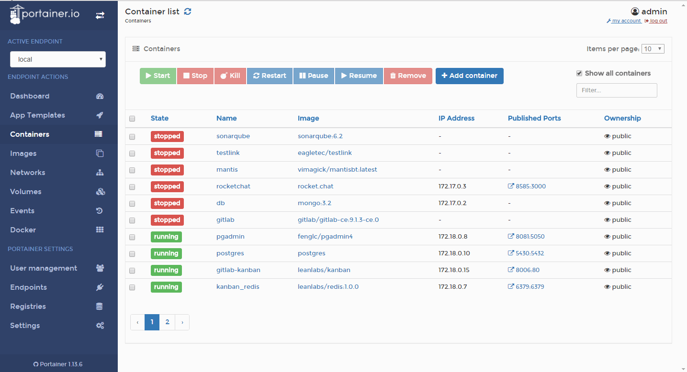

Para manter o processo de atualização, backup e manutenção dos servidores de desenvolvimento mais fácil, foi criado uma infraestrutura de servidores baseado em containers Docker.

Essa infraestrutura está alocada em um único servidor linux `Ubuntu 16.04`, com **500GB** de armazenamento e **8GB** de memória, no qual serve como base para os serviços instalados.

O SH pode ser encontrado na rede sobre o **IP** `192.168.1.10`. Todos os serviços instalados poderão ser acessados utilizando esse IP mais a sua porta específica ou utilizando virtual hosts.

Cada um dos serviços se comporta como se fosse uma imagem VM, portanto eles só usam os recursos do core(baixo nível) do SH, evitando sobrecarca no servidor como um todo. Na infraestrutura esses serviços são chamados de `Containers`.

Alguns serviços persistem os dados no próprio SH de forma síncrona, no qual é chamado de **volumes**. Assim é possível parar e reinicializá-lo sem que perca os dados. Todos os volumes dos serviços estão localizados na pasta de usuário do SH em `~/docker/volumes`.

[](Infraestrutura-Docker.pdf)

## Nginx Proxy

Esse serviço responde pelas requisições de todos os outros containers. Com ele é possível em vez de usar IP + porta, utilizar somente nomes que identifique os serviços no navegador facilitando seu acesso.

Para que esse acesso seja efetivado, a máquina de onde está sendo disparado a requisição deve conter os nomes virtual host apontando para o IP do SH. Os nomes cadastrados são:

* portainer
* webdev
* gitlab
* jenkins
* sonarqube
* testlink
* phpmyadmin
* pgadmin

Com os virtual hosts devidamente cadastrados, basta chamar o nome do serviço no navegador para o acesso sem necessidade de IP ou portas.

Para facilitar a criação desses virtual hosts foi criado dois utilitários para linux e windows para inserção desses nomes no arquivo `hosts` do sistema operacional. 

* Utilitário para Windows (Para executar basta clicar duas vezes e pronto). 
* Utilitário para Linux (Execute o comando `sudo sh service-hosts.sh` e pronto).

[Baixar utilitários](service-hosts.zip)

## Portainer

Esse serviço é o que gerencia em nível de interface todos os outros serviços instalados no SH. Com ele é possível ver em tempo real quanto cada um dos containers está usando de hardware do SH, além de poder criar, deletar, parar, iniciar e matar containers e imagens.

**Mapeamento dos Volumes**

```yaml

volumes:
        - /var/run/docker.sock:/var/run/docker.sock
        - ~/docker/volumes/portainer/data:/data
```

O serviço pode ser acessado usando a porta `9000` ou pelo nome `portainer/`. ([Acessar](http://192.168.1.10:9000))

[Documetação do Serviço](https://hub.docker.com/r/portainer/portainer/)



## Mantis

O Mantis é um sistema para registrar e controlar demandas de software para teste.

O serviço pode ser acessado usando a porta `8989` ou pelo nome `mantis/`. ([Acessar](http://192.168.1.10:8989)).

## Web

Esse serviço é responsável para o ambiente de desenvolvimento web. Qualquer sistema baseado em web deverá ser testado e possivelmente desenvolvido usando este serviço.

**Recursos**:

* Servidor Web Nginx;
* PHP 7.0;
* Grunt e Gulp;
* Git;
* Bower;
* Redis;
* NodeJS e NPM;
* Composer;
* Suporte a MySql e PostgresSQL.

**Mapeamento dos Volumes**

```yaml

volumes:
        - ~/.composer:/home/homestead/.composer
        - ~/.gitconfig:/home/homestead/.gitconfig
        - ~/.ssh:/home/homestead/.ssh
        - ~/docker/volumes/web/www/:/apps/www
        - ~/docker/volumes/web/nginx/sites-available:/etc/nginx/sites-available
        - ~/docker/volumes/web/nginx/sites-enabled:/etc/nginx/sites-enabled
```

O serviço pode ser acessado diretamente, pois responde pela porta 80 ou pelo nome `webdev/`. ([Acessar](http://192.168.1.10))

[Documentação do Serviço](https://hub.docker.com/r/shincoder/homestead/)

## GitLab

Este é o serviço que gerencia toda a parte de versionamento e CI da Eagle Tecnologia.

**Mapeamento dos Volumes**

```yaml

volumes:
      - ~/docker/volumes/gitlab/config:/etc/gitlab
      - ~/docker/volumes/gitlab/logs:/var/log/gitlab
      - ~/docker/volumes/gitlab/data:/var/opt/gitlab
```

O serviço pode ser acessado usando a porta `8000` ou pelo nome `gitlab/`. ([Acessar](http://192.168.1.10:8000)).

Esse serviço também pode ser acessado externamente pelo endereço [http://187.102.28.40](http://187.102.28.40).

[Documentação do Serviço](https://gitlab.com/gitlab-org/omnibus-gitlab/blob/master/doc/docker/README.md)
[Documentação Backup/Restore](https://docs.gitlab.com/ee/raketasks/backup_restore.html)
[Documentação uso Container](https://docs.gitlab.com/omnibus/docker/#install-gitlab-using-docker-compose)

## Jira Software

Este é o serviço que gerencia as ocorrências e issues em um painel scrum. Fornece informações sobre produtividade da equipe, tarefas em andamento, em review, em teste e concluídas e versões em lançamento e lançadas.

**Mapeamento dos Volumes**

```yaml

volumes:
      - ~/docker/volumes/atlassian/jira:/opt/atlassian/jira/logs
```

O serviço pode ser acessado usando a porta `8005` ou pelo nome `jira-software/`. ([Acessar](http://192.168.1.10:8005)).

Esse serviço também pode ser acessado externamente pelo endereço [http://186.195.139.10:8088](http://186.195.139.10:8088).

[Documentação do Serviço](https://hub.docker.com/r/cptactionhank/atlassian-jira-software/)

## Jenkins

Este serviço serve para gerenciar a **Integração Contínua** dos projetos desenvolvidos na Eagle Tecnologia. Ele é responsável por rodar testes unitários, fazer integração, deploy e homologação das aplicações.

**Mapeamento dos Volumes**

```yaml
volumes:
       - ~/docker/volumes/jenkins:/var/jenkins_home
```

O serviço pode ser acessado usando a porta `8001` ou pelo nome `jenkins/`. ([Acessar](http://192.168.1.10:8001))

[Documentação do Serviço](https://hub.docker.com/r/jenkins/jenkins/)

## Sonarqube

Esse serviço analisa e testa códigos verificando inconsistências, qualidade de código e sintaxes incorretas. Após a verificação é mostrado relatórios demonstrando os resultados.

**Mapeamento dos Volumes**

```yaml
volumes:
       - ~/docker/volumes/sonarqube/conf:/opt/sonarqube/conf
       - ~/docker/volumes/sonarqube/data:/opt/sonarqube/data
       - ~/docker/volumes/sonarqube/extensions:/opt/sonarqube/extensions
       - ~/docker/volumes/sonarqube/bundled-plugins:/opt/sonarqube/lib/bundled-plugins
```

O serviço pode ser acessado usando a porta `8002` ou pelo nome `sonarqube/`. ([Acessar](http://192.168.1.10:8002))

[Documentação do Serviço](https://hub.docker.com/_/sonarqube/)

## GitLab Kanban

[GitLab Kanban](http://kanban.leanlabs.io/) é um serviço para monitorar a evolução do ciclo de vida de issues de uma sprint.

O serviço utiliza o container `kanban_redis` para gravar dados, que atende pela porta `6379`.

**Mapeamento do Volume Redis**

```yaml
volumes:
	- ~/docker/volumes/kanban_redis:/data
```

O serviço pode ser acessado usando a porta `8006` ou pelo nome `gitlab-kanban/`. ([Acessar](http://192.168.1.10:8006))

Para criação do container em outro ambiente [siga a documentação](http://kanban.leanlabs.io/docs/installation/docker.html).

## TestLInk

Esse serviço é responsável por gerenciar testes unitários e retornar resultados em tempo de execução.

**Mapeamento dos Volumes**

```yaml
volumes:
       - ~/docker/volumes/testlink/html:/var/www/html
```

O serviço pode ser acessado usando a porta `8003` ou pelo nome `testlink/`. ([Acessar](http://192.168.1.10:8003))

Para esse serviço foi criado uma imagem customizada com base na [eboraas/apache](https://hub.docker.com/r/eboraas/apache/). A imagem customizada pode ser baixada usando o comando `docker pull eagletec/testlink`.

[Repositório Oficial](https://github.com/TestLinkOpenSourceTRMS/testlink-code/tree/testlink_1_9/)

## PhpMyAdmin

Esse serviço gerencia bancos de dados **MySql** em nível de interface.

O serviço pode ser acessado usando a porta `8080` ou pelo nome `phpmyadmin/`. ([Acessar](http://192.168.1.10:8080))

[Documentação do Serviço](https://hub.docker.com/r/phpmyadmin/phpmyadmin/)

## PgAdmin

Esse serviço gerencia bancos de dados **PostgreSQL** em nível de interface.

O serviço pode ser acessado usando a porta `8081` ou pelo nome `pgadmin/`. ([Acessar](http://192.168.1.10:8081))

[Documentação do Serviço](https://hub.docker.com/r/fenglc/pgadmin4/)

## MySql

Servidor de banco de dados MySql. Responde pela porta `33060` do SH.

**Mapeamento dos Volumes**

```yaml
volumes:
       - ~/docker/volumes/mysql:/var/lib/mysql
```

Host do Servidor: **mysql**

[Documentação do Serviço](https://hub.docker.com/_/mysql/)

## Postgres

Servidor de banco de dados PostgreSQL. Responde pela porta `5430` do SH.

**Mapeamento dos Volumes**

```yaml
volumes:
       - ~/docker/volumes/posgres:/var/lib/postgresql/data
```

Host do Servidor: **postgres**

[Documentação do Serviço](https://hub.docker.com/_/postgres/)

!!! Obtenha acesso às **credenciais dos serviços** que pedem **autenticação** contatando o setor responsável.

---

## Orquestrar

Orquestrar significa gerenciar serviços docker de forma a não inviabilisar processos que já estejam rodando no servidor. Você pode a qualquer momento subir um novo serviço, bem como matá-lo, excluí-lo ou reinicia-lo sem que comprometa a infrastrutura e o servidor host.

#### Replicar infraestrutura

Para replicar toda a infraestrura em um outro servidor que tenha o `docker` e o `docker-compose` instalado, basta clonar o repositório `http://leo@192.168.1.5/leo/docker-compose.git` e colocar e rodar no servidor com o comando `docker-compose up -d`.

#### Subir um novo serviço

Para realizar a criação de um novo serviço e levantar mais um container é necessário editar o arquivo `docker-compose.yaml` localizado em `~/docker` no servidor `192.168.1.10`. Estrutura básica de um arquivo docker-compose.yaml:

```
version: '2'
services:
	nginx-proxy: #nome que irá identificar o serviço
    	image: jwilder/nginx-proxy #caminho para baixar a imagem
        restart: always #comando que reinicia o serviço toda vez que o host reinicializa
        container_name: nginx-proxy #apelido do container
        ports: #porta que será mapeada. A esquerda é a porta do host e a direita a porta do serviço
      		- "80:80"
      	volumes: #comando que permite persistir os dados do serviço na máquina host
      		- /var/run/docker.sock:/tmp/docker.sock:ro
```
São vários outras configurações que existem, mas essa estrura é a básica para que possa ser levantado um novo serviço.

O 1º passo é escolher o serviço que deseja incluir no arquivo `docker-compose.yaml`. Acesse o link [https://store.docker.com/](https://store.docker.com/) para pesquisar um serviço. Vamos supor que queremos instalar um serviço NodeJs. Pesquise pelo serviço e copie o endereço da imagem.




O 2º passo é acessar a documentação do serviço. Geralmente a maioria tem um repositório no github explicando como utiliza-lo com o docker compose. No caso do serviço NodeJs, existe um arquivo `docker-compose.yaml` no repositório onde se encontra várias opções para serem usadas. Escolheremos uma e colocaremos no nosso arquivo `docker-compose.yaml`.



No 3º passo iremos colar o script do serviço oferecido na documentação no nosso arquivo e salvá-lo.

! Atenção para colocar uma porta que já não esteja mapeada em outros serviços. Recomenda-se que siga a numeração crescente já estabelecida no arquivo.

O 4º e último passo é acionar o comando `docker-compose up -d` para que o processo de construção do serviço seja iniciado.

!! Se ocorrer algum erro durante o processo, abra e verifique se houve algum erro de sintaxe ou de indentação e corrija.

Se não hove nenhum erro, o serviço já poderá ser acessado via navegador pelo endereço `192.168.1.10:<porta_escolhida>`.

! Após o sucesso da operação, lembre-se de comitar o projeto e enviar as atualizações para o servidor de versionamento `GitLab`.

#### Gerenciar Serviços

Qualquer serviço que esteja rodando no servidor é possível ser gerenciado e monitorado. Para realizar esse procedimento de forma fácil, utiliza-se um serviço chamado Portainer.

O Portainer é um serviço que gerencia e aloca todos os outros serviços instalados no servidor. Para acessá-lo basta inserir i ip do servidor mais a porta mapeada para ele `192.168.1.10:9000`. Entre com o usuário administrador (solicitar a gerência).



Logo na página inicial temos a dashboar com informações importantes como informações sobre o Servidor Host onde o docker está instalado e quantidade de containes, imagens, redes e volumes. Essas informações nos dá uma ampla visão do que tem em nossa infraestrutura docker.

**Gerenciando containers**

Para gerenciar os containers basta acessar o menu `Containers`, selecionar os containers que deseja gerenciar na lista e aplicar alguma das opções do menu que aparece acima. É possível parar, iniciar, matar, reuniciar, pausar, remover e adicionar um container.

! Antes de aplicar qualquer uma das opções de parar, reiniciar e pausar, verifique se não está havendo nenhuma atividade crítica no serviço, pois isso pode corromper os processos do container.


É possível também analisar o quanto cada serviço está gastando do servidor, basta clicar em cima do serviço na listagem e depois acessar as estatísticas no link `Stats`.



## Configuração Manual de Rede VMWare ESXi 5.1

Essas operações é para caso específico das configurações de rede do VMWare for reinicializadas. Se as opções de rede estivierem desativadas na interface, será necessário entrar no Shell para realizar as configurações iniciais e reabilitar essas opções. Para entrar no Shell basta apertar `alt+f1` e para sair `alt+f2`. Para qualquer comando de configuração de rede deverá ter o prefixo `esxcli`.

As opções são desabilitadas porque a interface de rede é removida no processo de reinicialização das configurações de rede do VMWare, para que sejam abilitadas novamente deverá ser criado uma interface de rede para o adaptador ativo.

**Configurações de rede atuais (23/11/2017)**

* **IP**: 192.168.1.250
* **Masc**: 255.255.255.0
* **Gateway**: 192.168.1.1
* **DNS Primário**: 187.102.16.11
* **DNS Secundário**: 187.102.16.19

[Siga essas instruções para ativar e já configurar a rede novamente](http://pubs.vmware.com/horizon-cloud-onprem-13/index.jsp?topic=%2Fcom.vmware.hconprem.install.doc%2FGUID-FA91DD75-4778-4D1B-A1A4-5A425382276B.html)

! Observação: No passo 6 coloque os `vlan-id` em `4095` para que a máquina conecte-se a internet. Só é ncessário ir somente até esse passo. Faça o teste de ping para o ip do servidor e confirme que está sendo respondido, se sim, está tudo ok, caso contrário reveja a configuração.

[Aqui poderá encontrar todos os comandos necessários para configurar a rede manualmente no Shell](https://pubs.vmware.com/vsphere-50/index.jsp?topic=%2Fcom.vmware.vcli.ref.doc_50%2Fesxcli_network.html)

*[SH]: Servidor Host