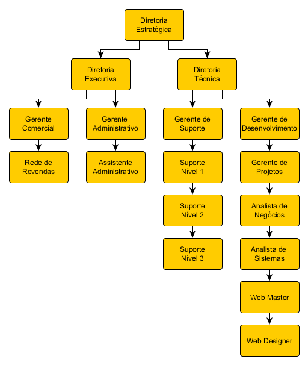

===
## Introdução
A estrutura organizacional define os cargos e funções necessárias para a operação eficaz da empresa. Essas funções são ocupadas por dirigentes e colaboradores e a cada função está associado um conjunto de responsabilidades. Responsabilidades da função são as atividades que, obrigatoriamente, devem ser cumpridas pelos seus ocupantes para assegurar o cumprimento da Missão da empresa. O conhecimento dessas responsabilidades das funções por parte dos dirigentes e colaboradores esclarece a participação de cada pessoa nas atividades da empresa e promove a sinergia do trabalho em equipe.

A seleção dos colaboradores tem o objetivo de preencher as funções vagas com pessoas aptas a executar as responsabilidades da função. A escolha das pessoas deve obedecer aos requisitos estabelecidos pela empresa para cada função. Esses requisitos são necessários para a adequada capacitação e posterior desempenho na execução da função. Recomenda-se que a seleção privilegie os membros atuais da equipe por meio de promoções às funções vagas, permitindo o crescimento das pessoas na empresa.

A capacitação dos colaboradores objetiva o desenvolvimento de conhecimentos, habilidades e atitudes que permitem o correto desempenho da função, promovendo, dessa forma, a eficiência e a sinergia da equipe de trabalho. Para a identificação das necessidades de capacitação, devem ser considerados os objetivos estratégicos, as estratégias e as metas da empresa, gerando um plano de treinamento e assegurando a coerência entre as necessidades das pessoas e as necessidades da empresa.

## Organograma

## Diretoria Estratégica

**Atividades**
1. Elaborar planejamento estratégico e plano de ação da empresa;
1. Realizar reuniões periódicas de monitoramento;
1. Definir estrutura comercial e políticas de comercialização;
1. Formular políticas e regimentos conforme a missão da empresa;
1. Estruturar canais de comercialização;
1. Decidir sobre segmento de mercado;
1. Decidir sobre tipo de cliente a atender;
1. Analisar ramo de atividade de clientes potenciais;
1. Aprovar orçamento anual;
1. Estabelecer critérios de comercialização (crédito, prazo, forma de pagamento);
1. Propor políticas de cargos e salários;
1. Contratar consultorias para melhoria de processos da empresa;
1. Recomendar tipos de investimentos a realizar;
1. Estabelecer estrutura administrativa, técnica e comercial da empresa;
1. Convocar reuniões gerais com toda a equipe.
1. Estabelecer metas e indicadores para os setores;

## Diretoria Técnica

**Atividades**
1. Estabelecer metas e indicadores para os setores;
1. Supervisionar atividade dos setores através de monitoramento de indicadores;
1. Realizar reuniões periódicas de monitoramento;
1. Cobrar e discutir resultados e suas correções com subordinados diretos;
1. Buscar novas tecnologias;
1. Participar de seminários, palestras e feiras tecnológicas para buscar atualização tecnológica;
1. Trocar informações tecnológicas com empresas similares;
1. Apresentar inovações tecnológicas;
1. Fazer cronograma de atividades semestrais;
1. Demonstrar reconhecimento pelo trabalho bem feito por subordinados;
1. Administrar conflitos;
1. Estimular o compartilhamento e o registro de conhecimento através de treinamentos, manuais, vídeos e outros;
1. Desenhar e documentar processos das atividades chaves de cada setor;
1. Estabelecem políticas de gestão de p&d.

## Diretoria Administrativa

**Atividades**
1. Estabelecer metas e indicadores para os setores;
1. Supervisionar atividade dos setores através de monitoramento de indicadores financeiros;
1. Realizar reuniões periódicas de monitoramento;
1. Cobrar e discutir resultados e suas correções com subordinados diretos;
1. Participar de seminários, palestras e feiras para buscar atualização tecnológica;
1. Fazer cronograma de atividades semestrais;
1. Demonstrar reconhecimento pelo trabalho bem feito por subordinados;
1. Administrar conflitos;
1. Estimular o compartilhamento e o registro de conhecimento através de treinamentos, manuais, vídeos e outros;
1. Desenhar e documentar processos das atividades chaves de cada setor;
1. Aplicar recursos, conforme a missão da empresa;
1. Aprovar precificação de produtos e serviços;
1. Elaborar e implementar orçamento anual;
1. Implementar e administrar política de desenvolvimento de recursos humanos;
1. Autorizar despesas;
1. Negociar com clientes, bancos e fornecedores;
1. Formular linhas gerais de campanhas de marketing;
1. Gerenciar fluxo financeiro da empresa;
1. Coordenar serviços de contabilidade.

## Gerente de Desenvolvimento

**Requisitos para ingresso**
1. Superior Completo em Tecnologia da Informação, Engenharia da Computação, Ciência da Computação, Sistemas de Informação ou afins;
1. Experiência mínima de 2 anos no setor de desenvolvimento de sistemas;
1. Formação complementar em gestão de projetos e gestão de pessoas;
2. Inglês intermediário/avançado;
1. Carteira de habilitação B;

**Conhecimentos técnicos necessários**
1. Conhecimentos em Engenharia de Software;
1. Conhecimentos em Metodologias de Gestão de Projetos;
1. Conhecimentos em Padrões de Projetos;
1. Metodologia Ágil Scrum;
1. Conhecimentos em Gestão de Pessoas;
1. Conhecimentos em Planejamento Estratégico;

**Atividades**
1. Responder pelo setor;
1. Estabelecer e documentar os processos e politicas para a realização das atividades chave do setor;
1. Planejar as versões seguindo o relatório de fila de prioridades de demandas;
1. Monitorar o cumprimento das metas e indicadores para o setor;
1. Monitorar o Processo de Liberação de Versão dos sistemas;
1. Apresentar indicadores do setor para diretoria técnica;
1. Facilitar comunicação entre o setor de suporte e o setor de desenvolvimento;

## Gerente de Projetos

**Requisitos para ingresso**
1. Superior Completo em Tecnologia da Informação, Engenharia da Computação, Ciência da Computação, Sistemas de Informação ou afins;
1. Experiência mínima de 3 anos em desenvolvimento de sistemas;
1. Inglês técnico intermediário;
1. Carteira de habilitação B;

**Conhecimentos técnicos necessários**
1. Conhecimentos em Engenharia de Software;
1. Conhecimentos em Metodologias de Gestão de Projetos;
1. Conhecimentos em Padrões de Projetos;
1. Metodologia Ágil Scrum;
1. Integração Contínua (Maven, Jenkins, Sonar), JMS, testes automáticos;
2. Conhecimento em orquestração de Containters Docker;
1. Bancos de Dados Firebird, MySQL e PostgreSQL.

**Atividades**
1. Prospectar novas tecnologias, padrões de projeto e ferramentas para o desenvolvimento;
1. Promover a capacitação dos membros da equipe;
1. Acompanhar, treinar e instruir os membros da equipe sobre o padrões, politicas e procedimentos do setor;
1. Fiscalizar a aplicação dos padrões e politicas referentes ao setor;
1. Promover a atualização dos sistemas e ferramentas utilizadas pelo setor;
1. Conduzir as reuniões e atividades previstas pelo SCRUM;
1. Atuar como SCRUM MASTER;
1. Coordenar o Processo de Liberação de Versão dos sistemas;

## Analista de Negocios

**Requisitos para ingresso**
1. Superior Completo em Tecnologia da Informação, Engenharia da Computação, Ciência da Computação, Sistemas de Informação ou afins;
1. Experiência mínima de 3 anos em suporte de sistemas;
1. Inglês técnico básico;
1. Carteira de habilitação B;

**Conhecimentos técnicos necessários**
1. Conhecimentos em Engenharia de Software;
1. Conhecimentos em Metodologias de Gestão de Projetos;
1. Conhecer a legislação que regula os projetos NF-e, NFS-e, NFC-e, SAT, CT-e, MDF-e e SPED (EFD Fiscal + EFD Contribuições) e afins;
1. Conhecimento em regras de negócios de sistemas de gestão empresarial; 

**Atividades**
1. Estudar legislação fiscal e contábil aplicada aos sistemas;
1. Analisar, aprovar e priorizar demandas de clientes seguindo processos estabelecidos;
1. Levantamento, análise e documentação de requisitos;
1. Analisar impacto de mudanças no cliente final;
1. Gerenciar abertura de demandas no sistema de gerenciamento de demandas;
1. Planejamento de release junto ao gerente de projetos com definição de cronograma;
1. Planejamento e execução de plano de testes funcionais;
1. Homologação de release;
1. Elaborar documento de release;
1. Ministrar treinamentos para o setor de suporte de releases homologados;

## Analista de Testes

**Requisitos para ingresso**
1. Superior Completo em Tecnologia da Informação, Engenharia da Computação, Ciência da Computação, Sistemas de Informação ou afins;
1. Experiência mínima de 2 anos em suporte de sistemas e 1 ano em experiência com testes de software;
1. Inglês técnico básico;
1. Carteira de habilitação B

**Conhecimentos técnicos necessários**
1. Conhecimento em ferramentas e procedimentos de testes de sistemas;
2. Conhecimento em Experiência do Usuário e Acessibilidade;
3. Conhecimento em metodologias de teste (Teste de unidade, integração, stress, carga, etc..);
4. Conhecimento em regras de negócios de sistemas de gestão empresarial;

**Atividades**
1. Elaborar plano de testes visando a reutilização;
2. Elaborar os cenários e casos de testes;
3. Elaborar estimativas para projetos de testes;
4. Registrar não conformidades relativas à arquitetura e/ou modelagem dos sistemas;
5. Especificar a massa de dados para testes;
6. Avaliar os riscos e impactos nos testes;
7. Planejar, projetar e validar ambientes necessários para realização dos testes;
8. Comunicação constante com desenvolvedores das issues a serem testadas;

## Analista de Sistemas

**Conhecimentos técnicos necessários**
1. Conhecimentos em Engenharia de Software;
1. Conhecimentos em Padrões de Projetos;
1. Metodologia Ágil Scrum;
1. Conhceimentos em programação orientada a objetos;
1. Avançado em PL/SQL(DML, DDL, stored procedures, triggers, views e etc.);
1. Mapeamento de Processos;
1. Modelagem de banco de dados;
1. Prototipação;
2. API RestFull
1. Git (Controle de versão, logs, ramos, tags, merge);
1. Integração Contínua (Jenkins);
1. Regra de Negócio de Sistemas de Gestão Empresarial.
1. Conhecer os manuais de orientação dos projetos NF-e, NFS-e, NFC-e, SAT, CT-e, MDF-e e SPED (EFD Fiscal + EFD Contribuições) e afins;

**Conhecimentos Específicos - Divisão Desktop**
1. Conhecimentos em Linguagem Delphi;
1. Desenvolvimento com o SGBD Firebird 2.5;
1. Conhecer a Especificação de Requisitos do Paf-ECF MG002;

**Conhecimentos Específicos - Divisão Web**
1. Conhecimentos em Linguagens Server Side PHP, Javascript (NodeJS);
2. Desenvolvimento com SGBD MySql e Postgres;
2. Frameworks Laravel(PHP), Express(NodeJS), Vue.js(Javascript);
3. Noções de SPA(Single Page Applications)
4. HTML 5 e CSS 3;
5. Linux intermediário;

**Conhecimentos Específicos - Divisão Mobile**
1. Conhecimento em Linguagens Java ou Kotlin;
2. Frameworks híbridos Ionic ou Quasar;
3. Noções de design responsivo e PWA(Progressive Web Apps);

**Atividades**
1. Realizar analise e projeto para as demandas registradas no sistema de gerenciamento de demandas;
1. Implementar demandas analisadas com base nos padrões de projetos estabelecidos;
1. Realizar testes pós-implementação e pré-liberação de versão;
1. Registrar o desenvolvimento de acordo com os padrões estabelecidos;
1. Registrar a solução implementada de acordo com os padrões estabelecidos;
1. Versionar os códigos-fontes desenvolvidos com base nos padrões estabelecidos;
1. Executar o processo de liberação de versão (geração de instaladores e atualizadores) no mês em que estiver designado;  
1. Preparar ambiente de desenvolvimento para liberação de versão;  
1. Participar das reuniões e atividades previstas pelo SCRUM;

## Progressão de cargo para Analista de Sistemas

### Analista de Sistemas JR(Júnior)

**Requisitos para ingresso**
1. Superior Completo em Tecnologia da Informação, Engenharia da Computação, Ciência da Computação, Sistemas de Informação ou afins;
2. Experiência de 1 a 2 anos em desenvolvimento de sistemas;
3. Inglês técnico básico;

**Habilidades e Competências Essenciais**
1. Desenvolvimento de projetos sob orientação

### Analista de Sistemas PL(Pleno)

**Requisitos para ingresso**
1. Superior Completo em Tecnologia da Informação, Engenharia da Computação, Ciência da Computação, Sistemas de Informação ou afins;
2. Formação complementar em gestão de projetos;
3. Experiência de 3 a 5 anos em desenvolvimento de sistemas;
4. Inglês técnico intermediário;

**Habilidades e Competências Essenciais**
1. Processos e procedimentos de trabalho;
2. Analise de problemas;

### Analista de Sistemas SR(Sênior)

**Requisitos para ingresso**
1. Superior Completo em Tecnologia da Informação, Engenharia da Computação, Ciência da Computação, Sistemas de Informação ou afins;
2. Formação complementar em gestão de projetos e gestão de pessoas;
2. Experiência superior a 5 anos em desenvolvimento de sistemas;
3. Inglês intermediário/avançado;

**Habilidades e Competências Essenciais**
1. Produção de soluções inovadoras;
2. Aconselhamento de alternativas;
3. Gestão de projetos e liderança de equipes;

## Web Designer

**Requisitos para ingresso**
1. Superior Completo em Tecnologia da Informação, Engenharia da Computação, Ciência da Computação, Sistemas de Informação ou afins;
2. Experiência de 1 a 2 anos em desenvolvimento de websites;
3. Inglês técnico básico;

**Conhecimentos técnicos necessários**
1. Manipulação de imagens usando softwares profissionais como Photoshop e Illustrator;
1. Conhecimento intermediário em HTML, CSS e Javascript;
1. Conhecimento intermediário em banco de dados;
1. Conhecimento desejável em configuração e manutenção de servidores web;
1. Conhecimento básico em PHP;
1. Conhecimento intermediário em Joomla;
1. Conhecimento desejável em Pré-Processadores CSS (Less ou Sass);
1. Conhecimento desejável no framework CSS Bootstrap;
1. Conhecimento intermediário em desenvolvimento de projetos responsivos;
1. Conhecimento básico em UX (Experiência do Usuário), Usabilidade e Acessibilidade;
1. Conhecimento básico em SEO;
1. Conhecimento básico no software de versionamento Git;
1. Conhecimento desejável em administração e configuração de Templates Joomla;

**Atividades**
1. Criação de wireframes e mockups para sistemas e websites;
1. Criar artes para projetos internos;
1. Desenvolver templates, sites, blogs, hotsites, landing page e interfaces para aplicações internas e externas;
1. Documentar, atualizar e criar manual de projetos de website;
1. Fornecer suporte técnico;
1. Monitorar e manter compatibilidade, acessibilidade, performance e desempenho da aplicação;
1. Manter e monitorar uso da Identidade Visual da Empresa; 
1. Aplicar técnicas SEO nos projetos;
1. Modelar estrutura de banco de dados;
1. Definir padronizações de sistemas e aplicações;
1. Identificar, manter e gerenciar nomes de domínio e e-mails;
1. Gerenciar servidores de hospedagem;
1. Consultar renovação de hospedagem;
1. Seguir rotina e políticas de backup e atualização;
1. Manter-se atualizado em tecnologias web;
1. Gerenciar e monitorar contas no Google Analytics e Google Webmaster;
1. Manter organização e integridade dos Servidores de Desenvolvimento;
1. Apoiar o setor de Marketing. 

## Gerente de Suporte

**Requisitos para ingresso**
1. Ensino superior completo em tecnologia da informação ou administração
2. Ter conhecimentos de nível 2;
3. Experiência mínima de 2 anos em suporte de sistemas.
4. Carteira de habilitação B

**Atividades**
1. Responder pelo setor;
2. Estabelecer metas e indicadores para o setor;
3. Elaborar e documentar processos gerenciais do setor;
4. Coordenar a utilização e atualização da base de conhecimento do suporte;
5. Elaborar cronograma de atividades, planejar e delegar tarefas;
6. Avaliar grau de uso de sistemas implantados nos clientes (aderência);
7. Detectar, apurar e solucionar as reclamações e problemas não solucionados com clientes;
8. Gerenciar e supervisionar equipe de suporte ao usuário;
9. Acompanhar e avaliar indicadores de atendimentos para medir o desempenho da equipe e identificar oportunidades de melhoria;
10. Motivar e treinar a equipe para que possam desempenhar suas funções com excelência;
11. Agendar implantações;
12. Reportar a diretoria problemas ou sugestões de melhorias do setor;
13. Planejar treinamento de Revendas.

## Suporte Nivel 1

**Requisitos para ingresso**

1. Conhecimento de Sistemas Operacionais 
2. Conhecimento de Infraestrutura redes
3. Conhecimento de Infraestrutura hardware
4. Carteira de habilitação B
5. Disponibilidade para viagens

**Atividades**
1. Instalar, ativar e configurar sistemas de gestão empresarial;
2. Instalar e configurar servidor de banco de dados SGBD
3. Realizar atendimentos sanando dúvidas do cliente sobre a sua utilização do sistema de gestão;
4. Instalar e configurar hardware e software para uso dos sistemas de gestão
5. Registrar solicitações de atendimentos no sistema de chamados;
6. Entender sobre as rotinas operacionais que envolvem os processos de gestão empresarial;
7. Entender sobre o processo de homologação de boletos bancários;
8. Estudar os manuais de utilização do sistema de gestão;
10. Ter conhecimentos básicos de linguagem SQL e SGBD;
12. Executar scripts em um banco de dados;
13. Realizar consultas simples em um banco de dados;
14. Ter conhecimentos básicos para personalizar relatórios;
15. Informar ao cliente se determinada funcionalidade é possível dentro do que já existe implementado no sistema;
16. Reportar necessidades do cliente;
17. Reportar situações conflitantes com clientes;
18. Detectar, analisar, classificar os problemas antes de encaminha-los ao nível 2.

## Suporte Nivel 2

**Requisitos para ingresso**
1. Ter conhecimentos de nível 1;

**Atividades**
1. Realizar Atendimentos que o nível 1 não solucionou
3. Elaborar e realizar implantação de sistemas;
4. Ter conhecimentos da capacidade do sistema de atender a legislação vigente;
4. Cumprir o cronograma de visitas de acompanhamento;
5. Entender sobre as rotinas fiscais que envolvem as obrigações SPED e Sintegra;
6. Realizar treinamento de usuários;
7. Fornecer sugestões para a organização sobre melhorias no suporte técnico;
8. Identificar e sugerir melhorias nos sistemas e encaminhar ao analista de negócios;
9. Ter conhecimentos intermediários de linguagem SQL e SGBD;
10. Ter conhecimentos intermediários para personalizar relatórios;
11. Atualizar manual de usuário com as novas funcionalidades homologadas;
12. Detectar, analisar, classificar os bugs antes de encaminha-los ao nível 3;
13. Realizar atendimentos externos.

## Suporte Nivel 3

**Requisitos para ingresso**
1. Ter conhecimentos de nível 2
 
**Atividades**
1. Realizar Atendimentos que o nível 2 não solucionou
2. Ter conhecimentos avançados de linguagem SQL e SGBD;
3. Realizar consultas complexas em um banco de dados;
4. Criar e testar scripts de bancos de dados;
5. Ter conhecimentos avançados para personalizar relatórios;
6. Detectar, analisar, classificar os problemas antes de encaminha-los ao desenvolvimento;
7. Fazer migração de dados.

## Gerente de Contas

**Requisitos para ingresso**
1. Ensino médio completo;
1. Carteira de habilitação B;
1. Disponibilidade para viagens.

**Atividades**
1. Prospectar clientes.
1. Mapear área de atuação e estabelecer roteiro de visitas.
1. Elaborar listas de clientes potenciais.
1. Receber clientes para apresentação dos produtos.
1. Prospectar clientes (telemarketing, presencial).
1. Cadastrar novos clientes no CRM
1. Requisitar material de divulgação
1. Divulgar produtos e serviços
1. Enviar brindes ao cliente
1. Demonstrar produtos e serviços, seus benefícios e qualidades.
1. Identificar necessidades do cliente e auxiliar na escolha dos produtos ou serviços.
1. Apresentar proposta de preço ao cliente e formas de pagamento.
1. Esclarecer dúvidas referentes aos pedidos e aos contratos de prestação de serviços
1. Finalizar Vendas e gerar contratos no CRM.
1. Estabelecer e acompanhar prazos de entrega dos produtos.
1. Alterar e renovar contratos de prestação de serviços.
1. Comunicar aos clientes novidades nos produtos e serviços.
1. Acompanhar cliente pós-venda.
1. Verificar opiniões do cliente.
1. Filtrar informações para melhoria de serviços.
1. Sugerir ações para melhoria nas vendas.

## Gerente Administrativo

**Requisitos para ingresso**
1. Ensino médio completo.

**Atividades**
1. Processar retorno e remessa;
1. Revezar hora de almoço com a secretária;
1. Realizar e conferir fechamento do caixa geral/bancos;
1. Realizar conciliação bancária;
1. Cadastrar clientes e fornecedores;
1. Receber clientes e/ou fornecedores;
1. Emitir boleto ou carnê de cobrança bancária de contratos;
1. Negociar com fornecedores de insumos preços condições de pagamentos prazos de entrega etc;
1. Controlar contas a pagar;
1. Negociar formas de quitação do débito junto a fornecedores;
1. Admitir novos colaboradores;
1. Resolver reclamações de clientes;
1. Administrar o ponto eletrônico dos funcionário;
1. Realizar fechamento de mês com a contabilidade;
1. Realizar faturamento de revendas;
1. Realizar cancelamento de contratos.

## ASSISTENTE ADMINISTRATIVO

**Requisitos para ingresso**
1. Ensino médio completo.

**Atividades**
1. Providenciar o lanche;
1. Realizar atendimento telefônico;
1. Atender clientes;
1. Encaminhar ligações para os setores;
1. Agendar atendimentos;
1. Identificar natureza das solicitações dos clientes;
1. Pesquisar satisfação dos clientes semestral ou anual;
1. Pesquisa de Pós-Vendas;
1. Executar atividades de crédito e cobrança;
1. Atualizar boletos para cliente;
1. Recolher o lixo de todas as salas no fim do expediente;
1. Arquivar documentos;
1. Realizar atividades externas.