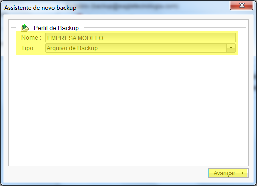
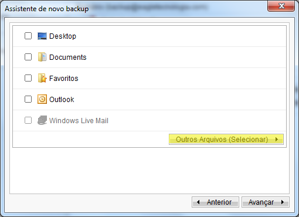
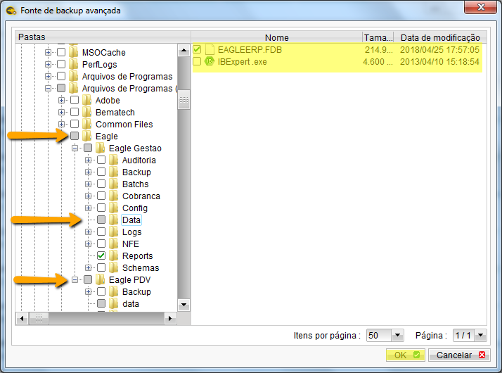
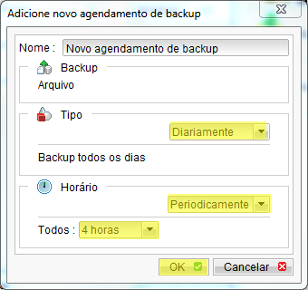
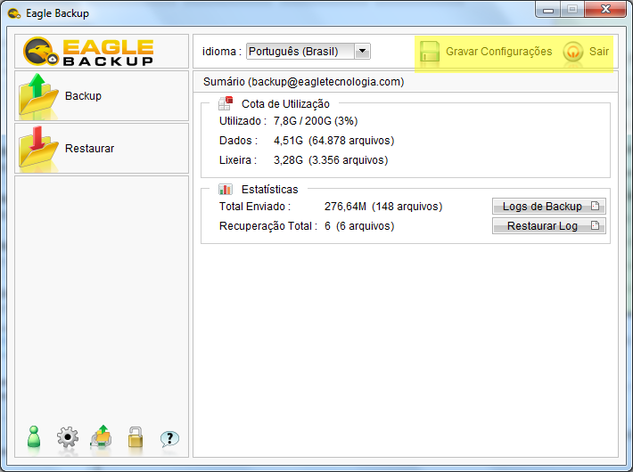

===

## OBJETIVOS
Orientar profissionais do setor de suporte quanto a instalação e configuração do eagle backup.

## INSTALANDO E CONFIGURANDO O EAGLE BACKUP
1. Baixe o eagle backup em [http://backup.eagletecnologia.com/sw-downloads](http://backup.eagletecnologia.com/sw-downloads)
1. Execute o instalador seguindo as opções padrão.
1. Realize o login com usuário backup@eagletecnologia.com e senha da conta
1. Na tela do `Assistente de novo backup` defina:
- Nome: RAZAO SOCIAL DO CLIENTE
- Tipo: Arquivo de backup
1. Clique em `Avançar` 

1. Desmarque todas as opções
1. Selecione a opção `Outros arquivos`

1. Definir os itens a serem salvos
- Pasta de dados do Eagle Gestão e Relatórios Personalizados
- Pasta de dados do Eagle PDV

1. Inicie a rotina de backup agendada neste computador
1. Clique em Adicionar
1. Selecione as opções:
- Tipo: Diariamente
- Horário: Periodicamente > 4 Horas
Clique em OK

1. Clique em Avançar > OK
1. Clique em Gravar configurações > Sair

## MONITORANDO BACKUPS

## OBTENDO BACKUPS

## TROCANDO DE TERMINAL

## Fontes
[Como utilizar uma única conta de backup em vários clientes](https://eagletecnologia.backupmanager.info/suporte/videos-de-treinamento/unica-lic-pro-em-varios-hosts)