## Introdução

Este guia descreve passo-a-passo como realizar a instalação e configuração do sistema Eagle Gestão que tem como base o sistema operacional Windows.

A instalação do sistema Eagle Gestão segue o padrão de instalação passo a passo onde diversas janelas são apresentadas com o objetivo de instalar o sistema, servidor de banco de dados, configuração de acesso ao banco de dados, backup e por fim o registro o do sistema.

A instalação aqui apresentada foi testada em um computador com Sistema Operacional Window 7 Ultimate 32 Bits, Intel Core i3-2328M CPU 2.2GHz, Memória 4GB, HD 500GB. O editor deste guia não se responsabiliza por eventuais erros ou danos causados por interpretações errôneas das informações aqui apresentadas. 

Este documento é a única fonte oficial de informação para os procedimentos de implantação do Eagle Gestão e seus sistemas integrados. Caso alguma informação relevante para implantação não esteja documentada neste manual, registre sua demanda através do e-mail suporte@eagletecnologia.com solicitando a informação que deveria constar neste manual.

! Alterações do conteúdo e das ilustrações deste manual poderão ser realizadas sem aviso prévio.

## IMPORTANTE
1. Antes de instalar o sistema verifique se os [REQUISITOS MÍNIMOS EXIGIDOS DO CLIENTE](https://ajuda.eagletecnologia.com/materiais/revenda/processos-internos/requisitos-minimos-exigidos-do-cliente) estejam de acordo com os especificados neste documento.
1. Antes de instalar verifique se existem versões anteriores do Servidor de Banco de Dados Firebid instalado no sistema operacional e desinstale-as.
1. O sistema principal será instalado em uma máquina chamada SERVIDOR e configurado confurado em rede em máquinas chamadas TERMINAL01, TERMINAL02 e assim sucessivamente.

## Executando o Instalador

Para dar início a instalação, obtenha a versão mais atualizada do sistema Eagle Gestão. Após o download do arquivo, clique duas vezes para iniciar o processo de instalação. Em seguida clique em **Avançar**. 

Na tela seguinte, selecione a opção, **Aceito os termos do Contrato** e em seguida clique em **Avançar**.

 

Para prosseguir com a instalação é necessário informar a senha do dia gerada pelo servidor de licenças. Caso o acesso ao servidor de licenças não esteja liberado, solicitar a senha do dia junto ao setor de suporte técnico.

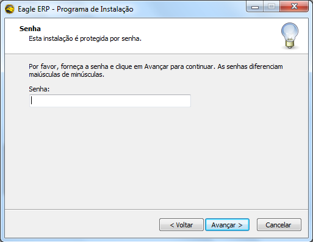

Após informar a senha do dia uma opção deverá ser selecionada para que a instalação prossiga. É recomendável sempre que seja escolhida a opção **Instalação Completa do Sistema (Servidor)**

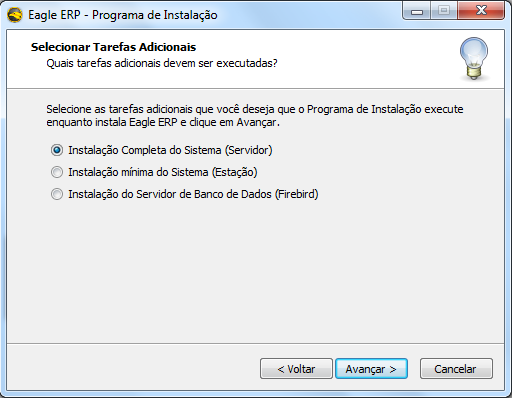

! Caso o servidor precise de manutenção, os outros terminais poderão assumir a função de servidor temporariamente. 

Clique em **Avançar** e **Instalar** e aguarde a instalação do sistema até que seja iniciada a instalação do Servidor de Banco de Dados Firebird.

## Instalando o Firebird

Para iniciar a instalação do Servidor de Banco de Dados Firebird clique em **OK**.

Clique em em **Seguinte**

Na tela seguinte, selecione a opção, **Aceito o contrato** e em seguida clique em **Seguinte**.

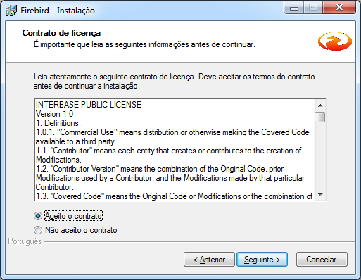

Clique em **Seguinte** sem modificar o destino de instalação

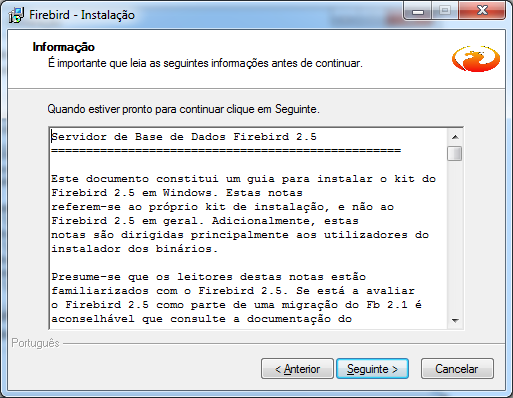

Clique em **Seguinte**

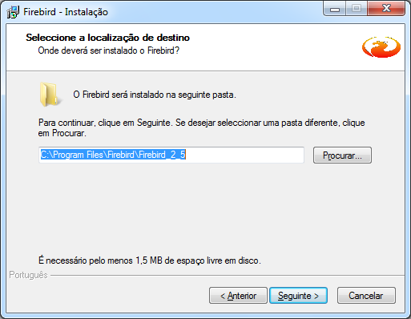

Clique em **Seguinte** de acordo com as opções marcadas na imagem abaixo

Clique em **Seguinte**

Após confirmar se as opções estão marcadas como na tela a seguir clique em **Seguinte** e **Instalar**

Aguarde a instalação

Clique em **Concluir**.

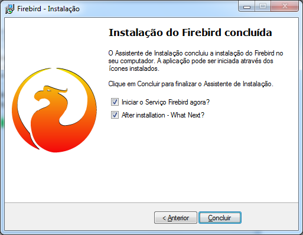

## Configurando Inicial

Após concluir a instalação, o sistema abre o Utilitário de Configurações Locais na **Aba Banco de Dados** para que sejam informadas as configurações iniciais.

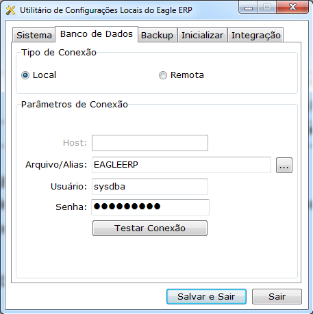

|Campo|Função|
|-----|------|
|**Tipo de Conexão**|Informar o tipo de conexão. Se o sistema for instalado no SERVIDOR o tipo de conexão deve ser LOCAL. Se o sistema for instalado em um TERMINAL um HOST deverá ser informado.|
|**Host**|Informar o nome ou o IP do computador onde está localizado o banco de dados.|
|**Arquivo/Alias**|Para que fique mais simples a configuração do banco de dados no SERVIDOR e nos TERMINAIS é recomendado que seja criado um ALIAS ( Apelido ) para que o arquivo do banco de dados seja acessado pelo nome.|
|**Usuário**|Informado pelo sistema.|
|**Senha**|Informado pelo sistema.|

! Caso o servidor de banco de dados tenha usuários e senhas diferentes de sysdba e masterey informar os mesmos nos campos Usuário e Senha.

Clique na **Aba Backup**

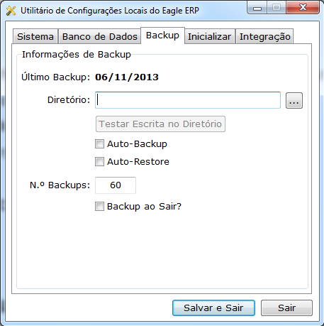

|Campo|Função|
|-----|------|
|**Diretório**|Selecionar o diretório onde serão armazenados os backups automáticos ou manuais.|
|**Testar Escrita no Diretório**| É recomendável testar as permissões de acesso no diretório escolhido para que o sistema possa armazenar o backup sem problemas.|
|**Auto Backup**|Ao marcar esta opção, pelo menos uma vez por dia o sistema faz um backup automático na primeira inicialização. Em se tratando de terminais acessando o SERVIDOR via rede Wireless não é aconselhável marcar esta opção pois o backup pode demorar a ser feito.|
|**Auto Restore**| Ao marcar esta opção, na primeira inicialização, após o backup o sistema fará logo em seguida uma restauração do banco de dados. É aconselhado que esta opção seja marcada somente quando houver somente um terminal na empresa.|
|**Número de Backups**|Esta informação é obrigatória e ao informá-la, o sistema manterá no diretório configurado para armazenar os backups a quantidade informada nesta configuração. Levando em consideração que o usuário poderá fazer o backup toda vez que ele sair do sistema várias vezes ao dia, o que é importante em termos de segurança, informar um número maior de backups que serão mantidos no diretório.|
|**Backup ao Sair**|Ao marcar esta opção, toda vez que o usuário sair do sistema, será solicitado o backup.|

Clique na **Aba Inicializar**

Nesta aba serão configurados os aplicativos que inicializarão automaticamente com o sistema. Ao finalizar o sistema estes aplicativos serão finalizados também.

|Campo|Ação|
|-----|----|
|**Utilitário de Atualizações Automáticas**|Marcar esta opção o utilitário de atualizações automáticas inicializará automaticamente com sistema e verificará no servidor se existe novas versões do sistema. É aconselhável também que esta opção seja configurada somente no SERVIDOR.|
|**Monitor Falcon FV**|Caso a empresa licenciada utilize o módulo de força de vendas, ao marcar esta opção o Monitor Falcon FV inicia e finaliza juntamente como sistema.|

|Campo|Ação|
|-----|----|
|**Validador Sintegra**|Selecionar o caminho executável principal do validador Sintegra. É aconselhável esteja instalado no cliente a versão mais atualizada do validador do Sintegra.|
|**Validador Sped Fiscal**|Selecionar o caminho executável principal do validador do Sped Fiscal. É aconselhável esteja instalado no cliente a versão mais atualizada do validador do Sped Fiscal.|
|Validador Sped PIS / COFINS|Selecionar o caminho executável principal do validador do Sped PIS/COFINS. É aconselhável esteja instalado no cliente a versão mais atualizada do validador do Sped PIS/COFINS.|
|**DJIntegração**|Informar o caminho do executável principal do integrador DJPDV que é responsável pela comunicação entre o sistema e o PAF-ECF DJPDV.|
|**PATH de Exportação de Notas Fiscais Eletrônicas**|Informar o caminho a ser sugerido quando o usuário acessar o comando para exportar XML de Nota Fiscal Eletrônica.|
|**Compartilhamento/Porta para impressora ZEBRA**|Caso a empresa utilize impressão de etiquetas pela impressora zebra, informar o endereço do compartilhamento da impressora.|

## Configurando Permissões de Acesso em Diretórios

Para configurar permissões de acesso em diretórios é necessário acessar suas propriedades. Os diretórios que precisam de permissão de acesso são os de instalação do Eagle Gestão, Firebird e caso o diretório escolhido para fazer backup for diferente do padrão conferir as permissões antes de configurar.

Clique na **Aba Segurança / Editar** para adicionar uma nova permissão de acesso.

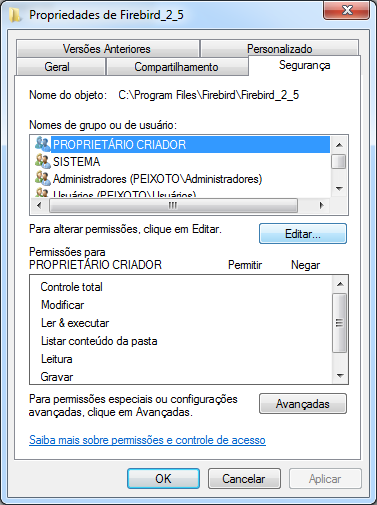

Clique em **Adicionar** para selecionar usuários ou grupos de acesso.

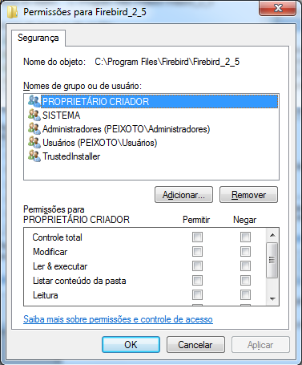

É recomendável que seja informado o objeto **Todos** para que qualquer usuário do sistema possa ter acesso a leitura e gravação no diretório configurado.

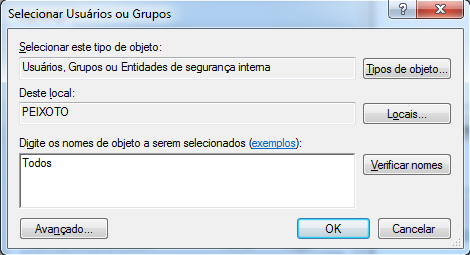

Ao selecionar o grupo de acesso e confirmar será mostrado o grupo de acesso selecionado para conceder a permissão marcando a opção **Controle Total**. Após marcar esta opção clique em **Aplicar** para que as permissões concedidas possam ser refletidas em todos os usuários do Windows. 

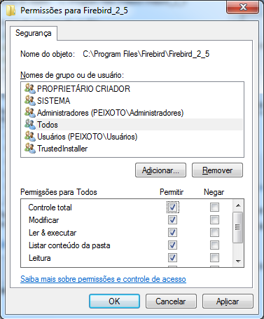

!!!! Os passos descritos neste tópico podem ser aplicados para conceder permissões no diretório de instalação do Eagle Gestão e no diretório de Backup.

## Configurando Permissões de Acesso no Registro

O Eagle Gestão armazena algumas configurações locais no Registro do Windows (Regedit). Em alguns casos também é necessário configurar as permissões no registro do Windows pois quando elas são criadas não estão concedidas a todos os usuários.

Para acessar o Registro Windows clique em Iniciar / Executar e digite o nome do programa ( Regedit ) para que Windows possa abrir.

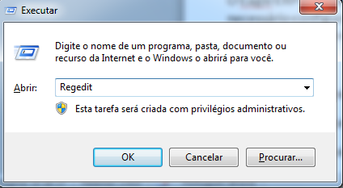

!!!! Nas versões do Windows 32 bits, localizar a chave HKEY_LOCAL_MACHINE\SOFTWARE\Eagle\EagleERP

!!!! Nas versões do Windows 64 bits localizar a chave HKEY_LOCAL_MACHINE\SOFTWARE\wow6432node\Eagle\EagleERP

Clique em **Chave / Botão Direito do Mouse / Permissões / Aba Segurança / Editar** para adicionar uma nova permissão de acesso.

É recomendável que seja informado o objeto **Todos** para que qualquer usuário do sistema possa ter acesso a leitura e gravação na chave configurada.

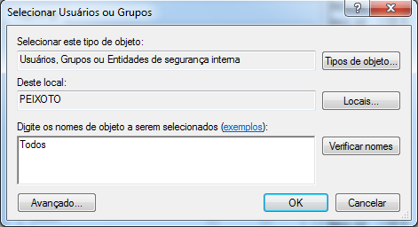

Ao selecionar o grupo de acesso e confirmar será mostrado o grupo de acesso selecionado para conceder a permissão marcando a opção **Controle Total**. Após marcar esta opção clique em **Aplicar** para que as permissões concedidas possam ser refletidas em todos os usuários do Windows. 

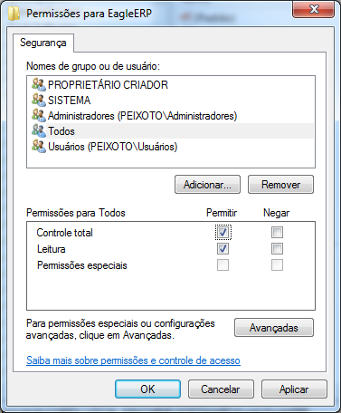

## Registrando o Sistema
Todas as instalações de cópias do Eagle Gestão são autorizadas no servidor de licenças tendo o acesso restrito as revendas e aos técnicos de suporte nível 2 da Eagle. Antes de proceder com a instalação os dados da empresa devem ser cadastrados no servidor de licenças e uma licença deve ser gerada para o SERVIDOR. Ao abrir o sistema pela primeira vez as informações de registro devem ser informadas para que a instalação seja concluída e o sistema desbloqueado para o uso.

|Campo|Função|
|-----|------|
|**CNPJ**|Informar o CNPJ da empresa a ser registrada.|
|**Terminal**|Chave que identifica o computador.|
|**Chave**|Informar a chave de liberação gerada pelo servidor de licenças.|
|**Descrição**|Informar a descrição do computador.|
|**Login**|Informar o login do parceiro.|
|**Senha**|Informar a senha do parceiro.|
|**Cancelar**|Clicar em cancelar para abortar o processo de registro.|
|**Registrar**|Clicar em registrar para o sistema validar os dados e desbloquear o sistema.|

Após a instalação e registro, o primeiro acesso ao sistema é possibilitado com a senha de manutenção para que possam ser informados os dados da empresa e criado os perfis de acesso e usuários para dar início ao processo de implantação junto aos usuários.

## Cadastro de Empresa

O cadastro da empresa merece muita atenção porque os dados informados nesta sessão aparecerão em documentos fiscais e algumas configurações globais também ficam no cadastro da empresa.

Para fazer o cadastro da empresa é recomendável que se faça uma busca pelo CNPJ da empresa no site do Sintegra, onde as informações necessárias para o preenchimento desta aba estão localizadas. Alguns campos merecem importância no cadastro da empresa. Apresentaremos a seguir as informações mais relevantes sobre dada sessão.

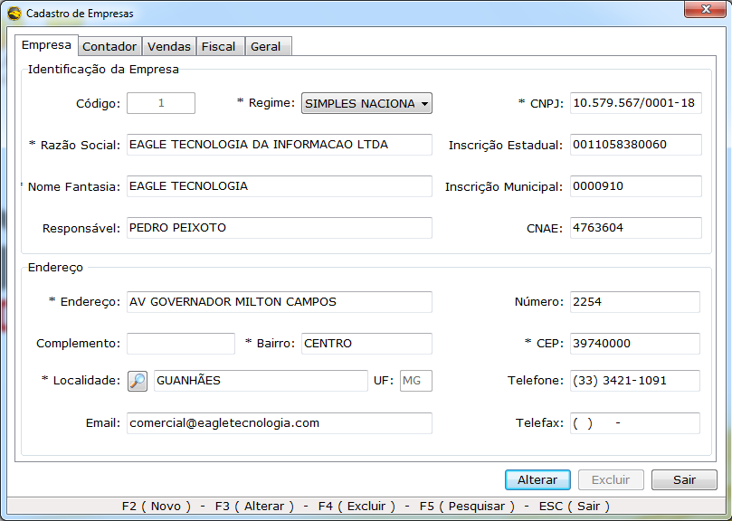

|Campo|Função|
|-----|------|
|**Regime**|Informar o Regime de Tributação da Empresa. Para empresas Optantes pelo Simples Nacional informar SIMPLES NACIONAL. Para empresas do Lucro Real ou Presumido, informar REGIME NORMAL.|
|**Inscrição Municipal**|Esta informação é obtida através do alvará de funcionamento da prefeitura.|
|**CNAE**|Informar o CNAE principal da empresa. Uma empresa pode ter várias atividades econômicas e neste caso a atividade principal é a que terá que ser informada.|

Os dados do contador deverão ser informados quando a empresa estiver enquadrada nos regimes tributários Lucro Real e Lucro Presumido. Estes dados serão utilizados para geração dos registros 0100 do SPED Fiscal e SPED PIS/COFINS.

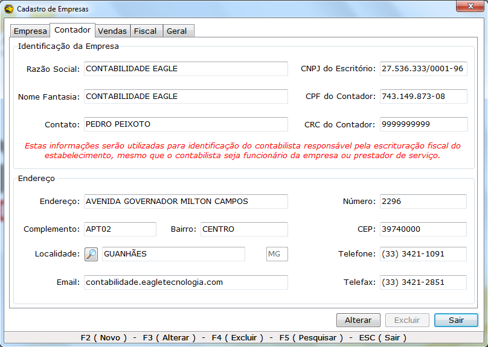

|Campo|Função|
|-----|------|
|**CNPJ do Escritório**|Informar o CNPJ do escritório de contabilidade.|
|**CPF do Contador**|Informar o CNPJ do contador.|
|**CRC**|Número de registro do conselho regional de contabilidade.|

O módulo de vendas possui algumas configurações que definem o comportamento do sistema durante o processo de venda e faturamento e devem ser alteradas conforme as necessidades do cliente. Logo abaixo serão apresendadas as configurações do módulo de vendas.

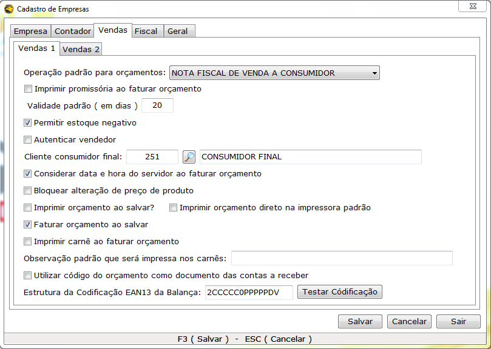

|Campo|Função|
|-----|------|
|**Operação padrão para orçamentos**|Informar a operação padrão um novo orçamento. Se você informar uma operação inativa nesta configuração o sistema abrirá a tela de consulta de operações quando o usuário clicar em novo na tela de pedido de venda|
|**Imprimir promissória ao faturar orçamentos**|Marcar esta opção para o sistema gerar promissória das parcelas após o faturamento. As promissórias poderão ser impressas novamente no módulo de contas a receber.|
|**Validade padrão ( em dias )**|Informar os dias de validade do pedido de venda.|
|**Permitir estoque negativo**|Marcar esta opção para o sistema permitir faturamentos que gerem estoque negativo.|
|**Autenticar vendedor**|Marcar esta opção para o sistema solicitar a senha do vendedor nos orçamentos. Ao marcar esta opção deve ser certificado que o usuário seja vinculado a um funcionário vendedor.|
|**Cliente consumidor final**|Defina qual cliente será considerado consumidor final para que o sistema considere o mesmo sempre que um novo pedido de venda for solicitado|
|**Considerar data e hora do servidor ao faturar orçamento**|Marque esta opção para que o sistema considere a data e hora do servidor como data de saída dos documentos fiscais faturados e para que os vencimentos sejam programados tendo como base a data do faturamento.|
|**Bloquear alteração de preço de produto**|Marque esta opção para bloquear a alteração direta de preços no módulo de orçamento.|
|**Imprimir orçamento ao salvar**|Marque esta opção para que o sistema abra a janela de impressoras para antes de imprimir o orçamento.|
|**Imprimir orçamento na impressora padrão**|Marque esta opção para que o sistema imprima o orçamento direto na impressora ao salvar o orçamento.|
|**Faturar orçamento ao salvar**|Marque esta opção para que o sistema dê a opção de faturamento do orçamento após sua confirmação.|
|**Imprimir carnê ao faturar orçamento**|Marque esta opção para que o sistema exiba o carnê após o faturamento do orçamento.|
|**Observação padrão que será impressa nos carnês**|Informar os dizeres que constarão nos carnês gerados.|
|**Utilizar código do orçamento como documento das contas a receber**|Marque esta opção para que o sistema gere as contas a receber do o número do documento com base no código do orçamento.|
|**Estrutura da Codificação EAN13 da Balança**|Informar a codificação para que o sistema reconheça o código gerado por balanças.|

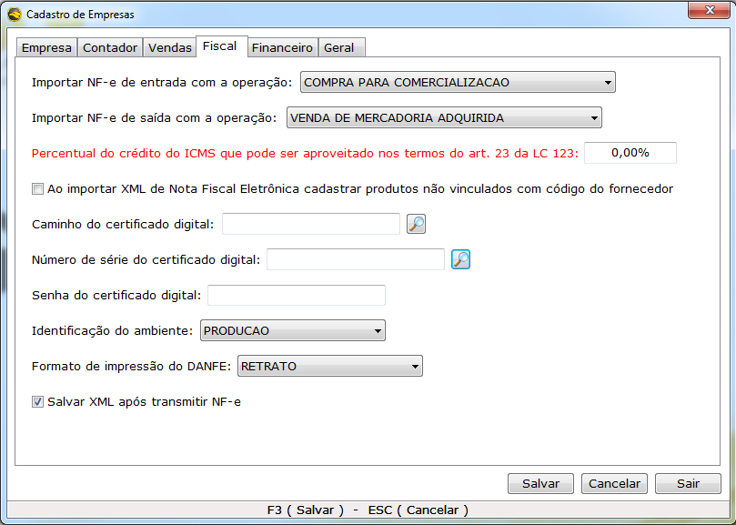

|Campo|Função|
|-----|------|
|**Importar NF-e de entrada com a operação**|Informar a operação padrão para importação de xml de nota fiscal eletrônica de entrada.|
|**Importar NF-e de saída com a operação**|Informar a operação padrão para importação de xml de nota fiscal eletrônica de saída.|
|**Percentual do crédito do ICMS que pode ser aproveitado nos termos do art. 23 da LC 123**|Consultar junto a contabilidade a alíquota referente ao percentual de crédito que poderá ser aproveitado nos termos do art. 23 da LC 123.|
|**Ao importar XML de Nota Fiscal Eletrônica cadastrar produtos não vinculados com código do fornecedor**|Informar esta opção caso o cliente deseje que seja cadastrado o produto como código do fornecedor.|
|**Caminho do Certificado Digital**|Informar o caminho do certificado digital modelo A1.|
|**Número de série do certificado digital**|Informar o número de série do certificado digital modelo A3.|
|**Senha do certificado digital**|Informar a senha do certificado digital.|
|**Identificação do Ambiente**|Informar ambiente de Produção.|
|**Formato de impressão do DANFE**|Informar Retrato.|
|**Salvar XML após transmitir NF-e**|Marcar esta opção para o sistema salvar o xml de todas as transações referentes a nota fiscal eletrônica.|

|Campo|Função|
|-----|------|
|**Padrão para consulta de texto**|Selecione esta opção para fixar o padrão de consulta para pesquisas de texto em todas as telas de pesquisa do sistema.|
|**Bloquear duplicidade de pessoas por CPF / CNPJ**|Marcar esta opção para o sistema bloquear cadastros com o mesmo CPF / CNPJ no sistema.|
|**Autenticar usuário ao Pagar e Receber Títulos**|Marcar esta opção para que o sistema solicite usuário e senha de usuário ao pagar ou receber contas.|
|**CNPJ da Matriz para o Cadastro Sincronizado**|Informar o CNPJ da matriz para o sistema identificar se vai ser cliente ou servidor de dados para o cadastro sincronizado.|

## Cadastro de Perfis de Usuário

O cadastro de Perfis de Usuários tem por finalidade definir níveis de acesso de acordo com as políticas da empresa. Os perfis de Manutenção, Administrador e Usuário são cadastrados por padrão e podem ser modificados ou outros podem ser criados.

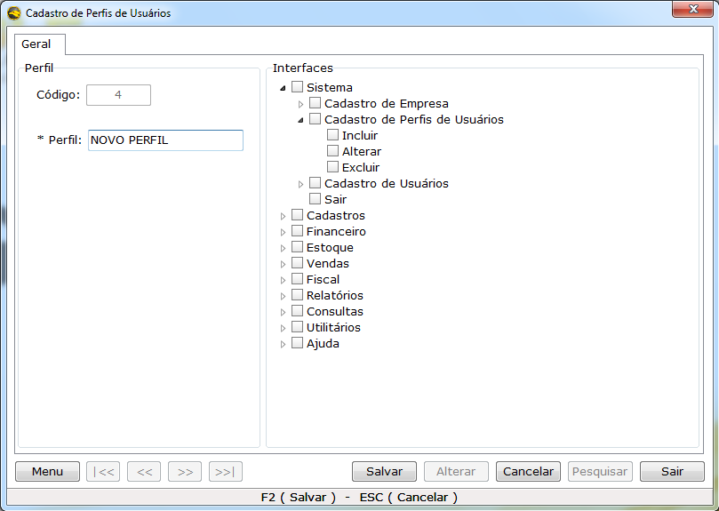

|Campo|Função|
|-----|------|
|**Código**|Gerado automaticamente pelo sistema.|
|**Perfil**|Informar o nome do perfil de acordo com a função dos funcionários que utilizarão o sistema.|
|**Interfaces**|Marcar as opções que os funcionários terão sobre as funcionalidades do sistema.|

! É aconselhável que as permissões de exclusão sejam negadas a **TODOS** os usuários durante o processo de implantação até que se tenha total confiança do domínio dos usuários com o uso das funções do sistema.

## Cadastro de Usuários
Para que os funcionários da empresa tenham acesso as funcionalidades do sistema um usuário terá que ser cadastrado no cadastro de usuários.

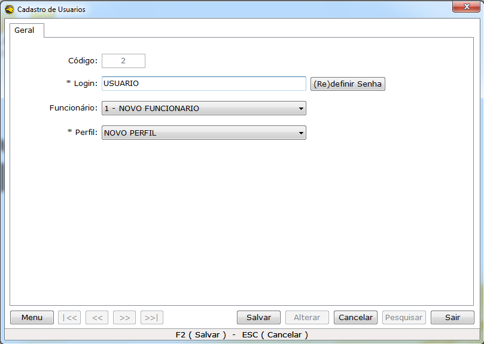

|Campo|Função|
|-----|------|
|**Código**|Gerado automaticamente pelo sistema.|
|**Login**|Infomar login do usuário.|
|**(Re) Definir Senha**|Informar a senha 2 ( duas ) vezes.|
|**Funcionário**|Vincular o usuário a um funcionário previamente cadastrado.|
|**Perfil**| Informar o perfil de acesso.|

## Backup e Restauração do Banco de Dados

O procedimento de restauração de banco de dados deve em casos de reinstalação do sistema onde somente os técnicos de suportes podem fazer este procedimento. Este procedimento deverá ser realizado no terminal servidor nunca poderá ser feito em outros terminais, pois ao restaurar o backup, se houver falhas de rede o mesmo não será restaurado por completo acarretando na perda do banco de dados sendo necessário restaurar a cópia novamente no servidor. É aconselhável que sempre que se for executar qualquer tipo de manutenção no terminal, seja no hardware ou até mesmo uma configuração do sistema, que se faça o backup.

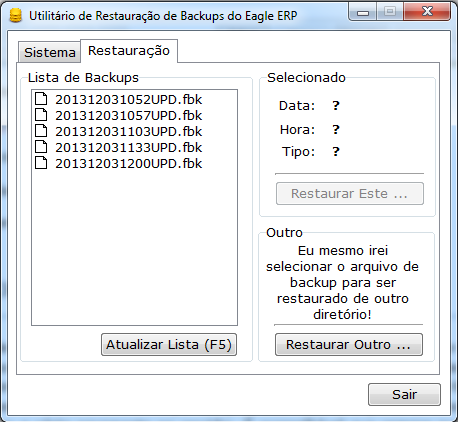

|Campo|Função|
|-----|------|
|**Lista de backups**|Nesta lista o sistema exibe os backups armazenados na pasta padrão para backups sendo possível escolher qualquer um dos backups para que sejam restaurados.|
|**Restaurar este**|Este comando executa a restauração dos backups exibidos na Lista de Backups.|
|**Restaurar Outro**|Este comando restaura um backup salvo em outro local escolhido pelo usuário.|

Após selcionar o backup a ser restaurado, o sistema só executará o procedimento com a confirmação do usuário. Antes de restaurar um backup verifique se o backup contem as últimas alterações relevantes feitas pelo o usuário.

Enquanto o backup e restaurado nenhum tipo de conexão com o banco de dados poderá ser feita muito menos desconectar o servidor de banco de dados.

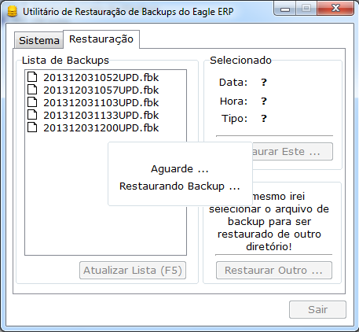

Após a conclusão da retauração do banco de dados os usuários poderão utilizar o sistema normalmente.

!!!! Se forem seguidas todas as orientações contidas neste manual não ocorrerão transtornos durante a implantação do sistema de gestão nos clientes.
